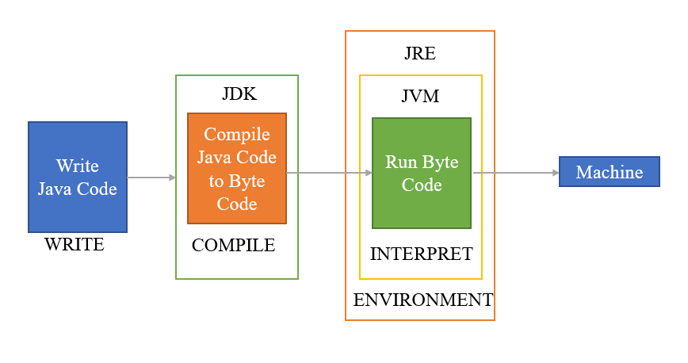

# 자바 시작하기

## 자바란
1991년 Sun Microsystems의 엔지니어들에 의해 Oak라는 언어가 고안됩니다.  
Oak는 가전제품에서 사용될 목적으로 만들어졌지만 인터넷의 등장으로 프로그래밍 언어로 사용되었습니다.  
그 후 Oak는 Java로 탈바꿈하고 지금까지 전세계적으로 다양한 분야에서 사용되고 있습니다.

### 자바의 특징
1. **이식성이 높은 언어**  
`이식성`이란 `한 프로그램이 다른 실행 환경으로 쉽게 옮겨질 수 있는 성질`을 말합니다. Windows에서 실행되는 프로그램이 Unix 기반 운영체제에서도 실행된다면 이식성이 높은 것입니다. 대부분의 프로그램은 각자 운영체제에 맞게 만들어지기 때문에 다른 환경에서 실행하려면 프로그램 소스 파일을 수정하고, 다시 컴파일하는 과정을 거쳐야 합니다. 하지만 자바로 개발된 프로그램은 `자바 실행 환경(Java Runtime Envirionment)이 설치되어 있는 모든 운영체제에서 실행이 가능`합니다.

2. **객체 지향 언어**  
객체들을 하나씩 조립하고 연결해서 전체 프로그램을 완성하는 기법을 객체 지향 프로그래밍(OOP: Object Oriented Programming)이라고 합니다. 자바는 처음부터 이러한 부분을 고려하여 설계되었기 때문에 객체 지향 언어의 특징인 `추상화`, `캡슐화`, `상속`, `다형성` 기능을 지원합니다.  
    ```
    추상화(Abstration): 객체의 공통적인 속성과 기능을 추출하여 정의하는 것
    캡슐화(Encapsulation): 서로 연관있는 속성과 기능들을 하나의 캡슐로 만들어 데이터를 외부로부터 보호하는 것
    상속(Inheritance): 기존의 클래스를 재활용하여 새로운 클래스를 작성하는 것
    다형성(Polymorphism): 어떤 객체의 속성이나 기능이 상황에 따라 여러 가지 형태를 가질 수 있는 성질
    ```

3. **함수적 프로그래밍 지원**  
함수적 프로그래밍은 대용량 데이터의 병렬 처리에 적합합니다. 자바는 이를 지원하기 위해서 자바 8부터 `람다식(Lambda Expressions)을 지원`합니다. 람다식을 사용하면 컬렉션 프레임워크(Set, List, Map)의 요소를 필터링, 매핑하기 쉬워지고, 코드가 간결해집니다.

4. **메모리를 자동으로 관리한다.**  
자바에서는 `메모리 누수를 방지`하기 위해 JVM내의 가비지 컬렉터(Garbage Collector)가 주기적으로 메모리를 청소해줍니다.
    ```
    System.gc()를 통해 가비지 컬렉터를 직접 호출할 수도 있지만,  
    해당 메서드를 호출하는 것은 시스템의 성능에 큰 영향을 미친다고 합니다.
    ```

5. **동적 로딩(Dynamic Loading)**  
`객체가 필요한 시점`에 클래스를 동적 로딩해서 `객체를 생성`합니다.
이로 인해 런타임 전까지 `메모리가 낭비되는 것을 방지`할 수 있습니다. 하지만 메모리에 미리 로드되어 있지 않기 때문에 시간이 필요하기 때문에 `프로그램 성능 저하`로 이어질 수 있습니다.

6. **멀티 쓰레드(Multi-Thread)를 쉽게 구현할 수 있다.**  
디스코드에서 파일을 다운로드하는 동시에 채팅까지 칠 수 있는 것은 해당 프로그램이 멀티 쓰레드로 구현되어 있기 때문입니다.
자바는 쓰레드 생성 및 제어와 관련된 라이브러리를 제공하고 있기 때문에 이러한 멀티 쓰레드를 쉽게 구현할 수 있습니다.

### JVM(Java Virtual Machine)
- `JVM`은 운영체제를 대신해서 자바 프로그램을 실행하는 `가상의 운영체제 역할`을 합니다. 운영체제별로 프로그램을 실행하고 관리하는 방법이 다르기 때문에 운영체제와 자바 프로그램 중간에 JVM을 두어 `이식성을 높일 수 있도록 설계`되었습니다.

- JVM은 각 운영체제에 맞게 바이트 코드를 기계어로 번역하는 역할이기 때문에 `운영체제에 종속적`입니다.  


## 문제
### 1. JDK와 JRE의 차이점을 설명한 것 중 틀린 것은?
1. JDK는 JRE와 컴파일러 등의 개발 도구가 포함된다.
2. 자바 프로그램을 개발하려면 JDK가 반드시 필요하다.
3. 자바 프로그램을 실행만 하려면 JRE만 설치해도 상관없다.
4. JRE에는 컴파일러(javac.exe)가 포함되어 있다.

### 2. JVM에 대한 설명으로 틀린 것은?
1. JVM은 java.exe 명령어에 의해 구동된다.
2. JVM은 바이트 코드를 기계어로 변환시키고 실행한다.
3. JVM은 운영체제에 독립적이다(운영체제별로 동일한 JVM이 사용된다).
4. 바이트 코드는 JVM에 독립적이지만, JVM은 운영체제에 종속적이다.

### 3. 자바 프로그램 개발 과정을 순서대로 나열하면?
1. javac.exe로 바이트 코드 파일(*.class)을 생성한다.
2. java.exe로 JVM을 구동시킨다.
3. 자바 소스 파일(*.java)을 작성한다.
4. JVM은 main() 메서드를 찾아 메서드 블록을 실행시킨다.