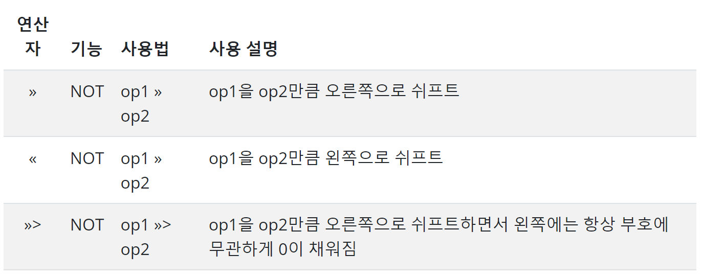

## Java 연산자(Operator)

연산자(Operator)는 주어진 변수나 리터럴에 대해 연산을 수행하기 위한 것이다. 연산자에 의해 처리되는 대상을 피연산자(Operator)라고 한다.
연산자는 대입 연산자, 산술 연산자, 비트 연산자, 비교(관계) 연산자, 논리 연산자 등으로 분류할 수 있다.

---

### 1. 대입 연산자
일반 수학에서의 단일 등호 기호 = 는 같다는 표현으로만 사용되지만, 프로그래밍에서는 변수에 할당 즉, 대입을 의미한다.
- 변수 = 값
```
int a = 1; // 변수 a에 1이 대입
```

- 변수 = 표현식
```
int a = 1 + 2; // 변수 a에 1+2를 하여 3이 대입
```

- 변수 = 변수 = 변수… = 값(혹은 표현식)
```
int a, b, c;
a = b = c = 100 // a, b, c 변수에 동일하게 100이 대입
```

- 변수의 표현식의 데이터 타입과 같거나 호환될 수 있어야 한다.
```
int a = 1;
boolean b = true;
int c = a + b;  // 컴파일 error
```

---

### 2. 산술 연산자
산술 연산자(arithmetic operators)는 일반 수학에 사용되는 것과 같은 방식으로 산술식에서 사용한다.

뎃셈, 뺄셈, 곱셈 나눗셈과 같이 모든 숫자형에 대한 산술 연산을 할 수 있다.


---

예제1
```
package com.devkuma.tutorial.operators;

public class Arithmetic {

    public static void main(String[] args) {
        int a = 1 + 3;
        int b = a - 2;
        int c = b * 5;
        int d = c / 2;
        int e = d % 3;

        System.out.println("a=" + a);
        System.out.println("b=" + b);
        System.out.println("c=" + c);
        System.out.println("d=" + d);
        System.out.println("e=" + e);
    }
}

# 실행 결과: 
a=4
b=2
c=10
d=5
e=2

```

#### 증가 연산자와 감소 연산자

증가 연산자는 하나를 증가시키며, 감소 연산자는 하나를 감소시킨다.

연산자가 어디에 위치에 있나에 따라 다른 결과를 가져오게 된다. 예를 들면 op가 초기 값이 2라고 가정하면 ++op 처럼 연산자를 앞에 오게 되면 증가를 시킨 후인 값 3를 반환하게 되고, op++처럼 연산자가 뒤에 오게 되면 증가 시키기 전 값인 2를 반환하고, op값은 3이 된다.


예제2
```
package com.devkuma.tutorial.operators;

public class Increase {

    public static void main(String[] args) {

        int a = 10;

        System.out.println(a++);
        System.out.println(++a);
        System.out.println(a--);
        System.out.println(--a);
    }
}

실행 결과:
10
12
12
10
```

---
산술적인 대입 연산자

대입 연산자와 다른 산술 연산자들과 결합하여 쓰이는 형태의 연산자이다. 예를 들면 a += 2이라고 하면 a에 2를 더하고 a에 2를 더한 값을 대입한다.


예제3
```
package com.devkuma.tutorial.operators;

public class AssignmentOperator {

    public static void main(String[] args) {
        int a = 4;
        int b = 5;
        int c = 6;

        a += 4;
        b -= 2;
        c += a * b;
        c %= 7;

        System.out.println("a=" + a);
        System.out.println("b=" + b);
        System.out.println("c=" + c);
    }
}

실행 결과
a=8
b=3
c=2
```
---

### 비트연산자
비트 연산자는 이진 비트연산을 한다.

3과 6을 &(AND) 연산을 하게 되면 0010(3) 과 0110(6)에 대해 각 비트를 AND 를 적용하여 0010 인 결과값 2가 된다.

- 0011(3) & 0110(6) = 0010(2)


예제4
```
package com.devkuma.tutorial.operators;

public class Bit {

    public static void main(String[] args) {
        int a = 3;
        int b = 6;
        int c = a & b;
        int d = a | b;
        int e = a ^ b;
        int f = (~a & b) | (a & ~b);

        System.out.println("c=" + c);
        System.out.println("d=" + d);
        System.out.println("e=" + e);
        System.out.println("f=" + f);
    }
}

실행 결과:

c=2
d=7
e=5
f=5
```

시프트 연산자
- 쉬프트 연산자(shift operators)는 왼쪽 쉬프트(left shift), 오른쪽 쉬프트(left shift), 부호없는 오른쪽 쉬프트(Unsigned Right Shift)가 있다.
- 부호없는 오른쪽 쉬프트(Unsigned Right Shift) 연산자는 32bit와 64bit에서만 값에서만 사용된다.



예제5
```
package com.devkuma.tutorial.operators;

public class Shift {

    public static void main(String[] args) {
        // 1000(8)를 2만큼 오른쪽으로 비트를 옮기면 100000(32)가 된다.
        byte a = 8 << 2;

        // 1000(8)를 2만큼 왼쪽으로 비트를 옮기면 10(2)가 된다.
        byte b = 8 >> 2;

        // -1를 32bit로 표현하면 11111111111111111111111111111111이 되고,
        // 이를 2만큼 오른쪽으로 쉬프트하면서 왼쪽에는 항상 부호에 무관하게 0이 채워짐
        // 그래서 값은 01111111111111111111111111111111(2147483647)이 된다.
        int c = -1 >>> 1;

        System.out.println("a=" + a);
        System.out.println("b=" + b);
        System.out.println("c=" + c);
    }
}
실행 결과:

a=32
b=2
c=2147483647
```
---

#### 비트 대입연산자
대입 연산자와 다른 비트 연산자들과 결합하여 쓰이는 형태의 연산자이다.


비트 연산자의 논리 결과표


---

### 비교(관계) 연산자

비교(관계) 연산자는 이항 연산자로서 한 연산항이 다른 연산항에 대해 가지는 관계를 결정한다.

이 연산들의 결과 값은 항상 부울형(true 또는 false)의 형태이기 때문에 if문과 같은 제어문이나 for문 같은 반복문장에 자주 사용된다.


예제6
```
package com.devkuma.tutorial.operators;

public class Relation {

    public static void main(String[] args) {

        int a = 10;
        int b = 20;
        int c = 10;

        boolean d = a > b;
        boolean e = a >= b;
        boolean f = a < b;
        boolean g = a <= c;
        boolean h = a == c;
        boolean i = a != b;

        System.out.println("d=" + d);
        System.out.println("e=" + e);
        System.out.println("f=" + f);
        System.out.println("g=" + g);
        System.out.println("h=" + h);
        System.out.println("i=" + i);
    }
}

실행 결과

d=false
e=false
f=true
g=true
h=true
i=true
```

---

### 논리연산자
논리 연산자는 피연산자(operand)의 값을 평가하여 결과로 true 또는 false값을 반환한다.

특이 사항으로 &&(논리곱)와 ||(논리합) 단축 논리 연산자(Short-circuit logical operator)가 있다. 부하가 1개인 &와 |과는 다르게 하나의 첫 번째 피연산자를 평가한 결과 두 번째 피연산자를 평가할 필요가 없을 경우 바로 결과를 반환하는 연산자이다. 그러기 때문에 두 번째 피연산자에 뭔가 처리가 있는 로직인데 평가를 하지 않게 되면 처리가 되지 않는다.

예를 들면, 아래와 같은 수식에서 flag가 true이면 “count > index++“의 수식은 처리가 되지 않아 index는 증가하지 않는다. 반대로 flag가 false이면 index가 1만큼 증가를 한다.

(flag == true) || (count > index++)


예제 7
```
package com.devkuma.tutorial.operators;

public class Logic {

    public static void main(String[] args) {

        boolean a = true;
        boolean b = false;
        boolean c = true;

        boolean d = a & b;
        boolean e = a | b;
        boolean f = a ^ b;
        boolean g = a && b;
        boolean h = a && c;
        boolean i = a || b;
        boolean j = a || c;
        boolean k = !a;

        System.out.println("d=" + d);
        System.out.println("e=" + e);
        System.out.println("f=" + f);
        System.out.println("g=" + g);
        System.out.println("h=" + h);
        System.out.println("i=" + i);
        System.out.println("j=" + j);
        System.out.println("k=" + k);
    }
}

실행 결과:

d=false
e=true
f=true
g=false
h=true
i=true
j=true
k=false
```

논리연산자의 논리결과표


---

### 논리대입연산자
대입 연산자와 다른 논리 연산자들과 결합하여 쓰이는 형태의 연산자이다.


---

### 삼항 연산자
3개의 피연산자 (operand) 가진 3항 연산자 “:?“는 선택문의 if-when-else 문을 축약해서 사용할 수 있다.

- 조건 ? 수식1(조건이 true인 경우) : 수식2 (조건이 false인 경우)

조건을 평가하여 true인지 false인지 판별하여 true이면 수식1을 false이면 수식2를 실행하여 결과가 반환된다. 조건문(if) 대신에 대입 연산자와 함께 유용하게 사용된다.

예제
```
public class Three {

    public static void main(String[] args) {
        int a = 2;
        int b = 3;
        int max = (a > b) ? a : b;

        System.out.println("max=" + max);
    }
}
실행 결과:

max=3
```

---

### 연산자 우선순위
우선순위에 상관 없이 수식의 일부분을 괄호 ()로 묶어서 우선순위를 지정할 수 있다.

