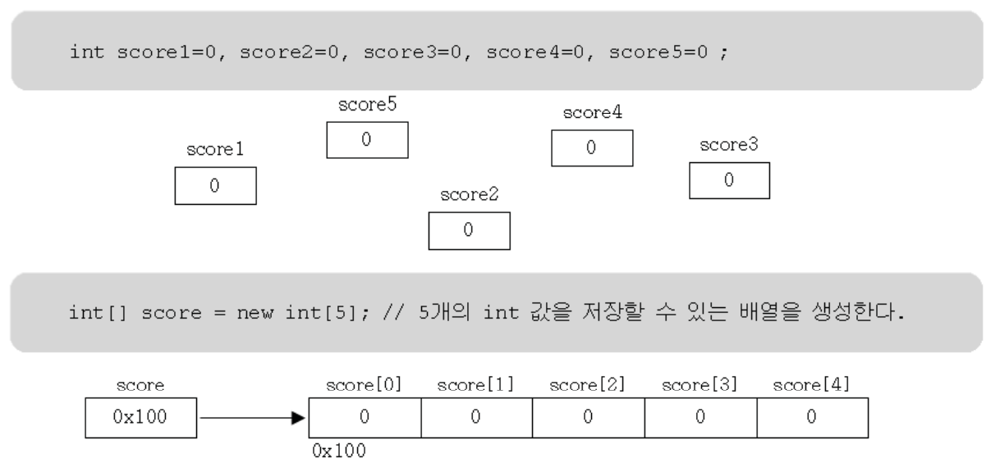

# Java 배열 (Java Arrays)

## 1.1 배열이란?

- 같은 타입의 여러 변수를 하나의 묶음으로 다루는 것
- 많은 양의 값(데이터)을 다룰 때 유용하다.
- 배열의 각 요소는 서로 연속적이다.


## 1.2 배열의 선언과 생성

- 타입  또는 변수이름 뒤에 대괄호[]를 붙여서 배열을 선언한다


- 배열을 선언한다고 해서 값을 저장할 공간이 생성되는 것이 아니라 배열을 다루는데 필요한 변수가 생성된다.

```
int[] score; // 배열을 선언. (생성된 배열을 다루는데 사용될 참조변수 선언)

score = new int[5]; // 배열을 생성한다. (5개의 int값을 저장할 수 있는 공간생성)

// int[] scroe = nre int[5]; 와 같이 한 줄로 쓸수 있음
```

## 1.3 배열의 초기화

- 생성된 배열에 처음으로 값을 저장 하는 것

```
// 배열을 선언하면서 초기화
int[] score = new int[5];
score[0] = 100;
score[1] = 200;
score[2] = 300;
score[3] = 400;
score[4] = 500;

```
## 1.4 배열의 활용
- 배열에 값을 저장하고 읽어오기

```
score[3] = 100;
int value = score[3];
```

```
// 배열이름.length 은 배열의 길이를 알려준다.

int[] numbers = {1, 2, 3, 4, 5};
for (int i = 0; i < numbers.length; i++) {
    System.out.println(numbers[i]);
}

```

## 1.5 다차원 배열의 선언과 생성
- []의 개수가 차원의 수를 의미한다.
```
// 2차원 배열 선언과 생성
int[][] matrix = new int[3][3];

```

## 1.6 가변배열
- 다차원 배열에서 마지막 차수의 크기를 지정하지 않고 각각 다르게 지정

```
// 가변배열 예제
int[][] jaggedArray = new int[3][];
jaggedArray[0] = new int[]{1, 2, 3};
jaggedArray[1] = new int[]{4, 5};
jaggedArray[2] = new int[]{6, 7, 8};

```

## 1.7 배열의 복사
for문을 이용한 복사
```
int[] number = {1, 2, 3, 4, 5};
int[] newNumber = new int[10]

for (int i=0; i<number.length; i++) {
    newNumber[i] = number[i]; // 배열 number의 값을 newNumber에 저장한다.
}
```

```
// System.arraycopy()를 이용한 배열의 복사

int[] sourceArray = {1, 2, 3};
int[] targetArray = new int[sourceArray.length];
System.arraycopy(sourceArray, 0, targetArray, 0, sourceArray.length);

```

## 1.8 사용자 입력받기 - 커맨드라인
커맨드라인에서 사용자로부터 입력을 받는 방법과 입력된 값을 배열로 저장하는 방법을 설명합니다.
```
// 커맨드라인 입력을 배열로 저장하는 예제
import java.util.Scanner;

public class CommandLineInputExample {
    public static void main(String[] args) {
        Scanner scanner = new Scanner(System.in);
        System.out.print("배열 크기를 입력하세요: ");
        int size = scanner.nextInt();
        int[] numbers = new int[size];
        for (int i = 0; i < size; i++) {
            System.out.print("숫자를 입력하세요: ");
            numbers[i] = scanner.nextInt();
        }
        scanner.close();
    }
}
```
---

---

// <처리 조건>

- 배열에는 95, 75, 85, 100, 50이 차례대로 저장된다.
- 배열에 저장된 값을 오름차순으로 정렬하여 출력한다.

```
public class Test {
    public static void main(String[] args) {
        int result[] = new int[5];
        int arr[] = { 77, 32, 10, 99, 50 };
 
        for (int i = 0; i < 5; i++) {
            result[i] = 1;
 
            for (int j = 0; j < 5; j++) {
                if (arr[i] < arr[j]) {
                    result[i]++;
                }
            }
        }
        for (int k = 0; k < 5; k++) {
            System.out.println(result[k]);
        }
    }
}
```

---
```
public class Test02 {
    public static void main(String[] args) {
        int a[] = {10, 30, 50, 70, 90};
        int i, max, min;
        max = a[0];
        min = a[0];
        for (i = 0; i < 5; i++) {
            if ( (    ) > max) {
                max = a[i];
            }
            if ( (    ) < min) {
                min = a[i];
            }
        }
        System.out.printf("%d\n", max);
        System.out.printf("%d\n", min);
    }
}
```