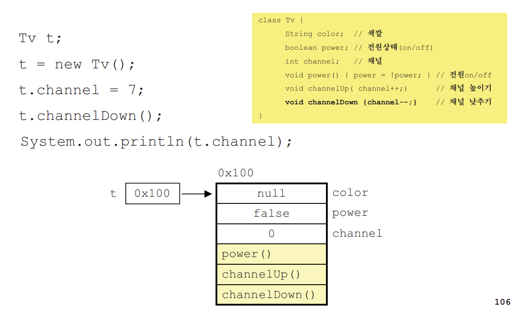

# 1. 객체지향언어란?

## 1.1 객체지향언어의 역사

- 과학, 군사적 모의실험(simulation)을 위해 컴퓨터를 이용한 가상세계를 구현하려는 노력으로부터 객체지향이론이 시작됨

- 1960년대 최초의 객체지향언어 Simula탄생

- 1980년대 절차방식의 프로그래밍의 한계를 객체지향방식으로 극복하려고 노력함.(C++, Smalltalk과 같은 보다 발전된 객체지향 언어가 탄생)

- 1995년 말 Java탄생. 객체지향언어가 프로그래밍 언어의 주류가 됨.

---

## 1.2 객체지향언어의 특징

### 기존의 프로그래밍언어와 크게 다르지 않다.
- 기존의 프로그래밍 언어에 몇가지 규칙을 추가한 것일 뿐이다.

### 코드의 재사용성이 높다.
- 새로운 코드를 작성할 때 기존의 코드를 이용해서 쉽게 작성할 수 있다.

### 코드의 관리가 쉬워졌다.
- 코드간의 관계를 맺어줌으로써 보다 적은 노력으로 코드변경이 가능하다.

### 신뢰성이 높은 프로그램의 개발을 가능하게 한다.
- 제어자와 메서드를 이용해서 데이터를 보호하고, 코드의 중복을 제거하여 코드의 불일치로 인한 오류를 방지할 수 있다.

---

# 2. 클래스와 객체

## 2.1 클래스와 객체의 정의와 용도
### 클래스의 정의 - 클래스란 객체를 정의해 놓은 것이다.
### 클래스의 용도 - 클래스는 객체를 생성하는데 사용된다.

### 객체의 정의 - 실제로 존재하는 것. 사물 또는 개념.
### 객체의 용도 - 객체의 속성과 기능에 따라 다름.

---

## 2.2 객체와 인스턴스

---

## 2.3 객체의 구성요소 - 속성과 기능
### 객체는 속성과 기능으로 이루어져 있다.
- 객체는 속성과 기능의 집합이며, 속성과 기능을 객체의 멤버(member, 구성요소)라고 한다.

### 속성은 변수로, 기능은 메서드로 정의한다.
- 클래스를 정의할 때 객체의 속성은 변수로, 기능은 메서드로 정의한다.

---

## 2.4 인스턴스의 생성과 사용(1/4)
### 인스턴스의 생성방법
클래스명 참조변수명; // 객체를 다루기 위한 참조변수 선언
참조변수명 = new 클래스명 (); // 객체생성 후, 생성된 객체의 주소를 참조변수에 저장

## 2.4 인스턴스의 생성과 사용(2/4)

## 2.4 인스턴스의 생성과 사용(3/4)

## 2.4 인스턴스의 생성과 사용(4/4)

---

## 2.5 클래스의 또 다른 정의
### 1. 클래스 - 데이터와 함수의 결합

### 2. 클래스 - 사용자 정의 타입(User-defined type)

---

# 3. 변수와 메서드

## 3.1 선언위치에 따른 변수의 종류

## 3.2 클래스변수와 인스턴스변수
### 인스턴스(instance variable)
- 각 인스턴스의 개별적인 저장공간. 인스턴스마다 다른 값 저장가능
- 인스턴스 생성 후, '참조변수.인스턴스변수명' 으로 접근
- 인스턴스를 생성할 때 생성되고, 참조변수가 없을 때 가비지컬렉터에 의해 자동제거됨

### 클래스변수(class variable)
- 같은 클래스의 모든 인스턴스들이 공유하는 변수
- 인스턴스 생성없이 '클래스이름.클래스변수명' 으로 접근
- 클래스가 로딩될 때 생성되고 프로그램이 종료될 때 소멸

### 지역변수(local variable)
- 메서드 내에 선언되며, 메서드의 종료와 함께 소멸
- 조건문, 반복문의 블럭{} 내에 선언된 지역변수는 블럭을 벗어나면 소멸

## 클래스변수와 인스턴스변수
"인스턴스변수는 인스턴스가 생성될 때마다 생성되므로 인스턴스마다 각기 다른 값을 유지할 수 있지만, 클래스변수는 모든 인스턴스가 하나의 저장공간을 공유하므로 항상 공통된 값을 갖는다.

## 3.3 메서드(method)
### 메서드란?
- 작업을 수행하기 위한 명령문의 집합
- 어떤 값을 입력받아서 처리하고 그 결과를 돌려준다. (입력받는 값이 없을 수도 있고 결과를 돌려주지 않을 수도 있다.)

### 메서드의 장점과 작성지침
- 반복적인 코드를 줄이고 코드의 관리가 용이하다.
- 반복적으로 수행되는 여러 문장을 메서드로 작성한다.
- 하나의 메서드는 한 가지 기능만 수행하도록 작성하자.
- 관련된 여러 문장을 메서드로 작성한다.

## 3.4 return문
### 메서드가 정상적으로 종료되는 경우
- 메서드의 블럭{}의 끝에 도달했을 때
- 메서드의 블럭{}을 수행 도중 return 문을 만났을 때

### return문
- 현재 실행 중인 메서드를 종료하고 호출한 메서드로 되돌아간다.

- 주의사항

## 3.5 메서드 호출

## 3.6 JVM의 메모리구조

### 호출스택의 특징
- 메서드가 호출되면 수행에 필요한 메모리를 스택에 할당받는다.
- 메서드가 수행을 마치면 사용했던 메모리를 반환한다.
- 호출스택의 제일 위에 있는 메서드가 현재 실행중인 메서드다.
- 아래에 있는 메서드가 바로 위의 메서드를 호출한 메서드다.

## 3.7 기본형 매개변수와 참조형 매개변수
- 기본형 매개변수 - 변수의 값을 읽기만 할 수 있다.(read only)
- 참조형 매개변수 - 변수의 값을 읽고 변경할 수 있다.(read & write)

## 3.8 재귀호출(recursive call)
### 재귀호출이란?
- 메서드 내에서 자기자신을 반복적으로 호출하는 것
- 재귀호출은 반복문으로 바꿀 수 있으며 반복문보다 성능이 나쁨
- 이해하기 쉽고 간결한 코드를 작성할 수 있다

### 재귀호출의 예
- 팩토리얼, 제곱, 트리운행, 폴더목록표시 등

## 3.9 클래스 메서드와 인스턴스 메서드
### 인스턴스메서드
- 인스턴스 생성 후, '참조변수.메서드이름()'으로 호출
- 인스턴스변수나 인스턴스메서드와 관련된 작업을 하는 메서드
- 메서드 내에서 인스턴스변수 사용가능

### 클래스메서드(static메서드)
- 객체생성없이 '클래스이름.메서드이름()'으로 호출
- 인스턴스변수나 인스턴스메서드와 관련없는 작업을 하는 메서드
- 메서드 내에서 인스턴스변수 사용불가
- 메서드 내에서 인스턴스변수를 사용하지 않는다면 static을 붙이는 것을 고려한다.

## 3.10 멤버간의 참조와 호출

