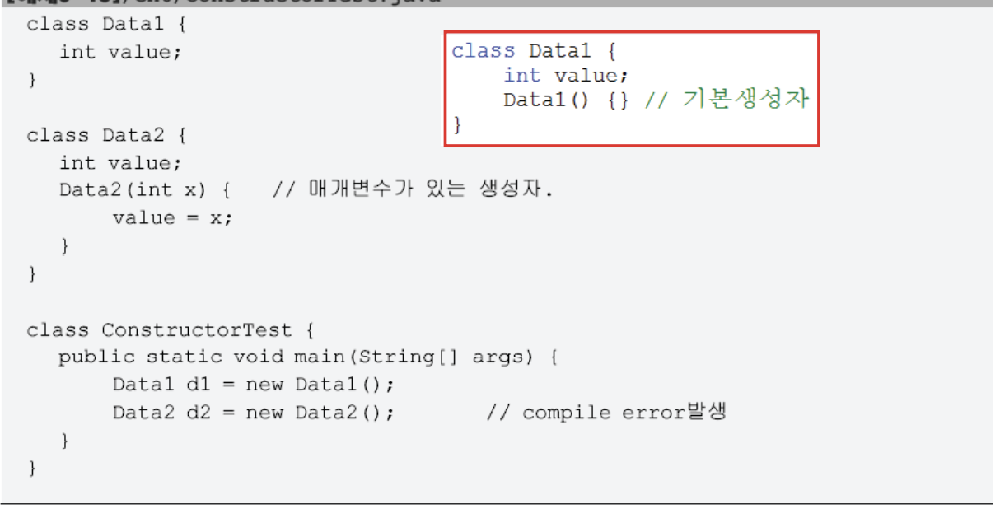
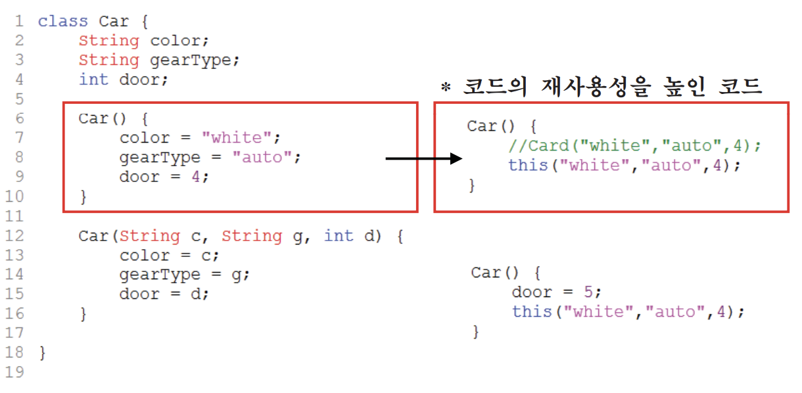
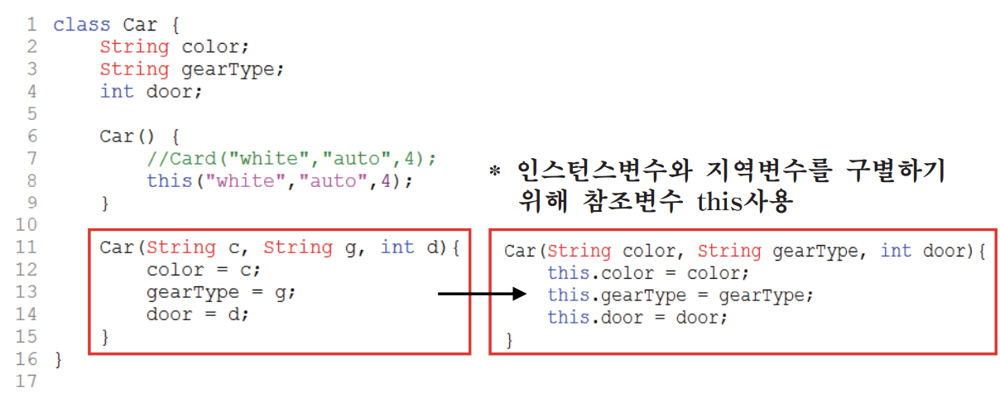
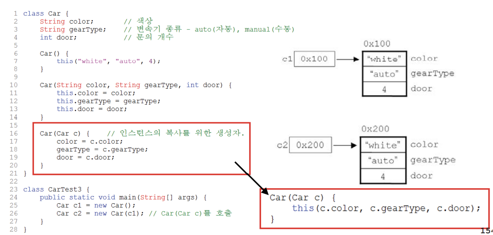
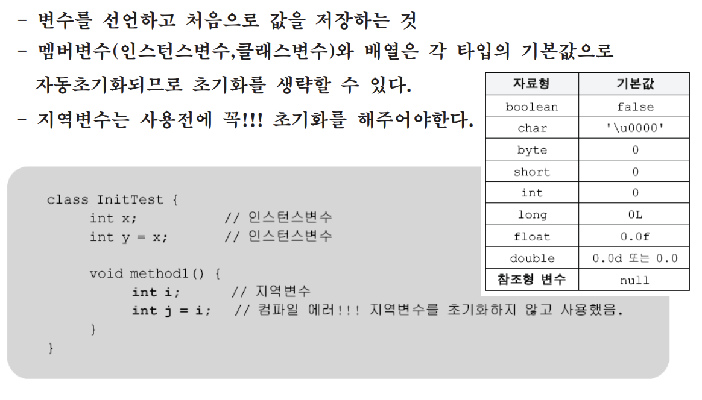
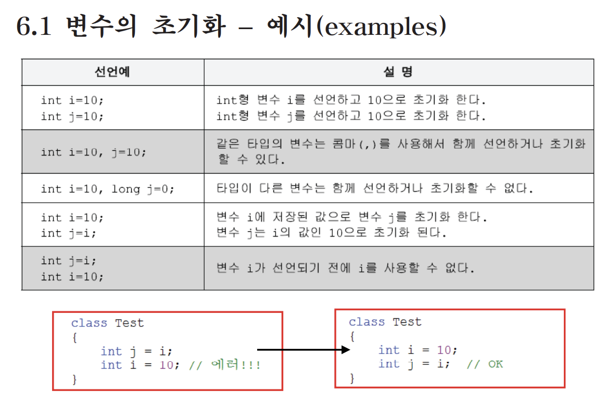
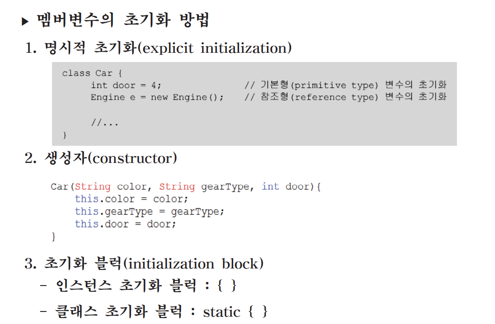
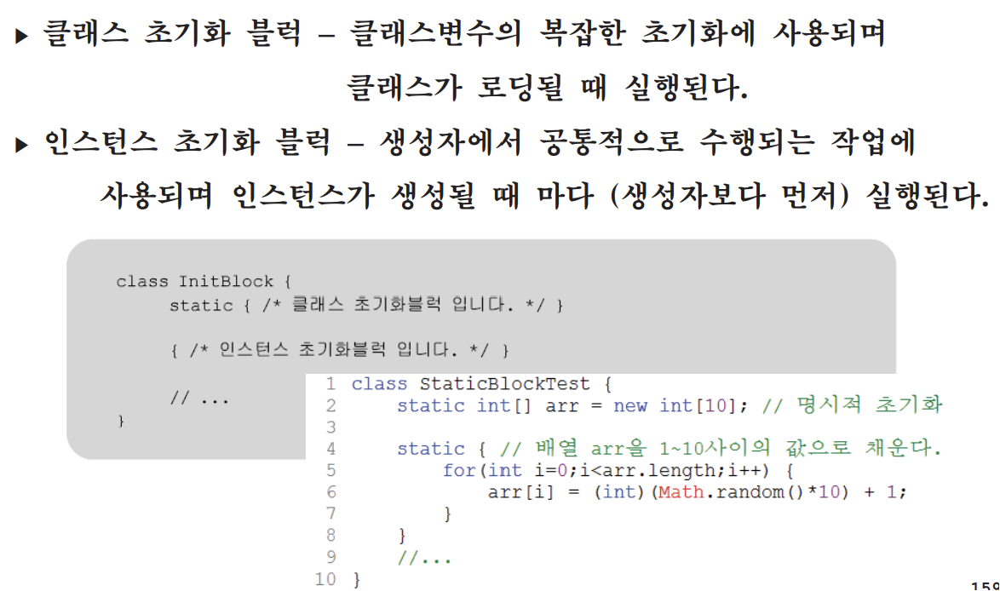
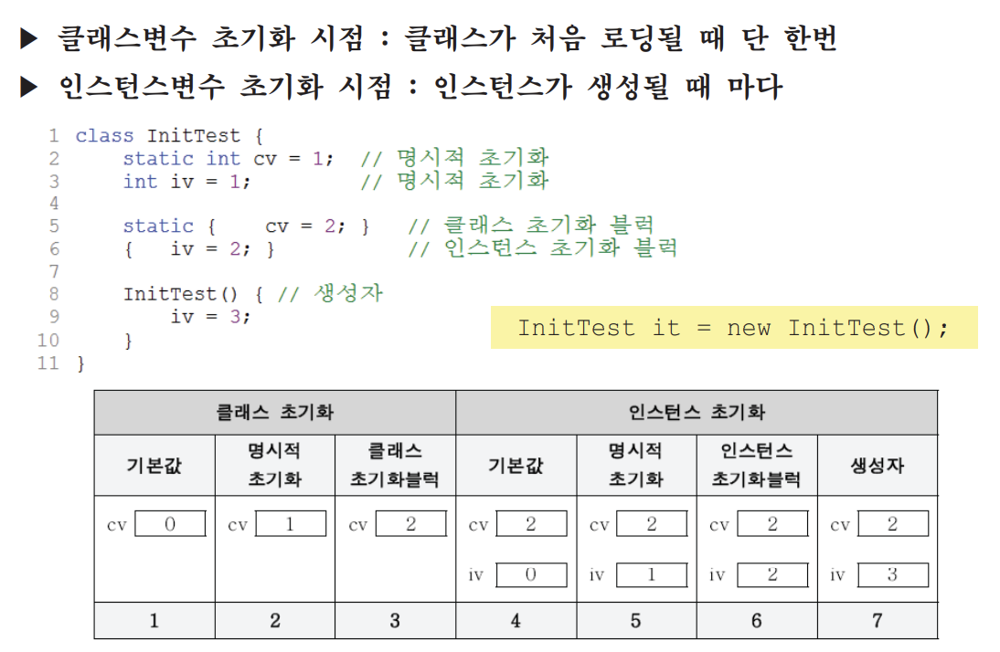
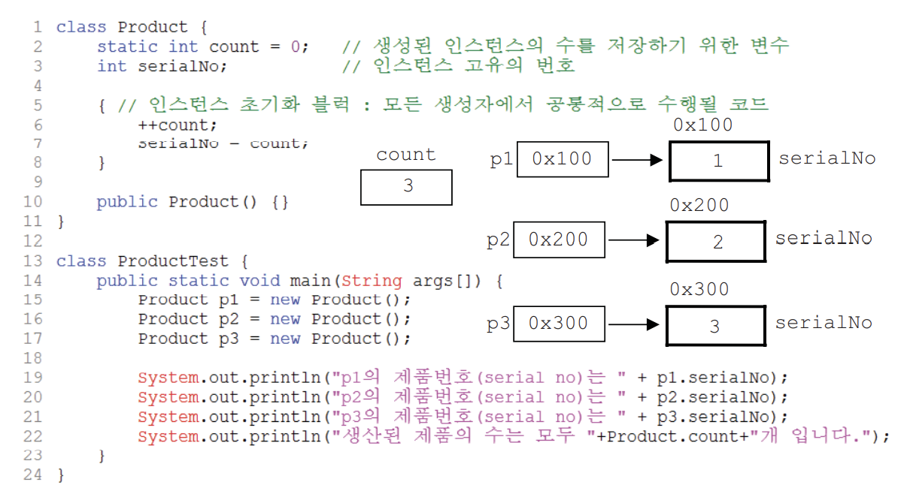

## 4.1 메서드 오버로딩(method overloading)이란?
### "하나의 클래스에 같은 이름의 메서드를 여러 개 정의하는 것을 메서드 오버로딩, 간단히 오버로딩이라고 한다."
* overload - 과적하다. 부담을 많이 지우다.


## 4.2 오버로딩의 조건
- 메서드의 이름이 같아야 한다.
- 매개변수의 개수 또는 타입이 달라야 한다.
- 매개변수는 같고 리턴타입이 다른 경우는 오버로딩이 성립되지 않음(리턴타입은 오버로딩을 구현하는데 아무런 영향을 주지 못한다.)


## 4.3 오버로딩의 예(1/3)
* System.out.println메서드
- 다양하게 오버로딩된 메서드를 제공함으로써 모든 타입의 변수를 출력할 수 있도록 설계
```
void println()
void println(boolean x)
void println(char x)
void println(char[] x)
void println(double x)
void println(float x)
void println(int x)
void println(long x)
void println(Object x)
void println(String x)
```

## 4.3 오버로딩의 예(1/2)
- 매개변수의 이름이 다른 것은 오버로딩이 아니다.
```
[보기1]
int add(int a, int b) { return a+b; }
int add(int x, int y) { return x+y; }
```

- 리턴타입은 오버로딩의 성립조건이 아니다.
```
[보기2]
int add(int a, int b) { return a+b; }
long add(int a, int b) { return (long) (a+b); }
```

## 4.3 오버로딩의 예(1/3)
- 매개변수의 타입이 다르므로 오버로딩이 성립한다.
```
[보기3]
long add(int a, long b) { return a+b; }
long add(long a, int b) { return a+b; }
```
- 오버로딩의 올바른 예 - 매개변수는 다르지만 같은 의미의 기능수행
```
[보기4]
int add(int a, int b) { return a+b; }
long add(long a, long b) { return a+b; }
int add(int[] a) {
    int result =0;

    for(int i=0; i < a.length; i++) {
        result += a[i];
    }
    return result;
}
```

# 객체지향개념

## 5. 생성자
### 5.1 생성자(constructor)란?
* 생성자란?
- 인스턴스가 생성될 때마다 호출되는 '인스턴스 초기화 메서드'
- 인스턴스 변수의 초기화 또는 인스턴스 생성시 수행할 작업에 사용
- 몇가지 조건을 제외하고는 메서드와 같다.
- 모든 클래스에는 반드시 하나 이상의 생성자가 있어야 한다.

* 인스턴스 초기화 - 인스턴스 변수에 적절한 값을 저장하는 것.

```
Card c = new Card();

1. 연산자 new에 의해서 메모리(heap)에 Card클래스의 인스턴스가 생성된다.
2. 생성자 Card()가 호출되어 수행된다.
3. 연산자 new의 결과로, 생성된 Card인스턴스의 주소가 반환되어 참조변수 c에 저장된다.
```

### 5.2 생성자의 조건
- 생성자의 이름은 클래스의 이름과 같아야 한다.
- 생성자는 리턴값이 없다. (하지만 void를 쓰지 않는다.)
```
클래스이름(타입 변수명, 타입 변수명, ... ) {
    /// 인스턴스 생성시 수행될 코드
    /// 주로 인스턴스 변수의 초기화 코드를 적는다.
}

class Card {
    ...
    Card() { // 매개변수가 없는 생성자.
    // 인스턴스 초기화 작업
    }
    Card(String kind, int number) { // 매개변수가 있는 생성자
    // 인스턴스 초기화 작업
    }
}
```
### 5.3 기본 생성자(default constructor)
- 매개변수가 없는 생성자
- 클래스에 생성자가 하나도 없으면 컴파일러가 기본 생성자를 추가한다.
(생성자가 하나라도 있으면 컴파일러는 기본 생성자를 추가하지 않는다.)

```
클래스이름() { }
Card() { } // 컴파일러에 의해 추가된 Card클래스의 기본 생성자, 내용이 없다.

// "모든 클래스에는 반드시 하나 이상의 생성자가 있어야 한다."
```




### 5.4 매개변수가 있는 생성자
```
class Car {
    String color; // 색상
    String gearType; // 변속기 종류 - auto(자동), manual(수동)
    int door; // 문의 개수

    Car() {} // 생성자
    Car(String c, String g, int d) { // 생성자
    color = c;
    gearType = g;
    door = d;
    }
}

Car c = new Car();
c.color = "white";
c.gearType = "auto";
c.door = 4;

Car c = new Car("white","auto",4);
```
### 5.5 생성자에서 다른 생성자 호출하기 - this()
- this() - 생성자, 같은 클래스의 다른 생성자를 호출할 때 사용
다른 생성자 호출은 생성자의 첫 문장에서만 가능



### 5.6 참조변수 this
- this() - 인스턴스 자신을 가리키는 참조변수. 인스턴스의 주소가 저장되어있음
모든 인스턴스 메서드에 지역변수로 숨겨진 채로 존재



### 5.7 생성자를 이용한 인스턴스의 복사
- 인스턴스간의 차이는 인스턴스변수의 값 뿐 나머지는 동일하다.
- 생성자에서 참조변수를 매개변수로 받아서 인스턴스변수들의 값을 복사한다.
- 똑같은 속성값을 갖는 독립적인 인스턴스가 하나 더 만들어진다.


---
## 6. 변수의 초기화
### 6.1 변수의 초기화



### 6.2 멤버변수의 초기화

### 6.3 초기화 블럭

### 6.4 멤버변수의 초기화 시기와 순서

