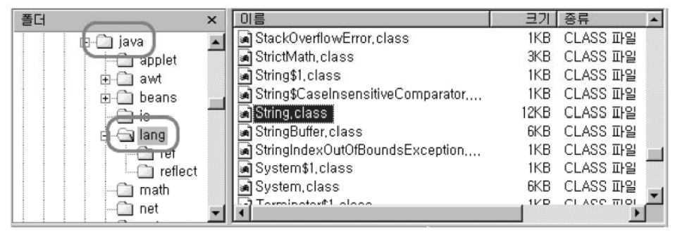

## 객체지향개념 II-1

### 1. 상속(inheritance)
#### 1.1 상속의 정의와 장점
* 상속이란?
- 기존의 클래스를 재사용해서 새로운 클래스를 작성하는 것
- 두 클래스를 조상과 자손으로 관계를 맺어주는 것
- 자손은 조상의 모든 멤버를 상속받는다.(생성자, 초기화블럭 제외)
- 자손의 멤버개수는 조상보다 적을 수 없다.(같거나 많다.)


#### 1.2 클래스간의 관계 - 상속관계(inheritance)
- 공통부분은 조상에서 관리하고 개별부분은 자손에서 관리한다.
- 조상의 변경은 자손에 영향을 미치지만, 자손의 변경은 조상에 아무런 영향을 미치지 않는다.


#### 1.2 클래스간의 관계 - 포함관계(composite)
* 포함(composite)이란?
- 한 클래스의 멤버변수로 다른 클래스를 선언하는 것
- 작은 단위의 클래스를 먼저 만들고, 이 들을 조합해서 하나의 커다란 클래스를 만든다.


#### 1.3 클래스간의 관계결정하기 - 상속 vs 포함
- 가능한 한 많은 관계를 맺어주어 재상용성을 높이고 관리하기 쉽게 한다.
- 'is-a'와 'has-a'를 가지고 문장을 만들어 본다.


- 원(Circle)은 도형(Shape)이다. (A Circle is a Shape.) : 상속관계
- 원(Circle)은 점(Point)를 가지고 있다.(A Circle has a Point.) : 포함관계


#### 1.4 단일 상속(single inheritance)
- Java는 단일상속만을 허용한다.(C++은 다중상속 허용)
```
class TVCR extends TV, VCR { // 이와 같은 표현은 허용하지 않는다.
//...
}

```
- 비중이 높은 클래스 하나만 상속관계로, 나머지는 포함관계로 한다.

#### 1.5 Object클래스 - 모든 클래스의 최고조상
- 조상이 없는 클래스는 자동적으로 Object클래스를 상속받게 된다.
- 상속계층도의 최상위에는 Object클래스가 위치한다.
- 모든 클래스는 Object클래스에 정의된 11개의 메서드를 상속받는다.
toString(), equals(Object obj), hashCode(), ...


---

### 2. 오버라이딩(overriding)
#### 2.1 오버라이딩이란?
"조상클래스로부터 상속받은 메서드의 내용을 상속받는 클래스에 맞게 변경하는 것을 오버라이딩이라고 한다."
* override - '~위에 덮어쓰다(overwrite).', '~에 우선하다.'
```
class Point {
    int x;
    int y;

    String getLocation() {
        return "x :" + x + ", y :"+ y;
    }
}

class Point3D extends Point {
    int z;
    String getLocation() {
        // 오버라이딩
        return "x :" + x + ", y :"+ y + ", z : " + z;
    }
}
```
#### 2.2 오버라이딩의 조건
1. 선언부가 같아야 한다.(이름, 매개변수, 리턴타입)
2. 접근제어자를 좁은 범위로 변경할 수 없다.
- 조상의 메서드가 protected라면, 범위가 같거나 넓은 protected나 public으로만 변경할 수 있다.
3. 조상클래스의 메서드보다 많은 수의 예외를 선언할 수 없다.

```
class parent {
    void parentMethod() throws IOException, SQLException {
        // ...
    }
}

class Child extends Parent {
    void parentMethod() throws IOException {
        //..
    }
}

class Child2 extends Parent {
    void parentMethod() throws Exception {
        //..
    }
}
```
#### 2.3 오버로딩 vs. 오버라이딩
* 오버로딩(overloading) - 기존에 없는 새로운 메서드를 정의하는 것(new)
오버라이딩(overriding) - 상속받은 메서드의 내용을 변경하는 것(change, modify)

```
class Parent {
    void parentMethod() {}
}

class Child extends Parent {
    void parentMethod() {} // 오버라이딩
    void parentMethod(int i) {} // 오버로딩

    void childMethod() {}
    void childMethod(int i) {} // 오버로딩
    void childMethod() {} // 에러!!! 중복정의임
}

```
#### 2.4 super
- this - 인스턴스 자신을 가리키는 참조변수. 인스턴스의 주소가 저장되어있음
모든 인스턴스 메서드에 지역변수로 숨겨진 채로 존재
- super - this와 같음. 조상의 멤버와 자신의 멤버를 구별하는 데 사용.


```
class Point {
    int x;
    int y;

    String getLocation() {
        return "x :" + x + ", y :"+ y;
    }
}

class Point3D extends Point {
    int z,
    String getLocation() { //오버라이딩
    // return "x :" + x + ", y : " + y + ", z :" + z;}
    return super.getLocation() +", z:"+ z; // 조상의 메서드 호출
}
```
#### 2.5 super() - 조상의 생성자
- 자손클래스의 인스턴스를 생성하면, 자손의 멤버와 조상의 멤버가 합쳐진 하나의 인스턴스가 생성된다.
- 조상의 멤버들도 초기화되어야 하기 때문에 자손의 생성자의 첫 문장에서 조상의 생성자를 호출해야 한다.


---

### 3. package와 import
#### 3.1 패키지(package)
- 서로 관련된 클래스와 인터페이스의 묶음.
- 클래스가 물리적으로 클래스파일(*.class)인 것처럼, 패키지는 물리적으로 폴더이다. 패키지는 서브패키지를 가질 수 있으며, '.'으로 구분한다.
- 클래스의 실제 이름(full name)은 패키지명이 포함된 것이다.
(String클래스의 full name은 java.lang.String)
- rt.jar는 Java API의 기본 클래스들을 압축한 파일
(JDK설치경로\jre\lib에 위치)


#### 3.2 패키지의 선언
- 패키지의 소스파일에 첫 번째 문장(주석 제외)으로 단 한번 선언한다.
- 하나의 소스파일에 둘 이상의 클래스가 포함된 경우, 모두 같은 패키지에 속하게 된다.(하나의 소스파일에 단 하나의 public클래스만 허용한다.)
- 모든 클래스는 하나의 패키지에 속하며, 패키지가 선언되지 않은 클래스는 자동적으로 이름없는(default) 패키지에 속하게 된다.

#### 3.3 클래스패스 설정
- 클래스패스(classpath)는 클래스파일(*.class)를 찾는 경로. 구분자는 ';'
- 클래스패스에 패키지가 포함된 폴더나 jar파일을(*.jar) 나열한다.
- 클래스패스가 없으면 자동적으로 현재 폴더가 포함되지만 클래스패스를 지정할 때는 현재 폴더(.)도 함께 추가해주어야 한다.


- 클래스패스로 자동 포함된 폴더 for 클래스파일(*.class) : 수동생성 해야함.
- JDK 설치경로\jre\classes

- 클래스패스로 자동 포함된 폴더 for jar파일(*.jar) : JDK설치시 자동생성됨.
- JDK 설치경로\jre\lib\ext


#### 3.4 import문
- 사용할 클래스가 속한 패키지를 지정하는데 사용.
- import문을 사용하면 클래스를 사용할 때 패키지명을 생략할 수 있다.


- java.lang패키지의 클래스는 import하지 않아도 사용할 수 있다.
String, Object, System, Thread ...

#### 3.5 import문의 선언


