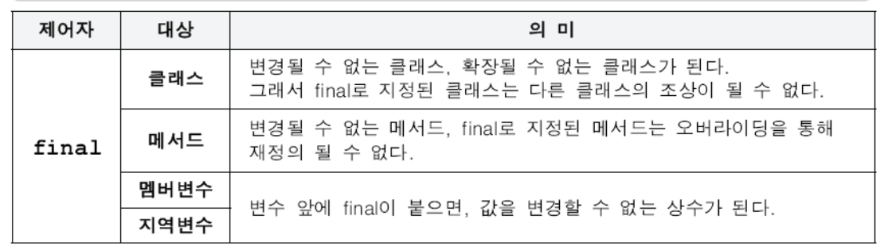
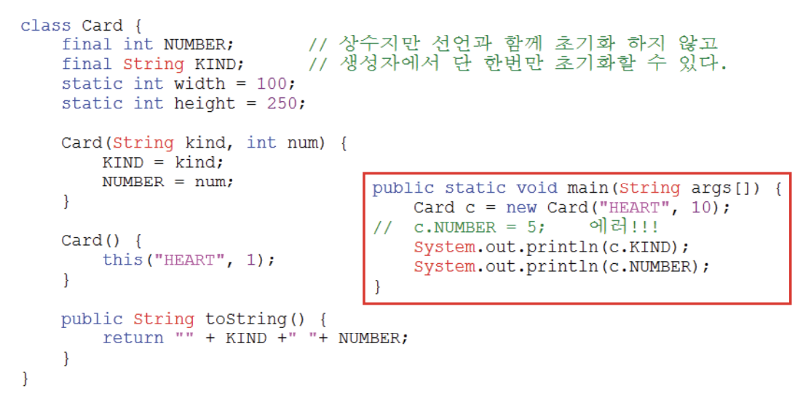

# 4. 제어자(modifiers)

## 4.1 제어자란?
- 클래스, 변수, 메서드의 선언부에 사용되어 부가적인 의미를 부여한다.
- 제어자는 크게 접근 제어자와 그 외의 제어자로 나뉜다.
- 하나의 대상에 여러 개의 제어자를 조합해서 사용할 수 있으나, 접근제어자는 단 하나만 사용할 수 있다.

* 접근제어자 - public, protected, default, private
* 그 외 - static, final, abstract, native, transient, synchronized, volatile, strictfp

## 4.2 static - 클래스의, 공통적인
- static이 사용될 수 있는 곳 - 멤버변수, 메서드, 초기화 블럭

```
class StaticTest {
    static int width = 200;
    static int height = 120;

    static { // 클래스 초기화 블럭
    // static변수의 복잡한 초기화 수행
    }

    static int max(int a, int b) {
        return a > b ? a : b;
    }
}
```
## 4.3 final 마지막의, 변경될 수 없는
- final이 사용될 수 있는 곳 - 클래스, 메서드, 멤버변수, 지역변수


```
// 대표적인 final클래스로는 String과 Math가 있다.
final class FinalTest {
    final int MAX_SIZE = 10; // 멤버변수

    final void getMaxSize() {
        final int LV = MAX_SIZE; // 지역변수
        return MAX_SIZE;
    }
}

class Child extends FinalTest {
    void get MaxSize() {} // 에러, 오버라이딩 불가
}
```

## 4.4 생성자를 이용한 final 멤버변수 초기화
- final이 붙은 변수는 상수이므로 보통은 선언과 초기화를 동시에 하지만, 인스턴스마다 고정값을 갖는 인스턴스 변수의 경우 생성자에서 초기화한다.
(카드의 무늬와 숫자는 한번 결정되면 바뀌지 않아야하는 경우)



## 4.5 abstract - 추상의, 미완성의
- abstract가 사용될 수 있는 곳 - 클래스, 메서드


## 4.6 접근 제어자


## 4.7 접근 제어자를 이용한 캡슐화

## 4.8 생성자의 접근 제어자

## 4.9 제어자의 조합

1. 메서드에 statc과 abstract를 함께 사용할 수 없다.
- static메서드는 몸통(구현부)이 있는 메서드에만 사용할 수 있기 때문이다.
2. 클래스에 abstract와 final을 동시에 사용할 수 없다.
- 클래스에 사용되는 final은 클래스를 확장할 수 없다는 의미이고, abstract는 상속을 통해서 완성되어야 한다는 의미이므로 서로 모순되기 때문이다.
3. abstract메서드의 접근제어자가 private일 수 없다.
-abstract메서드는 자손클래스에서 구현해주어야 하는데 접근 제어자가 private이면, 자손클래스에서 접근할 수 없기 때문이다.
4. 메서드에 private와 final을 같이 사용할 필요는 없다.
- 접근 제어자가 private인 메서드는 오버라이딩될 수 없기 때문이다. 이 둘 중 하나만 사용해도 의미가 충분하다.

---

# 5. 다형성(polymorphism)

## 5.1 다형성이란?
- 여러 가지 형태를 가질 수 있는 능력
- 하나의 참조변수로 여러 타입의 객체를 참조할 수 있는 것, 즉 조상타입의 참조변수로 자손타입의 객체를 다룰 수 있는 것이 다형성


- 조상타입의 참조변수로 자손타입의 인스턴스를 참조할 수 있지만, 반대로 자손타입의 참조변수로 조상타입의 인스턴스를 참조할 수는 없다.


## 5.2 참조변수의 형변환
- 서로 상속관계에 있는 타입간의 형변환만 가능하다.
- 자손 타입에서 조상타입으로 형변환하는 경우, 형변환 생략가능


## 5.3 instanceof연산자
- 참조변수가 참조하는 인스턴스의 실제 타입을 체크하는데 사용.
- 이항연산자이며 피연산자는 참조형 변수와 타입. 연산결과는 true, false
- instancesof의 연산결과가 true이면, 해당 타입으로 형변환이 가능하다.


## 5.4 참조변수와 인스턴스 변수의 연결
- 멤버변수가 중복정의된 경우, 참조변수의 타입에 따라 연결되는 멤버변수가 달라진다. (참조변수타입에 영향받음)

- 메서드가 중복정의된 경우, 참조변수의 타입에 관계없이 항상 실제 인스턴스의 타입에 정의된 메서드가 호출된다. (참조변수타입에 영향받지 않음)


## 5.5 매개변수의 다형성
- 참조형 매개변수는 메서드 호출시, 자신과 같은 타입 또는 자손타입의 인스턴스를 넘겨줄 수 있다.


## 5.6 여러 종류의 객체를 하나의 배열로 다루기
- 조상타입의 배열에 자손들의 객체를 담을 수 있다.


---
---

# 6. 추상클래스(abstract class)
## 6.1 추상클래스(abstract class)란?
- 클래스가 설계도라면 추상클래스는 '미완성 설계도'
- 추상메서드(미완성 메서드)를 포함하고 있는 클래스
    * 추상메서드 : 선언부만 있고 구현부(몸통, body)가 없는 메서드
```
abstract class Player {
    int currentPos; // 현재 Play되고 있는 위치를 저장하기 위한 변수

    Player() { // 추상클래스도 생성자가 있어야 한다.
        currentPos = 0;
    }

    abstract void play(int pos); // 추상메서드
    abstract void stop(); // 추상메서드

    void play() {
        play(currentPos); // 추상메서드를 사용할 수 있다.
    }
    ...
}
```

- 일반메서드가 추상메서드를 호출 할 수 있다.(호출할 때 필요한 건 선언부)
- 완성된 설계도가 아니므로 인스턴스를 생성할 수 없다.
- 다른 클래스를 작성하는 데 도움을 줄 목적으로 작성된다.


## 6.2 추상메서드(abstract method)란?
- 선언부만 있고 구현부(몸통, body)가 없는 메서드
```
/* 주석을 통해 어떤 기능을 수행할 목적으로 작성하였는지 설명한다 */
abstract 리턴타입 메서드이름() ;

Ex
/* 지정된 위치(pos)에서 재생을 시작하는 기능이 수행되도록 작성한다. */
abstract void play(int pos);
```

- 꼭 필요하지만 자손마다 다르게 구현될 것으로 예상되는 경우에 사용
- 추상클래스를 상속받는 자손클래스에서 추상메서드의 구현부를 완성해야 한다.

```
abstract class Player {
    ...
    abstract void play(int pos); // 추상메서드
    abstract void stop(); // 추상메서드
    ...
}

class AudioPlayer extends Player {
    void play(int pos) { /* 내용 생략 */ }
    void stop() { /* 내용 생략 */ }
}

abstract class AbstractPlayer extends Player {
    void play(int pos) { /* 내용 생략 */ }
}


```

## 6.3 추상클래스의 작성
- 여러 클래스에 공통적으로 사용될 수 있는 추상클래스를 바로 작성하거나 기존클래스의 공통 부분을 뽑아서 추상클래스를 만든다.

---

# 7. 인터페이스(interface)
## 7.1 인터페이스(interface)란?
- 일종의 추상클래스. 추상클래스(미완성 설계도)보다 추상화 정도가 높다.
- 실제 구현된 것이 전혀 없는 기본 설계또.(알맹이 없는 껍데기)
- 추상메서드와 상수만을 멤버로 가질 수 있다.
- 인스턴스를 생성할 수 없고, 클래스 작성에 도움을 줄 목적으로 사용된다.
- 미리 정해진 규칙에 맞게 구현하도록 표준을 제시하는 데 사용된다.


## 7.2 인터페이스의 작성
- 'class'대신 'interface'를 사용한다는 것 외에는 클래스 작성과 동일하다.
```
interface 인터페이스이름 {
    public static final 타입 상수이름 = 값;
    public abstract 메서드이름(매개변수목록);
}
```
- 하지만, 구성요소(멤버)는 추상메서드와 상수만 가능하다.
    - 모든 멤버변수는 public static final 이어야 하며, 이를 생략할 수 있다.
    - 모든 메서드는 public abstract 이어야 하며, 이를 생략 할 수 있다.
```
interface PlayingCard {
    public static final int SPADE = 4;
    final int DIAMOND = 3; // public static final int DIAMOND = 3;
    static int HEART = 2; // public static final int HEART = 2;
    int CLOVER = 1; // public static final int CLOVER = 1;

    public abstract String getCardNumber();
    String getCardKind(); // public abstract String getCardKind();
}

```
## 7.3 인터페이스의 상속
- 인터페이스도 클래스처럼 상속이 가능하다.(클래스와 달리 다중상속 허용)
```
interface Movable {
    /** 지정된 위치(x, y)로 이동하는 기능의 메서드 */
    void move (int x, int y);
}

interface Attackable {
    /** 지정된 대상(u)을 공격하는 기능의 메서드 */
    void attack(Unit u);
}

interface Fightable extends Movable, Attackable {}
```
- 인터페이스는 Object클래스와 같은 최고 조상이 없다.

## 7.4 인터페이스의 구현
- 인터페이스를 구현하는 것은 클래스를 상속받는 것과 같다. 다만, 'extends' 대신 'implements'를 사용한다.

```
class 클래스이름 implements 인터페이스이름 {
    // 인터페이스에 정의된 추상메서드를 구현해야한다.
}
```
- 인터페이스에 정의된 추상메서드를 완성해야 한다.

- 상속과 구현이 동시에 가능하다.
```
class Fighter extends Unit implements Fightable {
    public void move(int x, int y) { /* 내용생략 */ }
    public void attack(Unit u) { /* 내용 생략*/ {}}
}
```
## 7.5 인터페이스를 이용한 다형성

## 7.6 인터페이스의 장점
1. 개발시간을 단축시킬 수 있다.
- 일단 인터페이스가 작성되면, 이를 사용해서 프로그램을 작성하는 것이 가능하다. 메서드를 호출하는 쪽에서는 선언부만 알면 되기 때문이다.

- 동시에 다른 한 쪽에서는 인터페이스를 구현하는 클래스를 작성하도록 하여, 인터페이스를 구현하는 클래스가 작성될 때까지 기다리지 않고 양쪽에서 동시에 개발을 진행할 수 있다.

2. 표준화가 가능하다.
- 프로젝트에 사용되는 기본 틀을 인터페이스로 작성한 다음, 개발자들에게 인터페이스를 구현하여 프로그램을 작성하도록 함으로써 보다 일관되고 정형화된 프로그램의 개발이 가능하다.

3. 서로 관계없는 클래스들에게 관계를 맺어 줄 수 있다.
- 서로 상속관계에 있지도 않고, 같은 조상클래스를 가지고 있지 않은 서로 아무런 관계도 없는 클래스들에게 하나의 인터페이스를 공통적으로 구현하도록 함으로써 관계를 맺어 줄 수 있다.

4. 독립적인 프로그래밍이 가능하다.
- 인터페이스를 이용하면 클래스의 선언과 구현을 분리시킬 수 있기 때문에 실제구현에 독립적인 프로그램을 작성하는 것이 가능하다.

- 클래스와 클래스간의 직접적인 관계를 인터페이스를 이용해서 간접적인 관계로 변경하면, 한 클래스의 변경이 관련된 다른 클래스에 영향을 미치지 않는 독립적인 프로그래밍이 가능하다.

## 7.7 인터페이스의 이해

* 인터페이스는
- 두 대상(객체) 간의 '연결, 대화, 소통'을 돕는 '중간 역할'을 한다.
- 선언(설계)와 구현을 분리시키는 것을 가능하게 한다.


* 인터페이스를 이해하려면 먼저 두 가지를 기억하자.
- 클래스를 사용하는 쪽(User)와 클래스를 제공하는 쪽(Provider)이 있다.
- 메서드를 사용(호출)하는 쪽(User)에서는 사용하려는 메서드(Provider)의 선언부만 알면 된다.


## 7.8 디폴트 메서드(default method)
- 인터페이스에 새로운 메서드(추상 메서드)를 추가하면? 이 인터페이스를 구현한 기존의 모든 클래스가 이 메서드를 구현해야 함
- 이 문제를 해결하기 위해 '디폴트 메서드'를 고안
- 디폴트 메서드는 추상 메서드의 기본 구현을 제공한다. 그래서 몸통{}을 가지고 있으며, 앞에 'default' 를 붙이고 항상 public이다.(생략 가능)


---

# 내부 클래스(inner class)
## 8.1 내부 클래스(inner class)란?
- 클래스 안에 선언된 클래스
- 특정 클래스 내에서만 주로 사용되는 클래스를 내부 클래스로 선언한다.
- GUI어플리케이션(AWT, Swing)의 이벤트처리에 많이 사용된다.


* 내부 클래스의 장점
- 내부 클래스에서 외부 클래스의 멤버들을 쉽게 접근할 수 있다.
- 코드의 복잡성을 줄일 수 있다.(캡슐화)

## 8.2 내부 클래스의 종류와 특징
- 내부 클래스의 종류는 변수의 선언위치에 따른 종류와 동일하다.
- 유효범위와 성질도 변수와 유사하므로 비교해보면 이해하기 쉽다.


## 8.3 내부 클래스의 제어자와 접근성
- 내부 클래스의 접근제어자는 변수에 사용할 수 있는 접근제어자와 동일하다.


- static클래스만 static멤버를 정의할 수 있다.


-내부 클래스도 외부 클래스의 멤버로 간주되며, 동일한 접근성을 갖는다.


- 외부 클래스의 지역변수는 final이 붙은 변수(상수)만 접근가능하다. 지역 클래스의 인스턴스가 소멸된 지역변수를 참조할 수 있기 때문이다.
```
class Outer {
    private int outerIv = 0;
    static int outerCv = 0;

    class instanceInner {
        int iiv = outerIv; // 외부 클래스의 private멤버도 접근가능하다.
        int iiv2 = outerCv;
    }

    static class StaticInner {
        // 스태틱 클래스는 외부 클래스의 인스턴스멤버에 접근할 수 없다.
        // int siv = outerIv;
        static int scv = outerCv;
    }

    void myMeethod() {
        int Iv = 0;
        final int LV = 0; // JDK1.8부터 final 생략 가능

        class LocalInner {
            int liv = outerIv;
            int liv2 = outerCv;

            // 외부클래스의 지역변수를 final이 붙은 변수(상수)만 접근가능하다.
            // int liv3 = lv; // 에러!!!(JDK1.8부터 에러 아님)
            int liv4 = LV; // OK
        }
    }
}
```


## 8.4 익명 클래스(anonymous class)
- 이름이 없는 일회용 클래스. 선언과 생성을 동시에, 하나의 객체만 생성가능
```
new 조상클래스이름() {
    // 멤버 선언
}

또는

new 구현인터페이스이름() {
    // 멤버 선언
}
```

