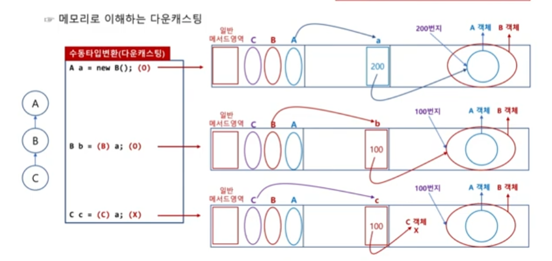

# 클래스의 상속과 다형성

## 클래스 상속의 개념과 문법적 특징

### 상속의 개념
클래스 상속은 부모 클래스의 멤버(필드, 메서드, 이너 클래스)를 내려받아 자식 클래스 내부에 포함시키는 문법 요소입니다.

> UML(unified modeling language)로 상속을 표시할 때는 화살표를 부모 클래스 쪽으로 향하게 그립니다.


### 상속의 장점
상속의 장점은 `코드의 중복성이 제거`되는 점과 `클래스의 다형적 표현이 가능`하다는 점이 있습니다.

- 사실 코드의 중복성 제거로 얻을 수 있는 장점은 그리 크지 않습니다.
실제 개발을 하다 보면 코드 중복을 해결하기 위해 상속을 하는 것보다 간단한 코드들은 각각의 클래스에 넣어 작성하는 것이 오히려 개발 속도도 빠르고 효율적일 때가 많습니다.

- 1개의 객체를 여러 가지 모양으로 표현할 수 있는 특성을 `다형성(polymorphism)`이라고 합니다.

예를 들어 사과, 포도, 키위 클래스를 만들고 각각의 객체를 만들어 배열로 관리하고자 한다면 배열은 같은 자료형만 저장할 수 있으므로 각각의 자료형을 따로 만들어 관리해야 합니다.  (여기서 과일이 추가된다면 새로운 자료형을 만들어줘야 합니다.)

```java
// 3개의 서로 다른 과일 배열 자료형
사과[] apple = {new 사과(), new 사과()};
포도[] grape = {new 포도(), new 포도()};
키위[] kiwi = {new 키위(), new 키위()};
```

하지만 사과, 포도, 키위는 모두 과일이기 때문에 과일이라는 부모 클래스를 만들어 상속시키면 `다형적 표현`을 할 수 있게 됩니다.

```java
과일 fruit1 = new 사과();   // 사과는 과일이다.
과일 fruit2 = new 포도();   // 포도는 과일이다.
과일 fruit3 = new 키위();   // 키위는 과일이다.
```

따라서 각각의 과일로 생성한 객체를 모두 과일이라 부를 수 있게 되므로 모든 객체를 과일 배열 하나로 관리할 수 있게 됩니다.

```java
// 1개의 배열 자료형으로 여러 과일 객체 저장
과일[] fruits = {new 사과(), new 사과(), new 포도(), new 포도(), new 키위(), new 키위()}
```

- 자바의 상속으로 다형적 표현을 할 수 있게 되었고, 다형적 표현의 사용으로 위와 같은 장점이 있습니다.


### 상속 문법
클래스를 상속할 때는 `extends` 키워드를 사용합니다.

```java
// 클래스 상속
class 자식 클래스 extends 부모 클래스 {
    ...
}
```

또한 부모 클래스의 멤버값은 당연히 자식 클래스에서 사용 가능합니다.

`자바는 모호성(ambiguous)이 발생하기 때문에 다중 상속이 불가능합니다.`
예를 들어 클래스 A와 B를 상속받은 C가 있습니다.
여기서 각각 `A클래스의 필드 d = 3`과 `B클래스의 필드 d = 5`가 있다고 가정할 경우, 클래스를 상속받은 C는 d의 필드를 가지지만 어떤 값을 가져야 되는지 알 수 없기 때문입니다.

> Python의 경우 `MRO: 메소드 해결 순서(Method Resolution Order)` 매직 메서드가 있어, 다중 상속이 가능합니다.


### 상속할 때의 메모리 구조
클래스 영역에는 선언된 자료형의 클래스와 그 부모 클래스가 모두 로딩됩니다.
이때 참조 변수는 자식 클래스 자료형으로 선언하기 때문에 자식 클래스의 객체를 가리키게 되고, JVM은 자식 클래스의 객체를 생성할 때 가장 먼저 부모 클래스의 객체를 생성하게 됩니다.
이후 자식 클래스에서 추가한 필드와 메서드가 객체에 추가됨으로써 전체 객체가 완성이 됩니다.

즉, 자식 클래스 객체의 내부에는 부모 클래스 객체가 포함되어 있으므로 자식 클래스 객체에서 부모 클래스의 멤버를 사용할 수 있는 것입니다.

### 생성자의 상속 여부
상속을 수행하면 부모 클래스의 모든 멤버를 내려받습니다.
생성자는 자식 클래스로 상속되지 않으며 자바 문법상 절대로 상속되어서는 안 됩니다.

```java
class A {
    A() {
        ...
    }
    ...
}

class B extends A {
    A() {}  // 문법 오류
}
```

이전에도 언급했듯이 클래스 내부에는 필드, 메서드, 생성자, 이너 클래스 이외에 문법은 올 수 없습니다.
위 예제 코드에서 B 클래스를 보면 우선 `A() {}`는 소괄호와 중괄호가 있기에 필드는 아닙니다.
그다음, 생성자로 보기에는 클래스와 이름이 동일하지 않아서 제외되고 클래스나 메서드로 보자니 반환값이 없어서 제외됩니다.


## 객체의 타입 변환
기본 자료형에서도 언급했듯이 자바 프로그램은 등호(=)를 중심으로 항상 왼쪽과 오른쪽의 자료형이 일치해야 합니다.
만일 자료형이 서로 다르다면 컴파일러가 자동으로 타입을 변환해 주거나 개발자가 직접 명시적으로 타입을 변환해 줘야 합니다.

객체에서도 이러한 타입 변환이 일어나며 이를 각각 업캐스팅과 다운캐스팅이라고 합니다.

### 객체의 업캐스팅과 다운캐스팅
기본 자료형에서 업캐스팅은 범위가 좁은 쪽에서 넓은 쪽으로 캐스팅하는 것을 말하며, 다운캐스팅은 그 반대입니다.
객체는 자식 클래스에서 부모 클래스 쪽으로 변환되는 것이 업캐스팅이라 하고, 그 반대가 다운 캐스팅입니다.

객체는 항상 업캐스팅할 수 있으므로 명시적으로 적어 주지 않아도 컴파일러가 대신 넣어 주지만, 다운 캐스팅은 개발자가 직접 명시적으로 넣어줘야 합니다.

또한, 기본 자료형의 경우 다운 캐스팅할 때는 넓은 범위의 값이 좁은 범위로 바뀌기 때문에 오차가 발생해도 문법적으로 항상 가능했지만, 객체는 명시적으로 적어 준다고 해도 다운 캐스팅 자체가 안될 때가 있습니다.

잘못된 다운 캐스팅을 수행하면 문법적으로 오류가 발생하지 않지만, 실행 이후 실제 캐스팅 과정에서 ClassCastException이라는 예외가 발생하고 프로그램이 종료됩니다.

| 업 캐스팅   	| 학생은 사람이다. 	| 항상 O.                                      	|
|-------------	|------------------	|----------------------------------------------	|
| 다운 캐스팅 	| 사람은 학생이다. 	| 학생인 사람이라면 O 학생이 아닌 사람이라면 X 	|


```java
class A {}
class B extends A {}
class C extends B {}
```


```java
// 자동 타입 변환(업 캐스팅)
B b1 = new B();
A a1 = b1;  // (A) 컴파일러가 자동으로 추가

C c2 = new C();
B b2 = c2  // (A) 컴파일러가 자동으로 추가 
A a2 = c2  // (A) 컴파일러가 자동으로 추가
```

```java
// 수동 타입 변환(다운 캐스팅)
A a1 = new A();
B b1 = a1;  // 예외 발생

A a2 = new B();
B b2 = a2;  // (O)
C c2 = a2;  // 예외 발생
```

다소 복잡해 보이지만 캐스팅의 가능 여부는 `무슨 타입으로 선언되어 있는지가 중요하지 않으며, 어떤 생성자로 생성되었는지가 중요`합니다.

실제로 생성된 객체의 위쪽(업 캐스팅 방향)에 있는 모든 클래스 타입으로는 항상 캐스팅을 할 수 있습니다.


### 메모리로 이해하는 다운캐스팅
메모리에서의 동작만 잘 이해하면 캐스팅의 가능 여부뿐 아니라 선언된 타입에 따른 차이점까지 한 번에 파악할 수 있습니다.
이전과 동일하게 `A <- B <- C`의 상속 관계일 때, `A a = new B()`일 경우 실제 객체는 B() 생성자로 만들어졌습니다.
앞서 상속에서 설명했듯이 자식 클래스의 생성자를 호출하면 부모 클래스의 객체를 먼저 생성한다고 했으므로 A 객체가 먼저 메모리에 만들어지고, 이후 B 객체가 만들어집니다.



위 이미지를 보면 객체를 A 타입의 참조 변수로 가리키고 있습니다(A a).
이때 실제 참조 변수는 힙 메모리의 B 객체 안에 있는 A 객체를 가리키게 됩니다.  이는 매우 중요합니다.
`선언된 타입이 의미하는 바는 실제 객체에서 자신이 선언된 타입의 객체를 가리키게 되는 것`입니다.

이제 B b = (B) a와 같이 A 타입의 a를 B 타입으로 캐스팅해 B 타입으로 저장하고자 합니다.  즉, a는 A 객체를 가리켰지만, (B) a는 B객체를 가리켜야 하는 것입니다.  힙 메모리에는 이미 B 객체가 있으므로 B 타입을 가리키는 것이 전혀 문제가 없습니다.

반면에 C c = (C) a와 같이 C 타입으로 캐스팅을 한다면, 참조 변수 c는 이제 C 타입을 가리켜야 하는데, 힙 메모리에는 C 타입 객체가 만들어진 적이 없기 때문에 다운캐스팅할 수 없습니다.

> 따라서 이와 같은 이유로 캐스팅의 가능 여부를 확인하기 위해 실제 어떤 생성자로 만들었는지가 중요했던 것입니다.


### 선언 타입에 따른 차이점

```java
class A {
    int m = 3;
    void abc() {
        System.out.println("A");
    }
}

class B extends A {
    int n = 4;
    void bcd() {
        System.out.println("B");
    }
}
```

위 코드를 B 타입과 A 타입으로 각각 선언했을 때의 차이를 알아보겠습니다.

```java
// B의 객체를 B 타입으로 선언했을 때
B b = new B();
System.out.println(b.m);    // O
System.out.println(b.n);    // O
b.abc();                    // O
b.bcd();                    // O
```

B() 생성자로 생성했으므로 힙 메모리에는 A 객체를 감싸고 있는 B 객체가 만들어졌기 때문에 A 클래스 필드와 B 클래스 필드, 모두를 사용할 수 있습니다.

```java
// B의 객체를 A 타입으로 선언했을 때
A a = new B();
System.out.println(a.m);    // O
System.out.println(a.n);    // X
a.abc();                    // O
a.bcd();                    // X
```

B() 생성자로 객체를 생성한 것은 동일하므로 힙 메모리에 생성되는 객체의 모양은 동일할 것입니다.
하지만, 참조 변수가 A 타입으로 선언되어 있으므로 실제로 힙 메모리에 B 객체가 있더라도 참조 변수 a는 A 객체만을 가리켜 A 클래스 필드만 사용할 수 있습니다.


### 캐스팅 가능 여부를 확인하는 instanceof 키워드
캐스팅 여부를 확인하기 위해서는 실제 객체를 어떤 생성자로 만들었는지와 클래스 사이의 상속 관계를 알아야 합니다.
하지만, 프로젝트 규모가 커지거나 다른 개발자가 만든 클래스를 사용할 때는 이런 정보를 일일이 알 수 없기 때문에, 이를 위해 자바는 캐스팅 가능 여부를 불리언 타입으로 확인할 수 있는 문법 요소를 제공하고 있습니다.

```java
// 캐스팅 가능 여부 확인
참조 변수 instanceof 타입     // true: 캐스팅 가능 / false: 캐스팅 불가능
```

여기서 instanceof 뒤의 타입은 참조 변수가 표현될 수 있는 모든 다형적 타입을 의미합니다.  예를 들어 `A <- B <- C`의 상속 구조는 아래와 같습니다.

```java
C c = new C();
System.out.println(c instanceof A);  // true
System.out.println(c instanceof B);  // true
system.out.println(c instanceof C);  // true
```

이렇게 instanceof 키워드를 사용하면 상속 관계나 객체를 만든 생성자를 직접 확인하지 않고도 캐스팅 가능 여부를 확인할 수 있습니다.
따라서 잘못된 캐스팅에 따른 실행 예외(ClassCastException)로 프로그램이 종료되는 것을 방지하고, 캐스팅 여부를 확인하고 가능할 때 수행합니다.


## 메서드 오버라이딩

### 메서드 오버라이딩의 개념과 동작
`메서드 오버라이딩(overriding)`은 부모 클래스에게 상속받은 메서드와 동일한 이름의 메서드를 재정의하는 것으로, 부모의 메서드를 자신이 만든 메서드로 덮어쓰는 개념입니다.

- 부모 클래스의 메서드와 시그니처(메서드 명, 입력매개변수의 타입과 개수) 및 리턴 타입이 동일해야 합니다.

- 부모 클래스의 메서드보다 접근 지정자의 범위가 같거나 넓어야 합니다.

```java
// 클래스 A와 B의 상속 관계 및 print() 메서드의 오버라이딩
class A {
    void print() {
        System.out.println("A 클래스");
    }
}

class B extends A {
    void print() {
        System.out.println("B 클래스");
    }
}
```

위 코드를 보면 A 클래스와 B 클래스 각각 print() 메서드가 있는 것으로 보아 자식 클래스에서 오버라이딩 한 것을 확인할 수 있습니다.

`B bb = new B()`로 객체를 생성하게 되면, 이전에 언급되었듯이 부모 클래스 객체가 먼저 생성되고, 이때 메서드 영역에 print()가 정의됩니다.
이후, 자식 클래스가 생성되면서 메서드 영역에 print() 메서드를 덮어쓰는, 즉 오버라이딩하게 되는 것입니다.

> 오버라이딩을 개념상 덮어쓰기라고 설명하고 있지만, 사실 덮어쓰기와 오버라이딩은 차이가 있습니다.
덮어쓰기는 이전 파일이 완전히 삭제되고 새로운 파일로 바뀌는 것이고, 오버라이딩은 이전에 메서드 위에 새로운 메서드가 올라(over) 타고(riding) 있다고 생각하면 됩니다.
그래서 원할 때 밑에 깔려 있는 부모 메서드도 호출할 수 있습니다.

> 객체 내에 동일한 필드 또는 동일한 메서드가 있을 때, 참조 변수가 가리키는 객체의 바깥쪽부터 안쪽으로 들어가면서 만나는 첫 번째 멤버가 실행됩니다.

여기서 만약 `A ab = new B()`로 객체를 생성하게 된다면, A 타입의 참조 변수를 사용하고 있으므로 참조 변수는 A 객체를 가리키고 있습니다.
하지만 B() 생성자(자식 클래스)로 객체가 순서적으로 만들어지면서 이미 오버라이딩이 되어 있는 메서드를 사용하게 됩니다.


### 메서드 오버라이딩을 사용하는 이유

```java
class Animal {
    void cry() {

    }
}

class Bird extends Animal {
    void cry() {
        System.out.println("쨱쨱");
    }
}

class Cat extends Animal {
    void cry() {
        System.out.println("야용");
    }
}

class Dog extends Animal {
    void cry() {
        System.out.println("멍멍");
    }
}
```

위 코드를 예시로 다형적 표현으로 각각의 자식 클래스 타입으로 객체를 생성하고, 이를 부모 클래스 타입으로 선언하면 아래와 같습니다.

```java
Animal ab = new Bird();
Animal ac = new Cat();
Animal bc = new Dog();

ab.cry();   // 짹짹
ac.cry();   // 야옹
bc.cry();   // 멍멍
```

각각 서로 다른 메서드로 오버라이딩 된 cry() 메서드의 서로 다른 출력 결과를 볼 수 있습니다.  여기서 꼭 알아야 할 것은 Animal 클래스 내부에 아무런 기능도 수행하지 않는 cry() 메서드가 있는 이유는 `다형적 표현으로 자식 클래스들의 객체를 부모 클래스인 Animal 타입으로 선언할 수는 있지만, 이렇게 되면 Animal 내부의 메서드만 사용할 수 있습니다.  즉, 만약 Animal 클래스 내부에 cry() 메서드가 없었다면, 어떤 참조 변수도 cry() 메서드를 호출할 수 없을 것입니다.` 이것이 아무런 기능도 수행하지 않는데도 Animal 클래스 내부에 cry() 메서드를 넣어둔 이유입니다.

이렇게 모든 객체를 부모 타입 하나로 선언하면 아래와 같이 배열로 한 번에 관리할 수 있다는 장점이 있습니다.

```java
Animal[] naimals = new Animal[] {new Bird(), new Cat(), new Dog()};
for (Animal animal: animals) {
    animal.cry();   //  짹짹, 야옹, 멍멍
}
```

> 부모 클래스의 선언한 cry() 메서드는 단순히 자식 클래스에서 호출하기 위한 용도입니다.
그렇다면 굳이 메서드의 원형을 지켜가면서 작성할 필요가 없을 것입니다.
그래서 나온 문법이 `추상 메서드(abstrack method)`입니다.


### 메서드오버라이딩과 메서드 오버로딩
간혹 메서드 오버라이딩(overriding)과 메서드 오버로딩(overloading)을 혼동할 때가 있습니다.

오버라이딩과 오버로딩을 폴더 내의 파일과 비교해 보면 오버라이딩은 파일명과 확장명이 완벽하게 동일한 파일을 같은 공간에 복사할 때 덮어쓰기가 수행되는 것이고, 반면 오버로딩은 파일명은 동일하지만 확장명이 다른(.jpg, .png, ...) 파일을 같은 폴더에 복사해 넣을 때입니다.

```java
class A {
    void print1() {
        System.out.println("A 클래스 print1");
    }
    void print2() {
        System.out.println("A 클래스 print2");
    }
}

class B extends A {
    void print1() {
        System.out.println("B 클래스 print1");
    }
    void print2(int a) {
        System.out.println("B 클래스 print2");
    }
}
```

> A 클래스를 상속받은 B 클래스 객체(`B bbc = new B()`)를 생성하게 되면 몇 개의 메서드를 사용할 수 있을까요?


### 메서드 오버라이딩과 접근 지정자
자식 클래스가 부모 클래스의 메서드를 오버라이딩할 때는 반드시 상속받은 메서드의 접근 지정자와 같거나 넓은 접근 지정자를 사용해야 합니다.

| 부모 클래스 메서드의 접근 지정자 	| 메서드 오버라이딩을 할 때 사용할 수 있는 접근 지정자 	|
|----------------------------------	|------------------------------------------------------	|
| public                           	| public                                               	|
| protected                        	| public, protected                                    	|
| default                          	| public, protected, default                           	|
| private                          	| public, protected, default, private                  	|


## 인스턴스 필드와 정적 멤버의 중복
인스턴스 필드와 정적 멤버(정적 필드와 정적 메서드)는 자식 클래스에서 동일한 이름으로 정의해도 오버라이딩 되지 않습니다.


### 인스턴스 필드의 중복
메서드 오버라이딩의 경우 같은 메서드 영역(공간)에서 생성되기 때문에 가능했지만, 각 클래스의 필드와 정적 멤버의 경우, 생성되는 공간의 위치가 다르기 때문에 오버라이딩이 되지 않습니다.

또한, 이전에도 언급했듯이 참조 변값이 가리키는 테두리부터 안쪽으로 가장 먼저 만나는 필드값을 출력합니다.

```java
class A {
    int m = 3;
}

class B extends A {
    int m = 4;
}
```

위 코드를 예시로 생성자가 B()이고 A 타입일 경우, A 객체를 가리키기 때문에 3의 값을 가진 A의 필드값을 사용합니다.
반면, 생성자가 B()이고, B 타입일 경우, B 객체를 가리키기 때문에 B 클래스의 필드값인 4가 나오게 됩니다.

```java
A a = new B();
System.out.println(a.m);    // 3

B b = new B();
System.out.println(b.m);    // 4
```


> `정적 필드와 정적 메서드의 중복`: 인스턴스 필드와 동일한 내용으로 정적 필드와 메서드 또한 저장 공간이 각 클래스 영역에 저장되기 때문에 오버라이딩이 발생되지 않습니다.


### 인스턴스 멤버와 정적 멤버의 중복 정리

| 멤버 종류           	| 인스턴스 필드  	| 인스턴스 메서드 	| 정적 필드      	| 정적 메서드    	|
|---------------------	|----------------	|-----------------	|----------------	|----------------	|
| 오버라이딩 여부     	| 오버라이딩 `(X)` 	| 오버라이딩 `(O)`  	| 오버라이딩 `(X)` 	| 오버라이딩 `(X)` 	|
| 값을 읽을 때의 기준 	| `A` a = new B(); 	| A a = new `B()`;  	| `A` a = new B(); 	| `A` a = new B(); 	|


## super 키워드와 super() 메서드
이전에 this. 키워드와 this() 메서드와 비교하자면 `this. 는 자신의 객체, this() 메서드는 자신의 생성자를 의미하고, super. 는 부모의 객체, super() 메서드는 부모의 생성자를 의미합니다.`

### 부모의 객체를 가리키는 super 키워드
super 키워드는 부모의 객체를 가리키는 것으로, 필드명의 중복 또는 메서드 오버라이딩으로 가려진 부모의 필드 또는 메서드를 호출하기 위해 사용됩니다.

```java
class A {
    void init() {
        // 메모리 할당, 화면 세팅, 변수 초기화 등의 코드 100줄
        // 화면 출력 코드 1줄
    }
}

class B extends A {
    void init() {
        super.init();
        // 다른 화면 출력 코드 1줄
    }
}
```

위와 같이 부모 클래스에서 작업된 100여 줄 이상의 코드를 재사용하여 다른 output을 내고 싶을 때 사용할 수 있습니다.


### 부모 클래스의 생성자를 호출하는 super() 메서드
this()와 마찬가지로 생성자의 내부에서만 사용할 수 있고, 반드시 첫 번째 줄에 작성해야 합니다.  this() 메서드도 생성자의 첫 줄에만 올 수 있으므로 이 둘은 1개의 생성자에 서 절대로 같이 사용할 수 없습니다.

만일 아무것도 작성하지 않으면 컴파일러는 super() 메서드를 자동으로 삽입합니다.
즉, 생성자를 호출할 때는 항상 부모 클래스의 생성자가 한 번은 호출된다는 것을 의미합니다.

```java
// super() 자동 추가 확인
class A {
    A(int a) {
        System.out.println("A 생성자");
    }
}

class B extends A {
    ...  // 오류 발생
}
```

위 코드의 경우 A 클래스는 입력매개변수를 1개 받는 생성자가 있고, 이를 상속받은 B 클래스는 아무것도 입력되어 있지 않습니다.
때문에 B 클래스의 생성자는 super() 메서드를 추가하게 되고, 이는 A 클래스의 생성자와 다르기 때문에 오류가 발생하게 됩니다.

> this() 메서드와 super() 메서드가 없다면 컴파일러는 super() 메서드를 추가합니다.

이를 해결하기 위해서는 2가지 방법이 있습니다.

첫 째는, 상속받은 B 클래스에서 생성자를 직접 작성하고 첫 줄에 super(3)과 같이 부모의 생성자를 명시적으로 호출해야 합니다.

둘 째는, 부모 클래스 내부에서 생성자를 각각 기본 생성자 A()와 실제 사용할 생성자 A(3)을 작성해 주는 방법이 있습니다.


## 최상위 클래스 Object
자바의 모든 클래스는 Object 클래스를 상속받습니다.  즉, Object 클래스는 자바의 최상위 클래스입니다.  실제로 컴파일러는 `아무런 클래스도 상속하지 않으면 자동으로 extends Object를 삽입해 Object 클래스를 상속`합니다.

따라서 자바의 모든 클래스는 어떤 객체로 만들든지 Object 타입으로 선언할 수 있게 됩니다.

```java
// 임의의 클래스를 Object 타입으로 선언하는 예
Object oa = new A();
Object ob = new B();
```

이는 정말 중요한 장점입니다.  자바 API에 포함되어 있는 println(Object x) 오버로딩은 사용자가 어떤 클래스 타입의 객체를 생성하더라도 다형성에 따라 Object 타입이라고 불릴 수 있으므로 입력매개변수로 모든 타입의 객체를 받아들일 수 있습니다.


### Object 클래스의 주요 메서드
Object 클래스의 대표적인 메서드는 아래와 같습니다.

| 반환 타입 	| 메서드 명                                               	| 주요 내용                                                                                                                              	|
|-----------	|---------------------------------------------------------	|----------------------------------------------------------------------------------------------------------------------------------------	|
| String    	| toString()                                              	| Object 객체의 정보 `패키지.클래스명@해시코드` 일반적으로 오버라이딩해서 사용                                                           	|
| boolean   	| equals(Object obj)                                      	| 입력매개변수 obj 객체와 stack 메모리값(번지) 비교 등가 비교 연산자 ==와 동일한 결과                                                    	|
| int       	| hashCode()                                              	| 객체의 hashCode() 값 리턴. Hashtable, HashMap 등의 동등 비교에 사용 위치값을기반으로 생성된 고윳값                                     	|
| void      	| wait() wait(long timeout) wait(long timeout, int nanos) 	| 현재의 쓰레드를 일시정지(waiting/timed-waiting) 상태로 전환 보통 notify() 또는 notifyAll()로 일시정지 해제 동기화 블록에서만 사용 가능 	|
| void      	| notify() notifyAll()                                    	| wait()를 이용해 일시정지 상태의 1개의 쓰레드(notify()) 또는 전체 쓰레드(notifyAll())의 일시정지 해제 동기화 블록에서만 사용 가능       	|


- `toString() - 객체 정보를 문자열로 출력`
Object 클래스의 toString() 메서드는 객체 정보를 문자열로 리턴하는 메서드입니다.
여기서 객체 정보는 `패키지명.클래스명@해시코드`로 나타납니다.

여기서 해시코드는 객체가 저장된 위치와 관련된 값입니다.

> hashCode()의 출력값은 정확한 객체의 위치값이 아니라 위치를 기반으로 생성된 고윳값정도로 이해합니다.

```java
class A {
    int a = 3;
    int b = 4;
}

A aa = new A();
System.out.println("%x\n", aa.hashCode());  // 70dea4e3
System.out.println(aa);                     // 패키지.클래스명@해시코드
```

println() 메서드는 객체를 출력하면 자동으로 객체 내의 toString() 메서드를 호출합니다.
또한, toString() 출력 결과인 패키지명.클래스명@해시코드는 직관적이지 않기 때문에 메서드 오버라이딩을 하여 사용하는 것이 일반적입니다.

```java
class B {
    int a = 3;
    int b = 4;
    @Override
    public String toString() {
        return "필드값: a = " + a + ", b = " + b;
    }
}
```


- `equals(Object obj) - 스택 메모리의 값 비교`
equals(Object obj)는 입력매개변수로 넘어온 객체와 자기 객체의 스택 메모리 변값을 비교해 그 결과를 true 또는 false로 리턴하는 메서드입니다.
기본 자료형이 아닌 객체의 스택 메모리값을 비교하므로 실제 데이터의 값이 아닌 실제 데이터의 위치(번지)를 비교하는 것입니다.
즉, 등가 비교 연산(==)과 완벽하게 동일한 기능을 수행합니다.

만일 실제 내용을 비교하고자 할 때는 equals() 메서드를 오버라이딩해서 사용해야 합니다.

```java
class B {
    String name;
    B(String name) {
        this.name = name;
    }
    @Override
    public boolean equals(Object obj) {
        if (obj instanceof B) {
            if (this.name == ((B) obj).name)
                return true;
        }
    }
}

B bb1 = new B("안녕");
B bb2 = new B("안녕");

System.out.println(bb1 == bb2);         // false
System.out.println(bb1.equals(bb2));    // true
```

- `hashCode() - 객체의 위치와 연관된 값`
hashCode() 메서드는 객체의 위치와 관련된 값으로, 실제 위치를 나타내는 값은 아니고 객체의 위값을 기준으로 생성된 고윳값 정도로 생각하는 것이 적절합니다.

Hashtable, HashMap 등에서 동등 비교를 하고자 할 때는 앞선 equals() 메서드와 같이 hashCode() 메서드까지 오버라이딩해야 합니다.

HashMap 자료 구조는 데이터를 (Key, value)의 쌍으로 저장하며, Key값은 중복되지 않습니다.

따라서 첫 번째로 비교하고자 하는 두 객체의 hashCode() 값을 비교하고, 동일하다면 equals() 메서드를 호출하여 동일하다면 같은 객체로 인식합니다.

> hashMap에서 Key와 value의 타입으로는 기본 자료형이 올 수 없습니다.
따라서 int 대신, int를 클래스 타입으로 포장한 클래스(Wrap-per Class)로 interger를 사용합니다.

```java
class A {
    String name;
    A(String name) {
        this.name = name;
    }
    @Override
    public boolean equals(Object obj) {
        if (obj instanceof A) {
            if (this.name == ((A) obj).name)
                return true;
        }
        return false;
    }
    @Override
    public String toString() {
        return name;
    }
}

class B {
    String name;
    B(String name) {
        this.name = name;
    }
    @Override
    public boolean equals(Object obj) {
        if (obj instanceof A) {
            if (this.name == ((A) obj).name)
                return true;
        }
        return false;
    }
    @Override
    public int hashCode() {
        return name.hashCode();
    }
    @Override
    public String toString() {
        return name;
    }
}
```

위 코드는 A 클래스는 equals() 메서드만 오버라이딩 했고, B 클래스는 equals() 메서드와 hashCode() 메서드를 오버라이딩 했습니다.

```java
HashMap<Integer, String> hm1 = new hashMap<>();
hm1.put(1, "데이터1");
hm1.put(1, "데이터2");
hm1.put(2, "데이터3");
System.out.println(hm1);        // {1=데이터2, 2=데이터3}


HashMap<A, String> hm2 = new HashMap<>();
hm2.put(new A("첫 번째"), "데이터1");
hm2.put(new A("첫 번째"), "데이터2");
hm2.put(new A("두 번째"), "데이터3");
System.out.println(hm2);        // {첫 번째=데이터2, 두 번째=데이터3, 첫 번째=데이터1}


HashMap<B, String> hm3 = new HashMap<>();
hm3.put(new B("첫 번째"), "데이터1");
hm3.put(new B("첫 번째"), "데이터2");
hm3.put(new B("두 번째"), "데이터3");
System.out.println(hm3);        // {첫 번째=데이터2, 두 번째=데이터3}
```

두 번째 생성 객체를 살펴보면 이전에 위에서 A 클래스에서는 equals() 메서드만 오버라이딩 하고, hashCode()는 오버라이딩 하지 않은 코드이기 때문에, new 키워드로 서로 다른 객체가 생성되어 중복되지 않고 값이 3개 모두 들어간 것을 확인할 수 있습니다.

반면 B 클래스의 경우 hashCode() 메서드를 오버라이딩할 때 `name`값을 기준으로 hashCode()가 생성이 되었고, 이는 같은 문자열이기 때문에 같은 hashCode()로 인하여 Key 중복이 제거된 것을 확인할 수 있습니다.

`Object의 hashCode() 메서드는 객체의 위치에 따른 고윳값을 리턴하고, Hash*** 형태의 자료 구조에서는 동등 비교를 위해 hashCode() 결괏값을 비교하므로 필요할 때마다 equals() 메서드와 함께 추가로 오버라이딩해야 한다는 것을 기억해야 합니다.`
