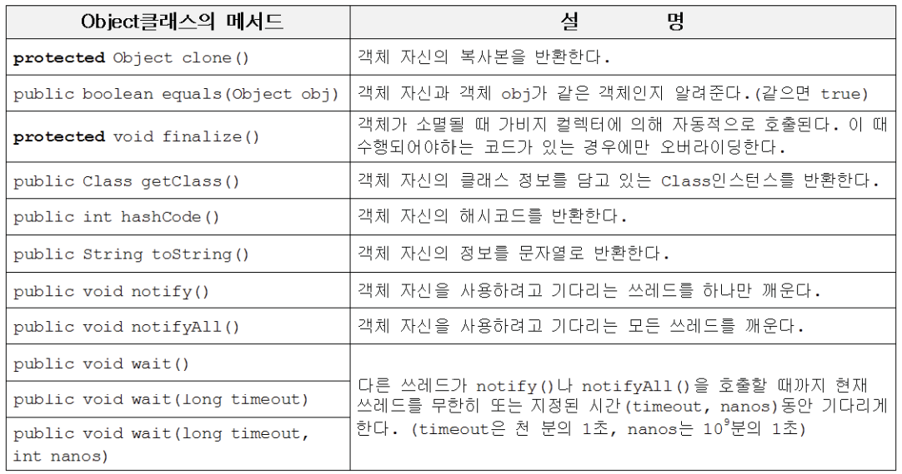
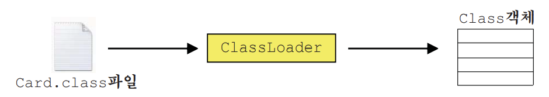

# 1. Object클래스
## 1.1 Object클래스의 메서드
- 모든 클래스의 최고 조상. 오직 11개의 메서드만을 가지고 있다.
- notify(), wait() 등은 쓰레드와 관련된 메서드이다.
- equals(), hashCode(), toString()은 적절히 오버라이딩해야 한다.


---

## 1.2 equals(Object obj)
- 객체 자신과 주어진 객체(obj)를 비교한다. 같으면 true, 다르면 false.
- Object클래스에 정의된 equals()는 참조변수 값(객체의 주소)을 비교한다.

```
public boolean equals(Object obj) {
    return (this==obj);
}
```

- equals()를 오버라이딩해서 인스턴스볍ㄴ수의 값을 비교하도록 바꾼다.


---

## 1.3 hashCode()

- 객체의 해시코드(int타입의 정수)를 반환하는 메서드(해시함수)다량의 데이터를 저장&검색하는 해싱기법에 사용된다.
- Object클래스의 hashCode()는 객체의 내부주소를 반환한다.
```
public class object {
    ...
    public native int hashCode();
}
```
- equals()를 오버라이딩하면, hashCode()도 같이 오버라이딩 해야 한다. equals()의 결과가 true인 두 객체의 hash code는 같아야하기 때문


- System.identityHashCode(Object obj)는 Object클래스의 hashCode()와 동일한 결과를 반환한다.


## 1.4 toString()
- 객체의 정보를 문자열(String)로 제공할 목적으로 정의된 메서드


## 1.5 getClass()
- 자신이 속한 클래스의 Class객체를 반환하는 메서드
- Class객체는 클래스의 모든 정보를 담고 있으며, 클래스당 단 1개만 존재 클래스파일(*.class)이 메모리에 로드될때 생성된다.

- Class객체를 얻는 여러가지 방법


# 2. String클래스
## 2.1 String클래스의 특징


---

## 2.2 빈 문자열(empty string)


---

## 2.3 String클래스의 생성자와 메서드


---

## 2.4 문자열과 기본형간의 변환


---

# 3. StringBuffer클래스
## 3.1 StringBuffer클래스의 특징


---

## 3.2 StringBuffer클래스의 생성자와 메서드


---

# 4. Math & wrapper클래스
## 4.1 Math클래스


---

## 4.2 wrapper클래스


---

## 4.3 Number클래스


---