# 예외처리(exception handling)
## 1.1 프로그램 오류
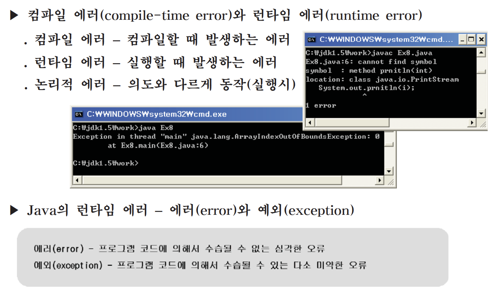

---

## 1.2 예외처리의 정의와 목적
- 에러(error)는 어쩔 수 없지만, 예외(exception)는 처리해야 한다.

```
에러(error) - 프로그램 코드에 의해서 수습될 수 없는 심각한 오류
예외(exception) - 프로그램 코드에 의해서 수습될 수 있는 다소 미약한 오류
```

- 예외처리의 정의와 목적

```
예외처리(exception handling)의
정의 - 프로그램 실행 시 발생할 수 있는 예외의 발생에 대비한 코드를 작성하는 것
목적 - 프로그램의 비정상 종료를 막고, 정상적인 실행상태를 유지하는 것
```
에러와 예외는 모두 실행 시(runtime) 발생하는 오류이다.

---

## 1.3 예외처리구문 - try-catch
- 예외를 처리하려면 try-catch문을 사용해야 한다.
```
try {
    // 예외가 발생할 가능성이 있는 문장들을 넣는다.
} catch (Exception1 e1) {
    // Exception이 발생했을 경우, 이를 처리하기 위한 문장을 적는다.
} catch (Exception2 e2) {
    // Exception2가 발생했을 경우, 이를 처리하기 위한 문장을 적는다.
    ...
} catch (ExceptionN eN) {
    // ExceptionN이 발생했을 경우, 이를 처리하기 위한 문장을 적는다.
}
```
if문과 달리 try블럭이나 catch블럭 내에 포함된 문장이 하나라고 해서 괄호{}를 생략할 수는 없다.

```
public static void main(String[] args)
{
    try {
        try {  } catch (Exception e) {
            //...
        }
    } catch (Exception e) {
        try {  } catch (Exception e) { // 컴파일 에러 발생!!!
        //...
        }
    } // try-catch의 끝
} // main메서드의 끝
```

---

## 1.4 try-catch문에서의 흐름
```
> try블럭 내에서 예외가 발생한 경우
1. 발생한 예외와 일치하는 catch블럭이 있는지 확인한다.
2. 일치하는 catch블럭을 찾게 되면, 그 catch블럭 내의 문장들을 수행하고 전체 try-catch문을 빠져나가서 그 다음 문장을 계속해서 수행한다. 만일 일치하는 catch블럭을 찾지 못하면, 예외는 처리되지 못한다.

> try블럭 내에서 예외가 발생하지 않은 경우,
1. catch블럭을 거치지 않고 전체 try-catch문을 빠져나가서 수행을 계속한다.

```
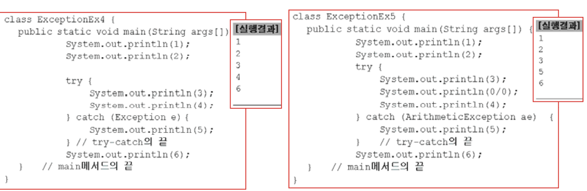

---

## 1.5 예외 발생시키기

```
1. 먼저, 연산자 new를 이용해서 발생시키려는 예외 클래스의 객체를 만든 다음
Excetion e = new Exception("고의로 발생시켰음");

2. 키워드 throw를 이용해서 예외를 발생시킨다.
throw e;
```

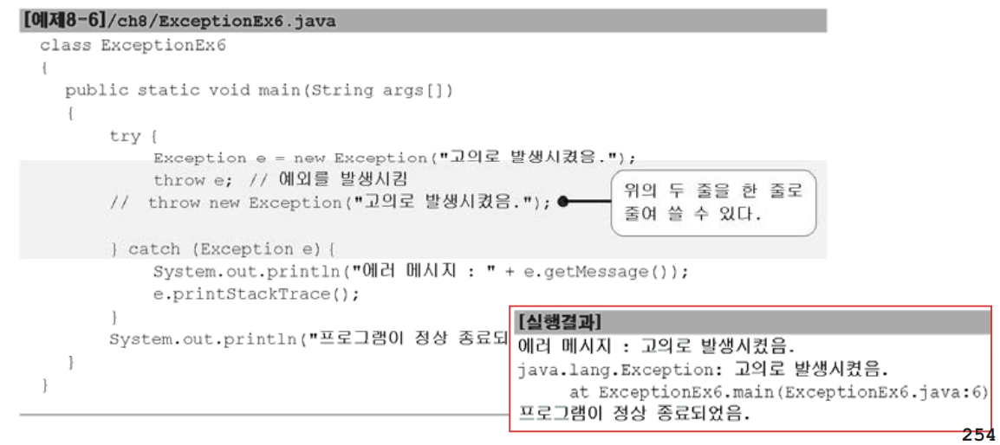

---


## 1.6 예외클래스의 계층구조
- 예외 클래스는 크게 두 그룹으로 나뉜다.
```
RuntimeException클래스들 - 프로그래머의 실수로 발생하는 예외 <- 예외처리 선택

Exception클래스들 - 사용자의 실수와 같은 외적인 요인에 의해 발생하는 예외 <- 예외처리 필수
```
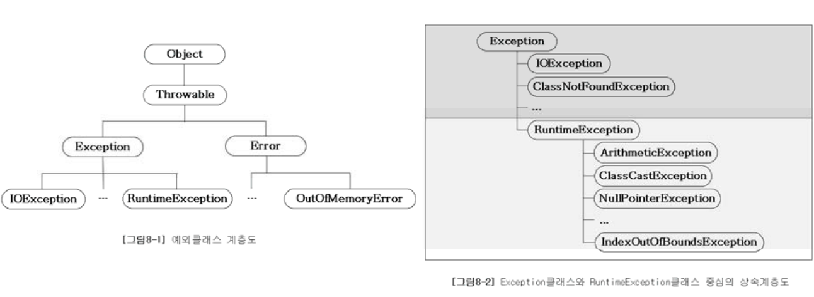
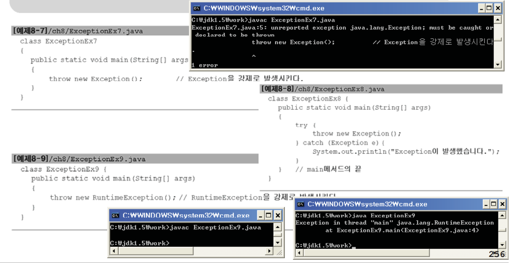

---


## 1.7 예외의 발생과 catch블럭

- try블럭에서 예외가 발생하면, 발생한 예외를 처리할 catch블럭응ㄹ 찾는다.
- 첫번째 catch블럭부터 순서대로 찾아 내려가며, 일치하는 catch블럭이 없으면 예외는 처리되지 않는다.
- 예외의 최고 조상인 Exception을 처리하는 catch블럭은 모든 종류의 예외를 처리할 수 있다.(반드시 마지막 catch블럭이어야 한다.)

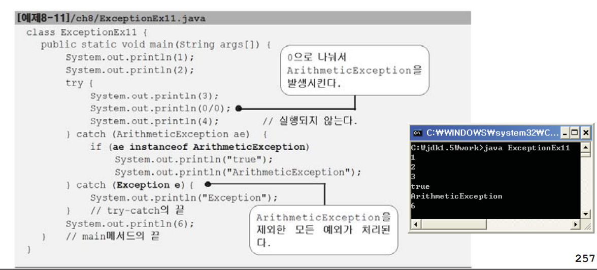

---

- 발생한 예외 객체를 catch블럭을 참조변수로 접근할 수 있다.
```
printStackTrace() - 예외발생 당시의 호출스택(Call Stack)에 있었던 메서드의 정보와 예외 메시지를 화면에 출력한다.
getMessage() - 발생한 예외클래스의 인스턴스에 저장된 메시지를 얻을 수 있다.
```

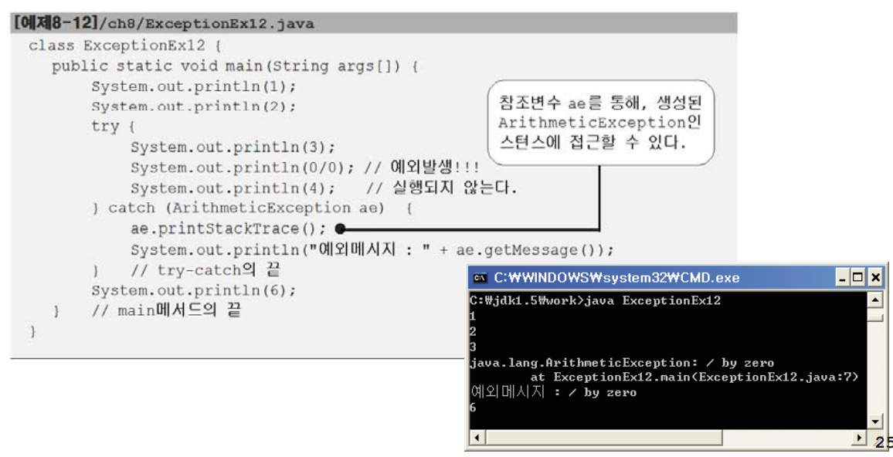

## 1.8 finally블럭

- 예외의 발생여부와 관계없이 실행되어야 하는 코드를 넣는다.
- 선택적으로 사용할 수 있으며, try-catch-finally의 순서로 구성된다.
- 예외 발생시, try -> catch -> finally의 순서로 실행되고 예외 미발생시, try -> finally의 순서로 실행된다.
- try 또는 catch블럭에서 return문을 만나도 finally블럭은 수행된다.

```
try {
    // 예외가 발생할 가능성이 있는 문장들을 넣는다.
} catch (Exception1 e1) {
    // 예외처리를 위한 문장을 적는다.
} finally {
    // 예외의 발생여부에 관계없이 항상 수행되어야하는 문장들을 넣는다.
    // finally블럭은 try-catch문의 맨 마지막에 위치해야한다.
}
```
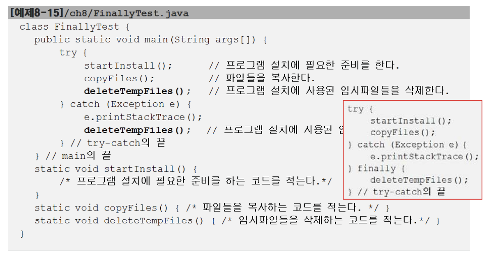

---

## 1.9 메서드에 예외 선언하기

- 예외를 처리하는 또 다른 방법
- 사실은 예외를 처리하는 것이 아니라, 호출한 메서드로 전달해주는 것
- 호출한 메서드에서 예외처리를 해야만 할 때 사용
```
void method() throws Exception1, Exception2, ... ExceptionN {
    // 메서드의 내용
}
```
예외를 발생시키는 키워드 throw와 예외를 메서드에 선언할 때 쓰이는 throws 를 잘 구별하자.

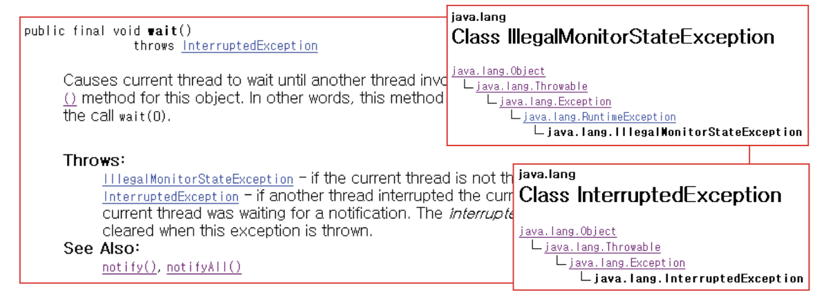
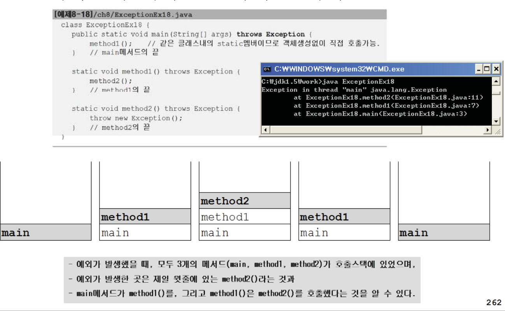
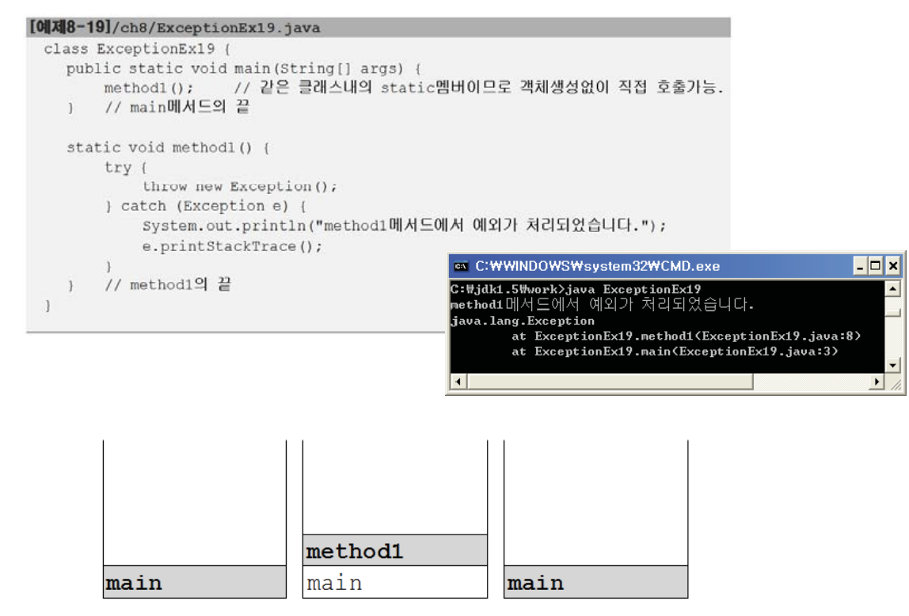
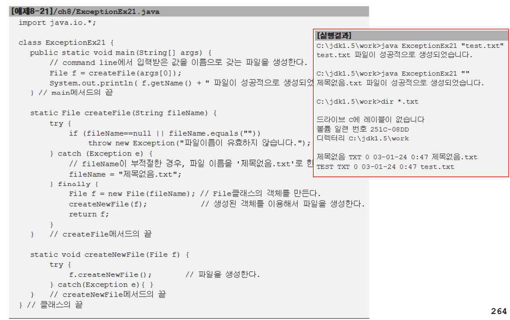
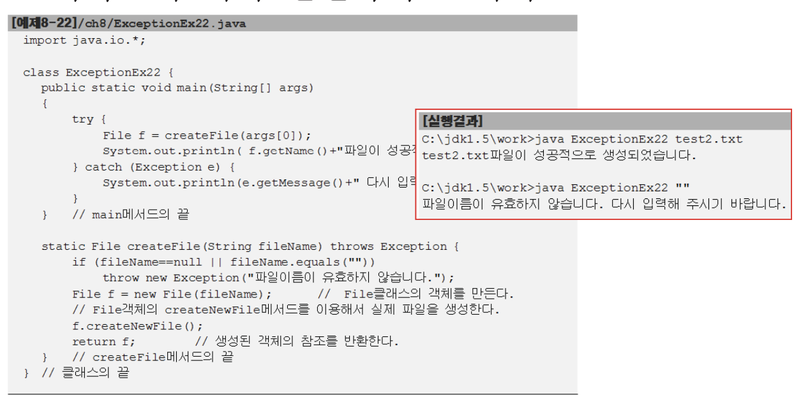

---

## 1.10 예외 되던지기(re-throwing)
- 예외를 처리한 후에 다시 예외를 생성해서 호출한 메서드로 전달 하는 것
- 예외가 발생한 메서드와 호출한 메서드, 양쪽에서 예외를 처리해야 하는경우에 사용
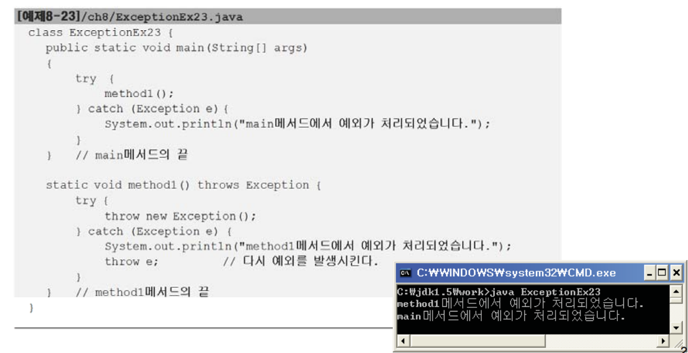

---

## 1.11 사용자정의 예외 만들기
- 기존의 예외 클래스를 상속받아서 새로운 예외 클래스를 정의할 수 있다.
```
class MyException extends Exception {
    myException(String msg) { // 문자열을 매개변수로 받는 생서어자
    super(msg); // 조상인 Exception클래스의 생성자를 호출한다.
    }
}
```
- 에러코드를 저장할 수 있게 ERR_CODE와 getErrCode()를 멤버로 추가
```
class MyExcetion extends Exception {
    // 에러 코드 값을 저장하기 위한 필드를 추가 했다.
    private final int ERR_CODE;

    MyException(String msg, int errCode) { // 생성자,
    super(msg);
    ERR_CODE = errCode;
    }

    MyException(String msg) { // 생성자,
    this(msg,100); // ERR_CODE를 100(기본값)으로 초기화한다.
    }

    public int getErrCode() { // 에러 코드를 얻을 수 있는 메서드도 추가했다.
    return ERR_CODE; // 이 메서드는 주로 getMessage()와 함께 사용될 것이다.
    }
}
```

---

## 1.12 연결된 예외(chained exception)

- 예외 A가 예외 B를 발생시켰다면, A를 B의 '원인 예외' 라고 한다.
```
Throwable initCause(Throwable cause) 지정한 예외를 원인 예외로 등록
Throwable getCause() 원인 예외를 반환
```

- SpaceException이 발생했을 때, 이를 원잉ㄴ예외로 하는 InstallException을 발생시키는 방법(호출한 쪽에서는 InstallException으로 처리)

```
try {
    startInstall(); // SpaceException 발생
    copyFiles();
} catch (SpaceException e) {
    InstallException ie = new InstallException("설치중 예외발생"); // 예외생성
    ie.initCause(e); // InstallException의 원인 예외를 SpaceException으로 지정
    throw ie; // InstallException을 발생시킨다.
} catch (MemoryException me) {
    ...
}
```

- 이유1 - 여러 예외를 큰 분류의 예외로 묶을 때, 연결된 예외로 처리
SpaceException, MemoryException은 모두 설치시 발생하는 예외이므로 InstallException(큰 분류의 예외)로 묶어서 처리하는 것이 편리할 때가 있음.

상속으로 처리하면, 상속관계도 변경해야 하고 실제로 발생한 예외를 알 수없다는 단점이 있다.

- 이유2 - 필수 예외(Exception자손)를 선택 예외(RuntimeException)로 바꿀 때
```
static void startInstall() throws SpaceException, MemoryException {
    if(lenoughSpace()) // 충분한 설치 공간이 없으면..
    throw new SpaceException("설치할 공간이 부족합니다.");

    if (lenoughMemory()) // 충분한 메모리가 없으면...
    throw new MemoryException("메모리가 부족합니다.");
}
```

```
static void startInstall() throws SpaceException {
    if(lenoughSpace()) // 충분한 설치 공간이 없으면..
    throw new SpaceException("설치할 공간이 부족합니다.");

    if (lenoughMemory()) // 충분한 메모리가 없으면..
    // MemoryException을 원인 예외로 등록. RuntimeException(Throwable cause)사용
    throw new RuntimeException(new MemoryException("메모리가 부족합니다."));
} // startInstall메서드의 끝

```

