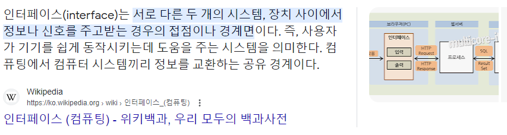

# 추상 클래스와 인터페이스

## 추상 클래스
자바는 객체지향 프로그래밍 요소로 클래스와 인터페이스를 제공하고 있으며, 클래스는 다시 일반 클래스와 추상 클래스로 나뉩니다.

### 추상 클래스의 정의
추상 메서드(abstrack method)는 `메서드의 본체가 완성되지 않은 미완성 메서드를 말합니다.`
여기서 메서드의 기능을 정의하는 중괄호 안이 비어 있다는 것이 아니라 중괄호 자체가 없으며, 중괄호가 없기 때문에 명령어의 끝을 알리는 세미콜론(;)으로 끝나야 합니다.

> 추상 메서드는 `미완성 메서드`라고도 부릅니다.

```java
// 추상 메서드
abstrack 리턴 타입 메서드명(입력매개변수);

// 예
abstrack void abc();
```

`추상 메서드를 1개 이상 포함하고 있는 클래스는 반드시 추상 클래스(abstrack class)로 정의되어야 합니다.`
즉, 일반적으로 추상 클래스는 메서드의 기능이 정의되어 있지 않은 미완성 메서드(중괄호가 없는 메서드)가 1개 이상 있다는 의미입니다.

```java
// 추상 클래스
abstrack class 클래스명 {
    ...
}

// 예
abstrack class A {
    abstrack void abc();
    void bcd() {
        ...
    }
}
```

> 메서드의 완성과 미완성의 구분 기준은 메서드의 기능을 정의하는 중괄호의 존재 여부입니다.  기능에 초점을 두다 보니 간혹 중괄 안에 아무런 코드가 작성되지 않으면 미완성 메서드라고 생각할 수 있지만, 유일한 구분점은 중괄호의 유무입니다.
만일 중괄호 안에 아무런 코드가 없다면 그 메서드는 `아무런 일도 하지 말라`고 기능이 명확히 정의된 완성된 메서드인 것입니다.


### 추상 클래스의 특징
추상 클래스는 내부의 미완성 메서드 때문에 `객체를 직접 생성할 수 없습니다.`
힙 메모리에 생성되는 객체는 내부 요소가 미완성된 상태로 들어갈 수 없기 때문입니다.

> 힙 메모리에는 값이 비어 있는 필드가 저장될 수 없으므로 초기화하지 않은 필드를 힙 메모리에 저장하려고 하면 강제로 값을 초기화합니다.
하물며 미완성 형태의 메서드는 당연히 힙 메모리에 포함될 수 없는 것입니다.

추상 클래스로는 직접 객체를 생성할 수 없지만 이 추상 클래스를 상속한 자식 클래스를 생성하면 그 자식 클래스로는 객체를 생성할 수 있고, 생성된 객체 내부에는 부모 클래스의 추상 메서드가 구현되어 있을 것입니다.

즉, 추상 클래스를 상속받는 자식 클래스는 부모에게 상속받은 미완성 메서드(추상 메서드)를 반드시 완성(오버라이딩) 해야 합니다.

부모에게 물려받은 미완성 메서드를 자식 클래스에서 완성하는 것을 특별히 `구현한다(implements)`라고 말합니다.

> 추상 메서드가 1개 이상 존재하면 반드시 추상 클래스로 정의해야 합니다.
반면 추상 클래스는 꼭 추상 메서드를 포함해야 되는지 묻는다면 그럴 필요는 없습니다.
정의는 가능하지만, 객체를 생성하지 못하는 제약 조건이 있으므로 굳이 클래스를 추상 클래스로 정의할 이유가 없습니다.


### 추상 클래스 타입의 객체 생성 방법
추상 클래스 자체로는 직접 객체를 생성할 수 없지만, 추상 클래스를 상속받은 자식 클래스를 생성해, 객체를 생성하고 부모 클래스인 추상 클래스 타입으로 선언할 수 있습니다.

```java
// 방법 1: 추상 클래스를 일반 클래스로 상속해 객체 생성
abstrack class A {
    abstrack void abc();
}

class B extends A {
    void abc() {
        ...
    }
}

A a = new B();
B b = new B();
```

- 자식 클래스가 일반 클래스로 정의되기 위해서는 반드시 상속받은 추상 메서드를 구현해야 합니다.

- 자식 클래스는 객체를 생성할 수 있고, 다형적 표현으로 부모 추상 클래스 타입으로 선언할 수 있습니다.


또 다른 추상 클래스의 객체 생성 방법으로는 익명 이너 클래스를 사용하는 것입니다.  이는 컴파일러가 내부적으로 추상 클래스를 상속해 메서드 오버라이딩을 수행한 클래스를 생성하고, 그 클래스로 객체를 생성하는 방법입니다.
`이때 내부적으로 생성된 클래스명은 전혀 알 수 없으므로 개발자의 입장에서는 익명(이름이 없는) 클래스가 되는 것입니다.`

```java
// 익명 이너 클래스
클래스명 참조 변수명 = new 생성자() {
    // 추상 클래스에 포함된 추상 메서드 오버라이딩
}

// 예
A a = new A() {
    void abc() {
        ...     // 추상 메서드(미완성 메서드)의 오버라이딩(완성)
    }
}
```

이때 A()는 클래스 A의 생성자를 호출하는 것이 아니라 컴파일러가 클래스 A를 상속받아 abc() 메서드를 오버라이딩한 익명 클래스의 생성자를 호출한다는 것을 의미합니다.

- 이러한 2가지 객체 생성 방법은 객체를 생성할 수 없는 다른 객체지향 프로그래밍 요소인 인터페이스에도 그대로 적용되므로 꼭 이해하셔야 합니다.

> 익명 이너 클래스 방법은 추상 클래스나 나중에 다룰 인터페이스뿐 아니라 완성된 메서드만 포함하는 일반 클래스를 상속받아 메서드를 추가하거나 재정의하는 데도 사용할 수 있습니다.

- 이제 2가지 방법의 장단점, 즉 언제 첫 번째 방법, 또 언제 두 번째 방법이 적절한지 알아보겠습니다.

```java
// 추상 클래스의 객체 생성 방법 1: 자식 클래스 활용하기
abstrack class A {
    abstrack void abc();
}
class B extends A {
    void abc() {
        System.out.println("방법 1. 자식 클래스 생성 및 추상 메서드 구현");
    }
}
public class AbstrackClass_1 {
    public static void main(String[] args) {
        A b1 = new B();
        A b2 = new B();

        b1.abc();
        b2.abc();
    }
}
```
output
```
방법 1. 자식 클래스 생성 및 추상 메서드 구현
방법 1. 자식 클래스 생성 및 추상 메서드 구현
```

```java
abstrack class A {
    abstrack void abc();
}
public class AbstrackClass_2 {
    public static void main(String[] args) {
        A a1 = new A() {
            void abc() {
                System.out.println("방법 2. 익명 이너 클래스 방법으로 객체 생성");
            }
        };
        A a2 = new A() {
            void abc() {    // 객체를 생성할 때마다 오버라이딩 필요
                System.out.println("방법 2. 익명 이너 클래스 방법으로 객체 생성");
            }
        };

        a1.abc();
        a2.abc();
    }
}
```
output
```
방법 2. 익명 이너 클래스 방법으로 객체 생성
방법 2. 익명 이너 클래스 방법으로 객체 생성
```

이를 정리하면, 객체를 여러 개 만들어야 하는 상황이라면 자식 클래스를 직접 정의하는 첫 번째 방법이 적절합니다.
하지만, 딱 한 번만 만들어 사용할 객체일 때는 익명 이너 클래스를 활용하는 것이 훨씬 간결한 코드를 작성하는 데 도움이 됩니다.


## 인터페이스
마지막 객체지향 프로그래밍 요소인 인터페이스를 알아보겠습니다.
일상생활에서 쓰는 인터페이스의 의미는 입출력 방식의 호환성을 의미합니다.



자바에서는 인터페이스 개념이 어떻게 적용되는지 알아보기 전에 프로그래밍 요소로서 인터페이스의 정의와 특성을 먼저 살펴보겠습니다.

### 인터페이스의 정의와 특징
인터페이스 내부의 모든 필드가 public static final로 정의되고, static과 default 메서드 이외의 모든 메서드는 public abstrack으로 정의된 객체지향 프로그래밍 요소입니다.
class 키워드 대신 interface 키워드를 사용해 선언합니다.

```java
// 인터페이스의 구조
interface 인터페이스명 {
    public static final 자료형 필드명 = 값;
    public abstrack 리턴 타입 메서드명();
}
// 예
interface A {
    public static final a = 3;
    public abstrack void abc();
}
```

이처럼 인터페이스 내에서 필드와 메서드에 사용할 수 있는 제어자(modifier)가 확정되어 있으므로 필드와 메서드 앞에 제어자를 생략해도 컴파일러가 자동으로 각각의 제어자를 삽입합니다.


### 인터페이스의 상속
클래스가 클래스를 상속할 때 extends 키워드를 사용하는 반면, 클래스가 인터페이스를 상속할 때는 implements 키워드를 사용합니다.
상속에 있어서 인터페이스의 가장 큰 특징은 `다중 상속이 가능`하다는 것입니다.

```java
// 클래스가 인터페이스를 상속하는 구조
클래스명 implements 인터페이스명, ..., 인터페이스명 {
    ...
}
```

클래스에서 다중 상속을 할 수 없는 이유는 두 부모 클래스에 동일한 이름의 필드 또는 메서드가 존재할 때 이를 내려받으면 충돌이 발생(ambiguous error) 하기 때문입니다.
하지만, 인터페이스에서는 모든 필드가 public static final로 정의되어 있어 실제 데이터값은 각각의 인터페이스 내부에 존재(즉, 저장 공간이 분리)해 공간상 겹치지 않기 때문입니다.
또한 메서드도 모두 미완성이어서 어차피 자식 클래스 내부에서 완성해 사용하므로 문제 될 것이 없습니다.

- `인터페이스는 다중 상속을 할 수 있다`는 개념은 꼭 알아가셔야 합니다.


```java
// 클래스와 인터페이스를 동시에 상속하는 구조
클래스명 extends 클래스명 implements 인터페이스명, ..., 인터페이스명 {
    ...
}
```

- 위 문법 구조에서 알 수 있듯이 클래스는 다중 상속을 할 수 없으므로 1개 이상의 부모 클래스는 존재할 수 없고, 인터페이스 앞에 표기해야 합니다. `(순서 변경 불가능)`

| 클래스 extends 클래스 {     … }        	| 인터페이스 implements 인터페이스 {     … }                	|
|----------------------------------------	|-----------------------------------------------------------	|
| 클래스 implements 인터페이스 {     … } 	| 인터페이스 extends/implements 클래스 {     // 절대 안됨 } 	|


- 클래스가 클래스를 상속할 때는 extends

- 클래스가 인터페이스를 상속할 때는 implements

이전에 미완성 메서드를 완성하는 것을 `구현하기(implement)`라고 했습니다.  인터페이스 내의 모든 메서드는 추상 메서드이므로 자식 클래스는 온전히 이들 추상 메서드들을 구현해야 하기 때문입니다.
따라서 `클래스 A가 인터페이스 B를 상속했다.`라는 표현은 종종 `클래스 A가 인터페이스 B를 구현했다.`와 같이 표현됩니다.

- 인터페이스가 인터페이스를 상속할 때는 extends

인터페이스 내부에는 완성된 메서드가 들어갈 수 없으므로 구현할 수 없는 것입니다.

- `인터페이스는 클래스를 상속할 수 없다`

클래스 내부에는 완성된 메서드가 존재하기 때문입니다.
인터페이스는 내부에 추상 메서드만 포함할 수 있으므로 만일 인터페이스가 클래스를 상속한다면 상속과 동시에 오류가 발생할 것입니다.

- `같은 타입끼리는 extends, 다른 타입끼리는 implements, 인터페이스는 클래스 상속 불가능`정도로 기억해 두면 됩니다.


```java
interface A {
    void abc();
}

class B implements A {
    void abc();
}
```

인터페이스의 추상 메서드를 완성하지 않아도 오류가 발생되지만, 위와 같이 완성해도 오류가 발생됩니다.
그 이유는 바로 `접근 지정자`때문입니다.
오버라이딩을 수행할 때 접근 지정자는 반드시 부모 메서드의 접근 지정자보다 접근 범위가 같거나 커야 합니다.
여기서 인터페이스는 모든 필드와 메서드가 public으로 강제되므로 사실상 모든 자식 클래스의 구현 메서드는 public만 가능합니다.
하지만 앞의 예시에서는 접근 지정자를 표기하지 않아 클래스 B의 메서드는 default 접근 지정자로 지정되었으므로 오류가 발생한 것입니다.

- `인터페이스 내 필드와 메서드의 제어자를 생략하고 사용할 때 자주 범하는 실수이므로 주의해야 합니다.`


### 인터페이스 타입의 객체 생성 방법
인터페이스도 추상 메서드를 포함하고 있으므로 객체를 직접 생성할 수는 없습니다.
때문에 추상 클래스와 마찬가지로 자식클래스를 정의하고 자식 클래스의 생성자로 객체를 생성하는 방법과 익명 이너 클래스를 이용해 바로 객체를 생성하는 방법을 사용할 수 있습니다.

### 인터페이스의 필요성
이 절의 서두에서 이야기한 것처럼 일상생활에서 인터페이스는 입출력의 호환성을 의미합니다.

인터페이스를 사용하지 않을 경우, 각각의 API 마다 서로 다른 기능들을 하는 클래스를 사용하기 때문에 A 클래스에서 B 클래스로 변경한다면 변경된 클래스에 맞는 기능들을 수정해야 될 것입니다.

하지만 각각의 API에 동일한 인터페이스를 사용한다면, 어떤 API이던 동일한 메서드가 존재할 것입니다.
다만 메서드 내부의 구현 내용은 다르지만 개발자의 입장에서는 각각의 API의 내부 메서드들이 어떻게 생겼는지 전혀 고려할 필요가 없어집니다.

> 인터페이스는 일반적으로 자바 API(Application Programming Interface)에서 제공합니다.
자바 API는 자바에서 기능을 제어할 수 있게 만든 인터페이스를 의미합니다. 

### 디폴트 메서드와 정적 메서드
자바 8이 등장하면서 인터페이스에 몇 가지 기능이 추가됐습니다.
그 첫 번째가 인터페이스 내에 완성된 메서드인 디폴트(default) 메서드가 포함될 수 있는 것입니다.

> 인터페이스 내의 default 메서드는 default 접근 지정자와 구분해야 합니다.
접근 지정자의 default는 접근 지정자 자체를 생략합니다.

```java
// 디폴트 메서드
interface 인터페이스명 {
    public default 리턴 타입 메서드명 {
        ...
    }
}
```

인터페이스 내의 필드 또는 추상 메서드처럼 디폴트 메서드 앞에 접근 지정자 public을 생략해도 컴파일러가 자동으로 삽입합니다.

디폴트 메서드 기능이 추가된 이유는 인터페이스를 상속받은 클래스가 수십, 수백 가지일 경우, 상속한 인터페이스 내부에 추상 메서드를 추가하게 된다면 상속받은 클래스들은 오류가 나거나 일일이 메서드를 추가, 또는 인터페이스를 따로 또 생성해줘야 할 것입니다.
하지만 디폴트 메서드는 이미 완성된 메서드이므로 자식 클래스는 반드시 이 메서드를 오버라이딩할 의무가 없어집니다.
(당연히 오버라이딩도 가능합니다.)

인터페이스 내에 완성된 메서드인 디폴트 메서드는 비록 완성된 형태이긴 하지만, 인터페이스 자체가 여전히 객체를 생성할 수 없는 상태이므로 디폴트 메서드를 실행하기 위해서는 일단 상속시켜야 한다는 점을 기억해야 합니다.

디폴트 메서드가 인터페이스 내부에 속하는 일반 메서드처럼 동작하므로 자식 클래스에서 부모 인터페이스 내부의 디폴트 메서드를 호출할 수 있습니다.

```java
// 자식 클래스에서 부모 인터페이스의 디폴트 메서드 호출 방법
부모 이너페이스명.super.디폴트 메서드
// 예
interface A {
    default void abc() {
        System.out.println("A 인터페이스의 abc()");
    }
}
class B implements A {
    @Override
    public void abc() {
        A.super.abc();
        System.out.println("B 클래스의 abc()");
    }
}


public class interfaceDefaultMethod {
    public static void main(String[] args) {
        B b = new B();
        b.abc();        // A 인터페이스 abc() -> B 클래스 abc()
    }
}
```

여기서 부모의 메서드를 호출하는 방식이 클래스와 조금 다른 것을 알 수 있습니다.
이유는 인터페이스는 다중 상속을 할 수 있으므로 부모 인터페이스가 여럿일 수 있기 때문입니다.
앞에서 모든 자바의 클래스는 Object 클래스를 상속한다고 했습니다.
만일 아무런 클래스도 상속하지 않으면 컴파일러는 다음과 같이 자동으로 Object 클래스를 상속하는 구문을 추가합니다.

```java
// 개발자 작성
class C implements A, B{
    ...
}
// 컴파일러가 자동으로 삽입
class C extends Object implements A, B {
    ...
}
```

이때 클래스 C는 부모가 셋(Object, A, B)이 생긴 셈입니다.
클래스는 어차피 다중 상속이 불가하므로 구분 지을 필요 없이 `super.부모메서드명`처럼 호출하면 되지만, 인터페이스는 다중 상속이 되므로 어떤 부모 인터페이스 내의 메서드를 호출할지 구분해줘야 합니다.
때문에 인터페이스 내의 메서드를 호출할 때는 `부모 인터페이스명.super.부모 메서드명`으로 호출하는 것입니다.


자바 8 이후부터 추가된 인터페이스의 두 번째 기능은 static 메서드를 포함할 수 있다는 것입니다.
이는 클래스 내부의 정적 메서드와 동일한 기능으로, 객체를 생성하지 않고 `인터페이스명.정적 메서드명`의 방식으로 바로 호출이 가능합니다.

```java
// 인터페이스 내의 정적 메서드 호출
인터페이스명. 정적 메서드명

// 예
interface A {
    static void abc() {...}
}

A.abc();    // 객체를 생성하지 않고 바로 사용 가능
```

