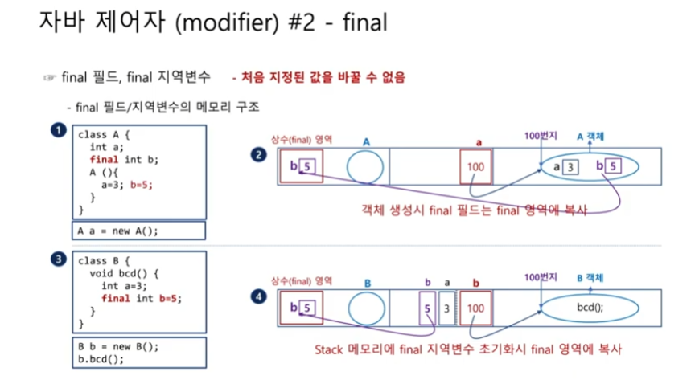

# 자바 제어자 2

## final 제어자
final 제어자는 필드, 지역 변수, 메서드, 클래스 앞에 위치할 수 있으며, 어디에 위치하느냐에 따라 의미가 다릅니다.

### final 변수
final 제어자는 변수를 선언할 때만 지정할 수 있으며, final 변수는 한 번 대입된 값을 수정할 수 없습니다.

```java
// final 필드의 예
class A1 {      // 선언과 동시에 값을 대입했을 때
    int a = 3;
    final int b = 5;
    A1() {}
}

class A2 {      // 선언과 값의 대입을 분리했을 
    int a;
    final int b;
    A2() {
        a = 3;
        b = 5;
    }
}

class A3 {      // final 필드값을 대입한 후에는 추가 값 대입 불가능
    int a = 3;
    final int b = 5;
    A3() {
        a = 7;
        // b = 9; (불가능)
    }
}
```

A2 클래스에서는 선언과 값의 대입을 분리하였습니다.  다만, 선언과 대입을 분리했을 때는 적어도 생성자에서는 값을 대입해야 합니다.
이는 final 필드가 일반 필드와 달리, 강제 초기화되지 않기 때문입니다.

> final 제어자를 사용한 필드나 지역 변수에 일단 값이 대입되면 절대 변경할 수 없습니다.
좀 더 명확히 말하면 일단 값이 대입된 후 값을 대입하는 행위 자체를 할 수 없습니다.


- 필드나 지역 변수가 final로 선언되었을 때 메모리에서 일어나는 상황을 알아보겠습니다.




- 필드는 멤버이므로 final 필드이든, 아니든 객체 속에 포함됩니다.

- 하지만 객체가 만들어질 때, final로 선언된 필드값은 상수(final) 영역에 1개가 복사됩니다.

- 메서드의 실행 과정에서 지역 변수들은 스택 영역 메모리에 저장되지만, final 지역 변수는 상수 역영에 1개가 복사됩니다.

- 값의 복사는 값을 선언한 후 최초로 값이 초기화될 때 딱 한 번 일어납니다.

> 이벤트를 처리할 때 지역 변수를 final로 선언해야 하는 경우가 자주 있습니다.
스택 메모리의 변숫값은 자신이 만들어진 메서드가 종료되면 메모리에서 사라지며, 이벤트를 처리할 때 메모리에서 사라진 그 변수를 나중에 사용해야 할 때가 있습니다.
`어떤 필요에 따라 복사본을 하나 만들어 놓음으로써 원본이 삭제된 이후에도 그 값을 활용할 수 있도록 하는 것이 final 변수(필드, 지역 변수)의 기능입니다.`


### final 메서드와 final 클래스
final 메서드와 final 클래스도 final 변수와 마찬가지로 각가 최종 메서드, 클래스의 의미를 가지고 있습니다.

- final 메서드의 경우, 부모 클래스에서 정의되면 자식 클래스에서 오버라이딩할 수 없습니다.

- final 클래스의 경우, 최종 클래스의 의미로 더 이상 자식 클래스가 없다는 것을 의미합니다.
따라서 `final 클래스는 상속 자체가 아예 불가능합니다.`

> 참고로 String 클래스도 final 클래스로 정의되어 있어, 상속받아 자식 클래스를 생성할 수 없습니다.

`이상 final 제어자를 정리하면 final 변수는 값을 변경할 수 없고, final 메서드는 오버라이딩을 할 수 없으며, final 클래스는 상속 자체를 할 수 없습니다.`

| final 변수                                                                                     	| final 메서드                                                                                                                            	| final 클래스                                                                              	|
|------------------------------------------------------------------------------------------------	|-----------------------------------------------------------------------------------------------------------------------------------------	|-------------------------------------------------------------------------------------------	|
| class A {     int m = 3;     final int n = 4; } A a = new A(); a.m = 5; a.n = 9;        // (X) 	| class A {     void abc() {...}     final void bcd() {...} } class B extends A {     void abc() {...}     void bcd() {...}      // (X) } 	| final class A {     int m;     void bcd() {...} } class B extends A {      // (X)     … } 	|
| 값 변경 불가능                                                                                 	| 오버라이딩 불가능                                                                                                                       	| 상속 불가능                                                                               	|


## abstrack 제어자
자바 제어자 중에서 마지막으로 알아볼 것은 abstrack 제어자입니다.
abstrack의 사전상 의미는 `'추상적인'`입니다. 때문에 abstrack이 붙은 메서드를 `추상 메서드(abstrack method)`, abstrack이 붙은 클래스를 `추상 클래스(abstrack class)`라고 합니다.

여기서 `추상적`이라는 것은 말 그대로 `구체적이지 않다`는 것으로, 메서드는 어떤 기능을 수행하는 요소이고, 기능은 메서드의 중괄호 안에서 정의되는데, 추상 메서드는 중괄호가 없는 메서드를 의미합니다.  또한, 중괄호로 끝나지 않기 때문에 세미클론(;)으로 끝납니다.

- 추상 메서드는 아직 무슨 기능을 정의할지 정해지지 않은 `미완성 메서드`라고 생각해도 좋습니다.

- 여기서 주의해야 할 점은 추상 메서드를 1개 이상 포함하고 있는 클래스는 반드시 추상 클래스로 정의해야 한다는 것입니다.


### abstrack 제어자의 장점
앞의 추상 메서드를 사용하는 이유를 살펴보면 코드가 그렇게 간결해진 것도 아니고, 오히려 중괄호가 없는 새로운 문법을 1개 더 사용해야 하는 번거로움만 추가되었습니다.

그렇다면 추상 메서드와 추상 클래스를 사용하며 얻게 되는 장점은 무엇인지 알아보겠습니다.

```java
// 일반 클래스로 정의했을 때
class Animal {
    void cry() {...}
}

class Cat extends Animal {
    void cRy() {    // 오타 발생
        System.out.println("야옹");
    }
}

Animal animal1 = new Cat();
animal1.cry();      // 출력 없음.


// 추상 클래스로 정의했을 때
abstrack class Animal {
    abstrack void cry();
}

class Cat extends Animal {
    void cRy() {    // 오류 발생
        System.out.println("야옹");
    }
}
```

일반 클래스를 상속받은 자식 클래스에서, 메서드 오버라이딩을 하는 과정에서 오타가 발생되었을 경우, 오버라이딩이 아닌 추가로 새로운 메서드를 정의한 셈으로 2개의 메서드(cry(), cRy())가 존재할 것입니다.

따라서 본인이 원하는 결괏값이 나오지도 않으며, 문법적으로 오류가 없는 결과가 나옵니다.

반대로 추상 클래스를 상속받은 자식 클래스에서 메서드 오버라이딩을 하는 과정에서 오타가 발생되었을 경우, 문법 오류가 발생됩니다.

이유는 추상 클래스를 상속하면 추상 메서드도 내려받게 되는데, 여기서 상속받은 자식 클래스는 추상 메서드를 오버라이딩하거나 자신을 추상 클래스로 정의해야 하지만, 해당 클래스는 추상 메서드를 일반 메서드로 오버라이딩도 하지 않고, 자신을 추상 클래스로 정의하지도 않았으므로 오류가 발생하는 것입니다.

정리하면 예를 들어 abc()라는 추상 메서드를 포함하고 있는 추상 클래스가 있을 때 `이를 상속한 모든 자식 클래스 내부에는 항상 abc() 메서드가 정의되어 있다`는 것이 보장되며, 문법 오류는 개발자에게 있어 단점이 아닌, 실수를 사전에 막아 주는 강력한 장점입니다.
