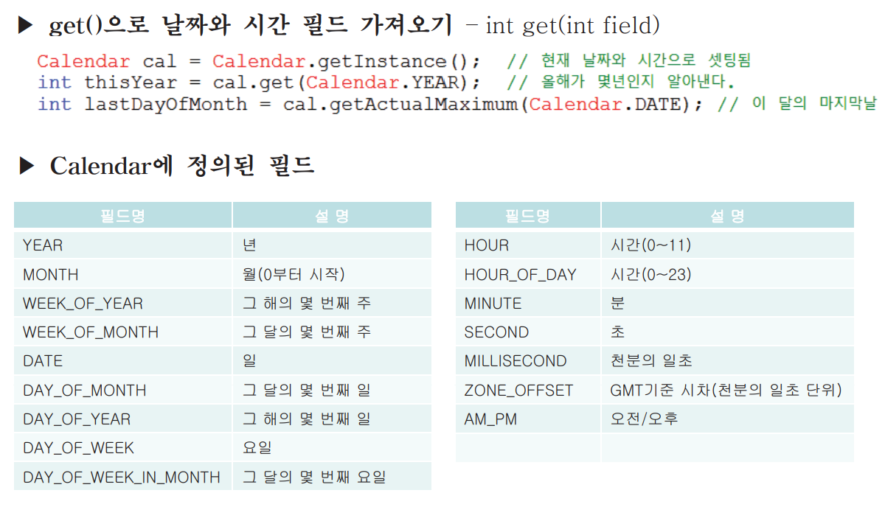
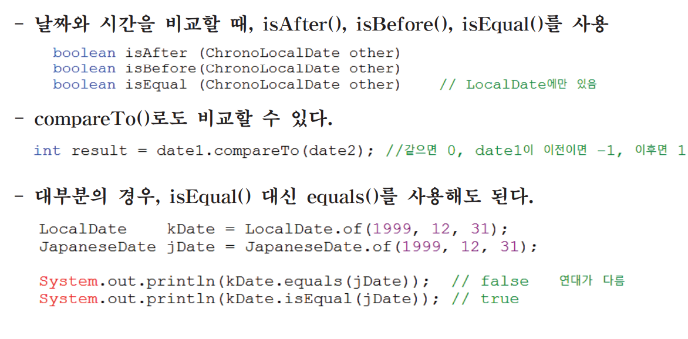

# 1. 날짜와 시간
## 1.1 Calendar와 Date
1. java.util.Date
- 날짜와 시간을 다룰 목적으로 만들어진 클래스(JDK1.0)

2. java.util.Calendar
- Date클래스를 개선한 클래스(JDK1.1). 여전히 단점이 존재

3. java.time패키지
- Date와 Calendar의 단점을 개선한 새로운 클래스들을 제공(JDK1.8)

---

## 1.2 Claendar
1. java.util.Calendar
- 추상 클래스이므로 getInstance()를 통해 구현된 객체를 얻어야 한다.

---

## 1.3 Calendar의 주요 메서드

---

# 2. 형식화
## 2.1 DecimalFormat

---
## 2.2 SimpleDateFormat

---
## 2.3 MessageFormat

---

# 3. java.time 패키지
## 3.1 java.time패키지란?

---

## 3.2 java.time패키지의 핵심 클래스

---

## 3.3 LocalDate와 LocalTime

---
## 3.4 Instant

---

## 3.5 LocalDateTime과 ZonedDateTime

---

## 3.6 ZonedDateTime의 변환

---

## 3.7 ZonedOffset과 OffsetDateTime

---

## 3.8 TemporalAdjusters

---

## 3.9 Period와 Durtion

---

## 3.10 날짜와 시간의 형식화

---
## 3.11 로케일에 종속된 형식화

---
## 3.12 출력형식 직접 정의하기

---

## 3.13 날짜와 시간 문자열 파싱

