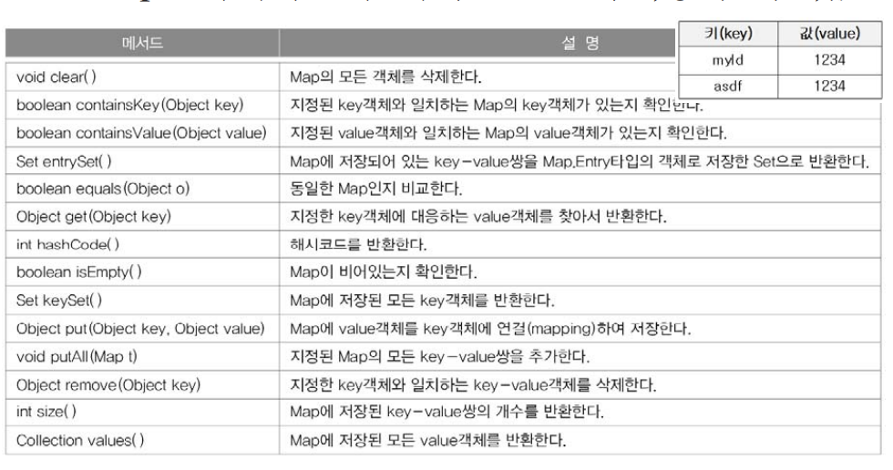
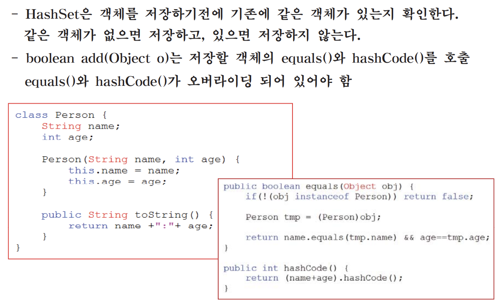
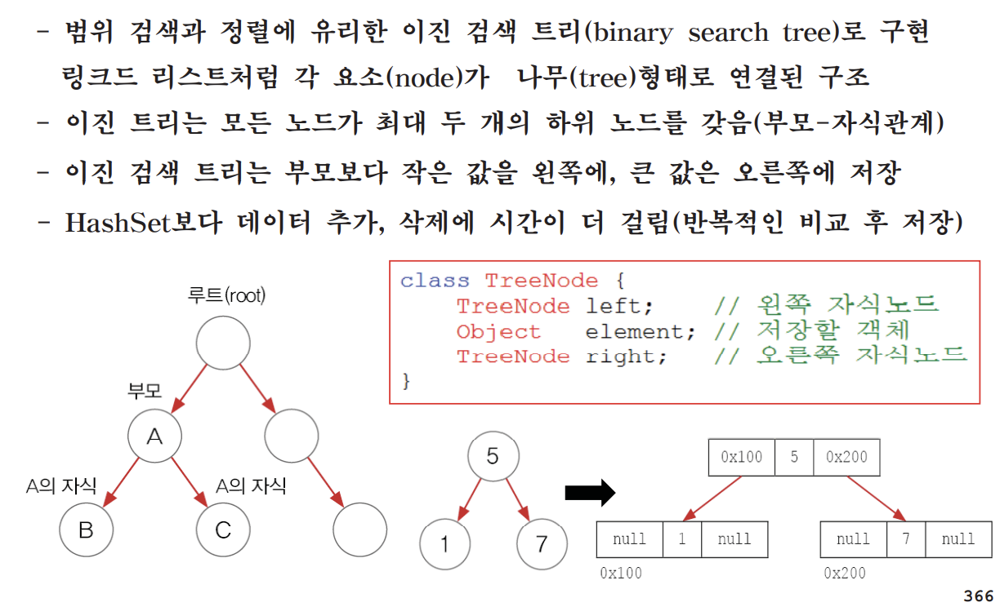

# 컬렉션 프레임웍 (collections framework)

## 컬렉션 프레임웍(collections framework)이란?

* 컬렉션(collection)
- 여러 객체(데이터)를 모아 놓은 것을 의미

* 프레임웍(framework)
- 표준화, 정형화된 체계적인 프로그래밍 방식

* 컬렉션 프레임웍(collection framework)
- 컬렉션(다수의 객체)을 다루기 위한 표준화된 프로그래밍 방식
- 컬렉션을 쉽고 편리하게 다룰 수 있는 다양한 클래스를 제공
- java.util패키지에 포함. JDK1.2부터 제공

* 컬렉션 클래스(collection class)
- 다수의 데이터를 저장할 수 있는 클래스(예, Vector, ArrayList, HashSet)

---

## 1.2 컬렉션 프레임웍의 핵심 인터페이스

---

## 1.3 Collection인터페이스의 메서드

---

## 1.4 List인터페이스의 메서드 - 순서O, 중복O

---

## 1.5 Set인터페이스 - 순서X, 중복X

---

## 1.6 Map인터페이스의 메서드 - 순서X, 중복(키X,값O)

---

## 2.1 Vector와 ArrayList
- ArrayList는 기존의 Vector를 개선한 것으로 구현원리와 기능적으로 동일
- Vector는 자체적으로 동기화처리가 되어 있으나 AraayList는 그렇지 않다.
- List인터페이스를 구현하므로, 저장순서가 유지되고 중복을 허용한다.
- 데이터의 저장공간으로 배열을 사용한다.(배열기반)

---

## 2.2 ArrayList의 사용예

## 2.3 ArrayList에 저장된 객체의 삭제과정(1/2)

---

## Vector의 크기(size)와 용량(capacity)

---

## 2.5 Vertor를 직접 구현하기 - MyVector.java
1. 객체를 저장할 객체배열(objArr)과 크기(size)를 저장할 변수를 선언
2. 생성자 MyVeector(int capacity)와 기본 생성자 MyVector()를 선언
3. 메서드 구현
    - int size() - 컬렉션의 크기(size, 객체배열에 저장된 객체의 개수)를 반환
    - int capacity() - 컬렉션의 용량(capacity, 객체배열의 길이)을 반환
    - boolean isEmpty() - 컬렉션이 비어있는지 확인
    - void clear() - 컬렉션의 객체를 모두 제거(객체배열의 모든 요소를 null)
    - Object get(int index) - 컬렉션에 서 지정된 index에 저장된 객체를 반환
    - int indexOf(Ovject obj) - 지정된 객체의 index를 반환(못찾으면 -1)
    - void setCapacity(int capacity) - 컬렉션의 용량을 변경
    - void ensureCapacity(int minCapacity) - 컬렉션의 용량을 확보
    - Object remove (int index) - 컬렉션에서 객체를 삭제
    - boolean add(Object obj) - 컬렉션에 객체를 추가

    ---

    ## 알아두면 좋아요! - Java API 소스보기(src.zip)
    

    ---

    ## 2.6 ArrayList의 장점과 단점

    

    ---

## 3.1 LinkedList - 배열의 단점을 보완

---

## 3.2 LinkedList 이중 연결 리스트

---

## 3.3 ArrayList vs. LinkedList - 성능 비교

---

## 4.1 스택과 큐(Stack & Queue)

---

## 알아두면 좋아요! - 인터페이스를 구현한 클래스 찾기

---

## 4.2 Queue의 변형 - Deque, PriorityQueue, BlockingQueue

---

## 5.1 Enumeration, Iterator, ListIterator
- 컬렉션에 저장된 데이터를 접근하는데 사용되는 인터페이스
- Enumeration은 Iterator의 구버젼
- ListIterator는 Iterator의 접근성을 향상시킨 것 (단방향 -> 양방향)

---

## 5.2 Iterator
- 컬렉션에 저장된 요소들을 읽어오는 방법을 표준화한 것
- 컬렉션에 iterator()를 호출해서 Iterator를 구현한 객체를 얻어서 사용.

---

## 5.3 ListIterator - Iterator의 기능을 확장(상속)
- Iterator의 접근성을 향상시킨 것이 ListIterator이다.(단방향 -> 양방향)
- listIterator()를 통해서 얻을 수 있다.(List를 구현한 컬렉션 클래스에 존재)

---

## 6.1 Arrays(1/3) - 배열을 다루기 편리한 메서드(static) 제공

---

## 6.2 Comparator와 Comparable

---

## 7.1 HashSet과 TreeSet - 순서X, 중복X

---

## 7.2 HashSet - boolean add(Object o)

---

## 7.3 HashSet - HashCode()의 오버라이딩 조건

---

## 7.4 TreeSet - 범위 검색과 정렬에 유리

---

## 7.5 TreeSet - 데이터 저장과정 boolean add(Object o)

---

## 7.6 TreeSet - 주요 생성자와 메서드

---

## 7.7 TreeSet - 범위 검색 subSet(), headSet(), tailSet()

---

## 7.8 TreeSet - 트리 순회(전위, 중위, 후위)

---

## 8.1 HashMap과 TreeMap - 순서X, 중복(키X, 값O)

---

## 8.2 HashMap

---

## 8.2 HashMap - 주요 메서드

---

## 8.3 해싱(hashing)

환자정보관리

---

## 8.4 TreeMap
- 이진 검색 트리의 구조로 키와 값의 쌍으로 이루어진 데이터를 저장
- TreeSet처럼, 데이터를 정렬(키)해서 저장하기 때문에 저장시간이 길다.(TreeSet은 TreeMap을 이용해서 구현되어 있음)
- 다수의 데이터에서 개별적인 검색은 TreeMap보다 HashMap이 빠르다.
- Map이 필요할 때 주로 HashMap을 사용하고, 정렬이나 범위검색이 필요한 경우 TreeMap을 사용

---

## 9.1 Properties & 예제
- 내부적으로 Hashtable을 사용하며, Key와 value를 (String, String)로 저장
- 주로 어플리케이션의 환경설정에 관련된 속성을 저장하는데 사용되며 파일로부터 편리하게 값을 읽고 쓸 수 있는 메서드를 제공한다.

---

## 9.3 Collections(1/2) 컬렉션을 위한 메서드(static)를 제공

---

## 9.4 컬렉션 클래스 정리 & 요약 (1/2)

