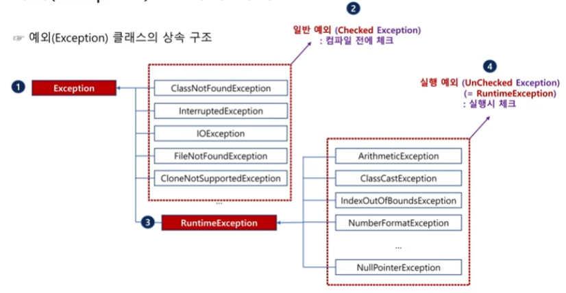

# 예외 처리

## 예외
개발자가 프로그램을 작성하는 과정에서 실수를 하거나 사용자가 잘못된 값을 입력하면 오류가 발생할 수 있습니다.

다양하게 발생하는 오류 중 개발자가 해결할 수 있는 오류를 `예외(exception)`, 이러한 예외가 발생했을 때 이를 적절히 처리하는 것을 `예외처리`라고 합니다.

### 예외와 에러의 차이점
자바에서 제공하는 예외 처리 메커니즘을 이해하기 전에 `예외(exception)`와 `에러(error)`의 의미를 정리해 보겠습니다.

먼저 예외는 `연산 오류, 숫자 포맷 오류 등과 같이 상황에 따라 개발자가 해결할 수 있는 오류`를 말하며, 여기서 `해결할 수 있는`의 의미는 오류 자체를 수정할 수 있다는 것이 아니라 오류가 발생했을 때 차선책을 선택하는 것을 말합니다.
반면 에러는 JVM 자체에서 발생하는 오류로, `개발자가 해결할 수 없는 오류`를 말합니다.

> 오류가 발생했을 때 차선책을 제시함으로써 오류를 피하는 과정을 `예외 처리`라고 합니다.

int a = 1 / 0 은 분모는 절대 0이 될 수 없어 연산 자체가 불가능하므로 예외가 발생하고, 대신해서 개발자가 a값에 -1 값 혹은 그 외 다른 값을 직접 대입하는 것을 예외 처리라고 합니다.
이렇게 개발자가 예외 처리하면 프로그램은 종료되지 않고 계속 실행됩니다.

에러는 차선책을 선택하는 것 자체도 불가능할 때를 말하며, 대표적인 예로는 메모리가 꽉 찼을 때, 쓰레드가 죽었을 때 등을 들 수 있습니다.

즉, 예외는 `개발자가 처리할 수 있는 오류`, 에러는 `개발자가 처리할 수 없는 오류`를 말합니다.

자바에서 예외의 최상위 클래스는 Exception 클래스, 에러의 최상위 클래스는 Error 클래스입니다.
이 2개의 클래스는 모두 Throwable 클래스를 상속하고 있습니다.
따라서 에러와 예외 모두 Throwable 클래스의 모든 기능을 포함합니다.


### 예외 클래스의 상속 구조
Throwable 클래스를 상속받은 Exception 클래스는 다시 `일반 예외(checked exception)` 클래스와 `실행 예외(unchecked(tuntime) exception)` 클래스로 나뉩니다.



- `일반 예외(Checked Exception)`: 컴파일 전에 체크
Exception 클래스에서 직접 상속받은 예외 클래스들이 처리하는 일반 예외는 컴파일 전에 예외 발생 문법을 검사(check)하며, 예외 처리를 하지 않으면 문법 오류가 발생합니다.

- `실행 예외(Unchecked Exception=Runtime Exception)`: 실행할 때 체크
반면 RuntimeException 클래스를 상속받은 예외 클래스들이 처리하는 실행 예외는 컴파일전이 아니라 실행할 때 발생하는 예외로, 예외 처리를 따로 하지 않더라도 문법 오류가 발생하지 않습니다.
다만, 프로그램 실행 시 프로그램이 강제 종료되는 이유는 대부분 실행 예외 때문이므로 이에 대한 세심한 주의가 필요합니다.


### 일반 예외 클래스
앞에서 설명한 것처럼 일반 예외는 예외 처리를 하지 않으면 문법 오류를 발생시켜 컴파일 자체가 불가능합니다.
이러한 일반 예외를 처리하는 일반 예외 클래스에 대해 알아보겠습니다.

- InterruptedException
Thread.sleep(시간) 메서드는 일정 시간 동안 해당 쓰레드를 일시정지 상태로 만드는 Thread 클래스의 정적 메서드입니다.
이 메서드는 일반 예외가 발생할 수 있기 때문에 반드시 예외 처리를 해야 합니다.

> 쓰레드는 프로그램 실행 과정에서 CPU를 사용하는 최소 단위로, 프로세스 내에 존재합니다.

- ClassNotFoundException
Class.forName("패키지명.클래스명")은 클래스를 동적으로 메모리에 로딩하는 메서드로, 해당 클래스의 정보를 담고 있는 Class 타입의 객체를 리턴합니다.
만일 클래스를 메모리에 동적으로 로딩하는 과정에서 해당 클래스가 존재하지 않을 때는 ClassNotFoundException이 발생하므로 이에 대한 예외 처리르 반드시 해줘야 합니다.

> 실제 java.lang.Object 클래스가 존재한다 하더라도 예외 처리를 하지 않으면 문법 오류가 발생합니다.
즉, 실제 클래스의 존재 유무와 상관없이 예외가 발생할 수 있는 코드인지가 중요합니다.

- IOException
IOException은 자바 입출력 부분에서 자주 보게 될 일반 예외로, 콘솔이나 파일에 데이터를 쓰거나(write()) 읽을(read()) 때 발생하며, 반드시 IOException에 대한 예외 처리를 해야 합니다.

- FileNotFoundException
파일을 읽을 때 해당 결로에 파일이 없으면 FileNotFoundException이 발생합니다.
이 또한 실제 파일의 존재 유무와는 상관없이 파일이 존재하지 않을 가능성이 있는 코드이기 때문에 반드시 예외 처리를 해야 문법 오류가 발생하지 않습니다.

- CloneNotSupportedException
자바의 모든 클래스는 Obejct 클래스를 상속합니다.
즉, 이는 Obejct의 모든 메서드를 사용할 수 있다는 뜻입니다.
Object 클래스의 메서드 중 clone()은 자신의 객체를 복사한 클론객체를 생성해 리턴하는 메서드입니다.
다만, 이를 위해 복사의 대상이 되는 클래스는 반드시 Cloneable 인터페이스를 상속해야 합니다.
쉽게 말해, `해당 클래스가 복사 기능을 제공해야 한다는 것입니다.`
만약 Cloneable 인터페이스를 상속하지 않은 클래스의 객체를 복사하기 위해 clone() 메서드를 호출하면 CloneNotSupportedException이 발생합니다.

참고로 아래 예제에서 class B의 내부에 추가 기능이 없는데도 Obejct 클래스의 clone() 메서드를 오버라이딩 한 이유는 protected의 접근 지정자를 갖는 clone() 메서드를 클래스 A 내부에서 호출할 수 있도록 하기 위해서입니다.

> CLoneable은 내부에 추상 메서드를 포함하고 있지 않으며, 단순히 해당 클래스가 복사 기능을 제공함을 나타내는 `마커(marker)`의 기능만을 수행하는 인터페이스입니다.

```java
class B {
    @Override
    protected Object clone() throws CloneNotSupportedException {
        return super.clone();
    }
}
public class A {
    public static void main(String[] args) {
        B b1 = new B();
        B b2 = (B) b1.clone();
    }
}
```


### 실행 예외
일반 예외는 예외 처리를 해 주지 않으면 문법 오류가 발생하기 때문에 실행 자체가 불가능한 반면, 실행 예외는 문법 오류가 발생하지 않습니다.
그렇기 때문에 예외 처리 없이 컴파일과 실행이 가능하지만, 실행 중 실행 예외가 발생하면 프로그램은 강제 종료됩니다.

실행 예외를 처리하는 클래스는 Exception의 자식 클래스인 Runtime Exception 클래스의 자식 클래스들입니다.

- ArithmeticException
Arithmetic의 사전적인 뜻은 `산술` 또는 `연산`입니다.
즉, ArithmeticException은 연산 자체가 불가능할 때 발생하는 실행 예외입니다.
수학식에서 절대 존재할 수 없는 대표적인 연산은 분모가 0일 때입니다.
이 연산을 수행하도록 하면 예외가 발생하고, 이때 예외 처리를 하지 않으면 예외가 발생했을 때 실행 중인 프로그램은 예외 발생 상황을 출력하고 강제 종료됩니다.

- ClassCastException
상속 관계에 있는 클래스 간의 업캐스팅은 항상 가능하지만, 다운캐스팅은 가능할 수도, 불가능할 수도 있습니다.
ClassCastException은 다운캐스팅이 불가능한 상황에서 다운캐스팅을 시도할 때 발생합니다.

- ArrayIndexOutOfBoundsException
ArrayIndexOutOfBoundsException은 이름에서 유추할 수 있는 것처럼 배열의 인덱스를 잘못 사용했을 때 발생합니다.
배열의 인덱스는 항상 0 ~ (배열의 길이 - 1)까지의 값만 사용할 수 있습니다.
만일 이 범위를 벗어나게 인덱스를 사용하면 예외가 발생합니다.

- NumberFormatException
문자열을 정수값으로 변환하고자 할 때는 `Integer.parseInt("문자열")`, 실수값으로 변환하고자 할 때는 `Double.parseDouble("문자열")`을 사용해야 합니다.
이렇게 문자열을 숫자 또는 실수로 변환할 때 문자열이 변환하고자 하는 숫자 형식이 아니면 변환이 실패하는데, 이때 발생하는 예외입니다.

> 문자열을 불리언값(true, false)으로 변환하는 과정은 문자열을 정수나 실수로 변환할 때와 다르게 동작합니다.
숫자가 아니기 때문에 변환하는 과정에서는 NumberFormatException이 발생하지 않습니다.

```java
Boolean.parseBoolean("true");       // true
Boolean.parseBoolean("false");      // false
Boolean.parseBoolean("true123");    // false
Boolean.parseBoolean("");           // false
```

이 예에서 알 수 있는 것처럼 문자열을 불리언값으로 변경할 때는 문자열이 "true"인지만 확인하면 됩니다.
불리언값으로 변환하고자 하는 문자열이 "true"일 때만 `true` 값으로 변환되고, 이외의 모든 문자열, 심지어 비어 있는 문자열도 `false`값으로 변환합니다.


- NullPointException
참조 변수가 실제 객체를 가리키고 있지 않은 상황에서 필드나 메서드를 호출할 때 발생합니다.
여기서 null은 위칫값을 저장하는 참조 변수의 초깃값으로만 사용할 수 있으며, 현재 가리키고(pointing)있는 객체가 없다는 것을 의미합니다.
객체를 가리키고 있지도 않는데 해당 위치에 가서 객체 안에 있는 멤버를 실행하라고 명령하니 수행할 수 없는 것입니다.


실행 예외는 예외 처리를 하지 않아도 문법 오류가 발생하지는 않지만, 실행 중인 프로그램이 강제 종료되는 주요 원인이 됩니다.
이는 매우 치명적인 단점이기 때문에 이를 방지하기 위해서는 실행 예외들도 적절한 예외 처리가 필요합니다.


## 예외 처리
예외 처리는 예외가 발생했을 때 처리하는 방법을 제공하는 문법 요소로, 예외 처리 구문이 포함되면 예외가 발생하더라도 프로그램이 계속 실행됩니다.

> 예외 처리 구문이 있으면 JVM은 적절히 예외가 처리되었다고 판단하기 때문에 프로그램을 강제 종료하지 않습니다.
심지어 예외 처리 구문 내에 아무런 코드를 작성하지 않아도 예외가 처리된 것으로 간주합니다.

### 예외 처리 문법
예외 처리 문법은 다음과 같이 크게 3가지 요소(try, catch, finally)로 구성되어 있습니다.

```java
// 예외 처리 문법 구조
try {
    // 일반 예외, 실행 예외 발생 가능 코드
} catch (예외 클래스명 참조 변수명) {
    // 예외가 발생했을 때 처리
} finally {
    // 예외 발생 여부에 상관없이 무조건 실행 (생략 가능)
}
```

하나의 catch() {} 블록이 모든 예외를 처리하는 것은 아니며, 소괄호 안의 예외 타입에 해당하는 예외에 한해서만 처리할 수 있습니다.
이 블록은 예외가 발생했을 때만 동작하며, 예외 없이 정상적으로 동작할 때는 실행되지 않습니다.

마지막 finally {} 블록은 예외 여부에 상관없이 무조건 실행되는 블록이며, 일반적으로 리스소 해제 또는 try {}, catch () {} 블록의 공통 기능 코드가 포함되어 있을 때, 중복 제거를 위해 사용합니다.
물론 생략할 수도 있습니다.

### 예외 처리 과정
실제 내부적으로 예외가 처리되는 메커니즘을 알아보겠습니다.
다음 예제는 분모가 0인 연산을 수행해 ArithmeticException 실행 예외가 발생하는 코드를 try {} 블록으로 감싸고, catch () {} 블록에서는 이 예외를 처리하는 구문을 작성하겠습니다.
마지막으로 finally {} 블록에서는 "프로그램 종료"라는 문자열을 출력하고 프로그램을 종료하겠습니다.

```java
try {
    System.out.println(3 / 0);
} catch (ArithmeticException e) {
    System.out.println("숫자는 0으로 나눌 수 없습니다.");
} finally {
    System.out.println("프로그램 종료");
    System.exit(0);
}
```

try {} 블록 내에서 예외가 발생하면 JVM이 가장 먼저 인지합니다.
이후 JVM은 발생한 예외 타입의 객체를 생성해 catch () {} 블록의 매개변수로 전달합니다.
이 예제에서처럼 ArithmeticException이 발생하면 JVM은 ArithmeticException 객체를 생성하고, 생성 객체를 catch() {} 블록의 매개변수로 전달합니다.
이 과정은 마치 JVM이 `catch()`라는 이름의 메서드를 호출하는 것과 비슷해 보입니다.

> System.exit(정수)는 현재 실행하고 있는 프로세스를 강제로 종료하는 System 클래스의 정적 메서드입니다.
매개변수로는 일반적으로 정상 종료일 때 0, 비정상 종료일 때 0 이외의 값을 사용합니다.


### 다중 예외 처리
메서드가 다양한 입력매개변수 타입으로 오버로딩될 수 있는 것처럼 catch () {} 블록도 예외 타입에 따라 여러 개를 포함할 수 있습니다.

> 예외 처리를 메서드로 비유하고 있지만, 절대로 메서드는 아닙니다.

```java
// 다중 예외 처리
try {
    // ...
} catch (예외 타입 e1) {
    // ...
} catch (예외 타입 e2) {
    // ...
} finally {
    // ...
}
```

이런 다중 예외 처리 구문을 작성할 때 반드시 주의해야 할 사항은 try {} 블록에서 예외가 발생하고, 여러 개의 catch () {} 블록이 있을 때 `실행할 catch () {} 블록의 선택 과정은 항상 위에서부터 확인`한다는 것입니다.
이는 if - else if - else 구문처럼 위에서부터 검사하는 것과 같습니다.

> Exception 클래스는 모든 예외 클래스의 부모 클래스이기 때문에 첫 번째 catch () {} 블록에 들어가게 된다면 아무리 다중 예외 처리를 하더라도 항상 첫 번째 블록만 실행될 것입니다. (이는 절대로 두 번째 블록에 도달할 수 없는 코드(unreachable code)가 되므로 오류가 발생하는 것입니다.)

또한, 다중 예외 처리 과정에서 각각의 예외가 발생했을 때 처리하는 내용이 동일할 수 있습니다.
이때 각각의 예외 타입은 OR(|) 기호를 사용해 연결하여 중복을 제거할 수 있습니다.

```java
// 다중 예외를 한 블록에서 처리
try {
    // ...
} catch (예외 타입 A | 예외 타입 B 참조 변수명) {
    // ...
} finally {
    // ...
}
```


### 리소스 자동 해제 예외 처리
이전에 finally {} 블록은 `항상 실행해야 하는 기능이 있을 때 사용하는 블록`이라고 했습니다.
가장 대표적인 기능은 리소스를 해제하는 것으로, 리소스 해제는 더 이상 사용하지 않는 자원을 반납하는 것을 의미합니다.

예를 들어 수정하기 위해 열어두었던 파일이 있다면 이 파일을 닫아야 다른 프로그램이 이 파일을 사용할 수 있을 것이고, 메모리에 엄청난 크기의 객체를 만들어 놓고 사용했을 때도 사용이 완료되면 메모리 공간을 확보하기 위해 리소스를 해제해야 할 것입니다.

하지만 자바에서 이런 반복적인 구조를 간략화하기 위해 추가된 예외 처리 구문이 리소스 자동 해제 예외 처리 구문입니다.

```java
// 리소스 자동 해제 예외 처리
try (리소스 자동 해제가 필요한 객체 생성) {
    // 예외 발생 가능 코드
} catch (예외 클래스명 참조 변수명) {
    // 해당 예외가 발생했을 때 처리하는 블록
} finally {
    // 예외 발생 여부에 상관없이 무조건 실행하는 블록
}
```

기존 예외 처리 구문과의 유일한 차이점은 try() {} 구문에도 소괄호(())가 포함된다는 것입니다.
이 소괄호 안에서 자동으로 리소스를 반납해야 할 객체를 생성하면 예외 처리 구문의 실행이 끝났을 때 리소스가 자동으로 해제됩니다.
좀 더 정확하게 말하면 예외 처리 구문이 완료되면 try () {} 블록의 소괄호 안에서 생성된 객체 내부의 close() 메서드를 자동으로 호출함으로써 리소스를 자동으로 해제합니다.

즉, finally {} 블록에서 하던 일을 자동으로 처리해 줍니다.

하지만 리소스를 자동으로 해제하는 객체(클래스)를 만들기 위해서는 반드시 AutoCloseabl 인터페이스를 구현해야 합니다.
이 인터페이스 내부에는 close() 추상 메서드가 포함되어 있기 때문에 이 인터페이스를 구현한 모든 클래스의 객체는 내부에 close() 메서드를 포함하고 있다는 것을 보장받을 수 있습니다.

```java
class A implements AutoCloseable {
    String resource;
    A(String resource) {
        this.resource = resource;
    }
    @Override
    public void close() throws Exception {
        resource = null;
        System.out.println("리소스 해제");
    }
}
```


## 예외 전가
예외가 발생했을 때 바로 처리할 수도 있지만, 자신을 호출한 지점으로 예외를 `전가(throws)`할 수도 있습니다.

예외를 전가하면 `예외 처리의 의무를 호출한 메서드가 갖게 됩니다.`
물론 상위의 메서드도 자신을 호출한 지점으로 예외를 전가할 수 있습니다.


### 예외 전가 문법
예외를 전가할 때는 메서드의 소괄호와 중괄호 사이에 전가시키고자 하는 예외 타입을 throws 키워드와 함께 삽입하는 방법을 사용합니다.

```java
// 예외 전가 구조
리턴 타입 메서드명(입력매개변수) throws 예외 클래스명 {
    // 예외 발생 코드
}

// 예
void abc () {
    try {
        bcd();
    } catch (예외 클래스 타입 참조 변수) {
        // 예외 처리
    }
}

void bcd() throws 예외 클래스 타입 {
    // 예외 가능 블록
}
```

위 예시 코드를 보면 알 수 있듯이, bcd() 메서드가 예외를 처리하지 않고, 자신을 호출한 메서드로 예외를 전가하고 있습니다.

> 이전에 Thread.sleep() 메서드 또한 `public static void sleep(long millis) throws InterruptedException`으로 전가하고 있기 때문입니다.


그렇다면 상위 메서드들도 예외를 직접 처리하지 않고 계속 전가만 한다면 어떻게 될까?
최상위 메서드인 main() 메서드까지 올라가고 main() 메서드마저도 예외를 전가하면, 이 main() 메서드를 실행한 JVM이 직접 예외를 처리하게 됩니다.

JVM의 예외 처리 방식은 매우 간단명료합니다.
발생한 예외의 정보를 화면에 출력하고 프로그램을 강제 종료하는 것입니다.
만일 예외를 처리하지 않으면 그동안 JVM이 혼자서 이런 식으로 예외를 처리해 왔던 것입니다.

예외를 처리할 때 여러 개의 catch () {} 구문을 포함하는 다중 예외 처리가 가능했던 것처럼 하나의 메서드 안에 발생할 수 있는 예외가 여러 종류일 때는 여러 개의 예외를 쉼표(,)로 구분하여 한 번에 전가할 수 있습니다.

```java
// 다중 예외 전가 구조
리턴 타입 메서드명(입력매개변수) throws 예외 클래스 A, 예외 클래스 B ... {
    // 여러 개의 예외 종류가 발생할 수 있는 블록
}
```


## 사용자 정의 예외 클래스
앞에서 살펴본 것처럼 자바는 다양한 형태의 일반 예외 클래스와 실행 예외 클래스를 제공합니다.
하지만 자바가 모든 예외 클래스를 제공하는 것은 불가능합니다.

예를 들어 int age = -1을 실행하면 나이는 음수가 될 수 없기 때문에 예외를 발생시켜야 하지만, 해당하는 예외 클래스는 자바에 존재하지 않습니다.

이때의 유일한 해결 방법은 예외 클래스를 직접 정의해 사용하는 것입니다.
사용자 정의 예외 클래스를 직접 작성하고 동작시켜 보면 이전에 다뤘던 자바에서 제공하는 다른 예외 클래스들의 동작 메커니즘도 자연스럽게 이해할 수 있을 것입니다.


### 사용자 정의 예외 클래스 생성 방법
사용자 예외 클래스를 정의해 사용하는 과정은 크게 3단계로 이뤄져 있습니다.
첫 번째로 예외 클래스를 사용자가 직접 정의하고, 두 번째로 작성한 예외 클래스를 이용해 객체를 생성합니다.
마지막으로 세 번째는 고려하는 예외 상황에서 예외 객체를 `던집니다(throw).`

- 사용자 정의 예외 클래스 작성
사용자 예외 클래스를 정의하는 방법은 자바에서 제공하는 예외 클래스와 마찬가지로 Exception을 바로 상속해 일반 예외 클래스로 만드는 방법과 RuntimeException을 상속해 실행 예외 클래스로 만드는 방법으로 나눌 수 있습니다.

사용자가 정의하는 예외라도 자바에서 제공하는 예외와 기본적인 특징은 같습니다.
사용자 클래스를 정의하는 과정에서 다음과 같이 기본 생성자와 문자열을 입력받는 생성자를 추가합니다.
두 번째 생성자는 예외 메시지를 전달받아 예외 클래스를 생성하는 생성자로, 내부에서는 부모 클래스인 Exception 또는 RuntimeException 클래스의 생성자를 호출해 사용합니다.

```java
// 1. 사용자 정의 예외 클래스
// 일반 예외
class MyException extends Exception {
    MyException() {

    }
    MyException(String s) {
        super(s);   // 부모 생성자 호출
    }
}

// 실행 예외
class MyRTException extends RuntimeException {
    MyRTException() {

    }
    MyRTException(String s) {
        super(s);   // 부모 생성자 호출
    }
}
```

- 사용자 정의 예외 객체 생성
이제 앞에서 정의한 예외 클래스로 예외 객체를 생성한다.
객체를 생성하는 밥법은 일반 예외든, 실행 예외든 상관없이 일반 클래스로 객체를 생성하는 방법과 동일합니다.

```java
// 2. 사용자 정의 예외 클래스 객체 생성
// 일반 예외 객체
MyException me1 = new MyException();
MyException me2 = new MyException("예외 메시지");

// 실행 예외 객체
MyRTException mre1 = new MyRTException();
MyRTException mre2 = new MyRTException("예외 메시지");
```

- 예외 상황에서 예외 객체 던지기
예외 상황이 발생하면 생성한 객체를 던집니다(throw). `예외 객체를 '던진다'는 것은 '실제 JVM에게 예외 객체를 만들어 전달한다`는 의미입니다.
예외 객체를 던지면 곧바로 예외가 발생합니다.
그러면 자바 가상 머신은 그 예외를 처리할 수 있는 catch () {} 블록에게 받았던 예외 객체를 전달할 것입니다.
예외 객체를 전달할 때는 `throw 예외 객체`의 형식을 사용합니다. 이때 사용하는 throw 키워드는 예외 객체를 던지는 기능을 수행하는 것으로, 예외를 전가하는 throws와 혼동하면 안 됩니다.

```java
// 3. 예외 상황에서 예외 객체 던지기
// 일반 예외 객체 던지기
throw me1;
throw me2;
throw new MyException();
throw new MyException("예외 메시지");

// 실행 예외 객체 던지기
throw mre1;
throw mre2;
throw new MyRTException();
throw new MyRTException("예외 메시지");
```

예외 객체를 throw 키워드로 던졌을 때 내부적으로 이뤄지는 처리 과정을 좀 더 자세하게 알아보겠습니다.

던져진 예외 객체는 JVM으로 전달되고, JVM은 해당 예외 객체를 처리할 catch () {} 블록을 찾습니다. 따라서 throw 이후에 예외를 직접 처리하거나 예외를 전가하는 구문을 반드시 작성해야 합니다.
해당 메서드가 직접 예외를 처리할 때는 JVM이 전달받은 예외 객체를 해당 메서드 내의 예외 처리 블록으로 전달할 것이고, 예외를 전가했을 때는 예외 객체를 상위 메서드 내의 예외 처리 블록으로 전달할 것입니다.

```java
// 방법 1: 예외를 해당 메서드 안에서 직접 처리
void abc(int age) {
    try {
        if (age >= 0)
            System.out.println("정상값");
        else
            throw new MyException();
    } catch (MyException e) {
        System.out.println("예외 처리");
    }
}
void bcd() {
    abc(-2);
}

// 방법 2: 예외를 상위 메서드로 전가해 예외 처리
void abc(int age) throws MyException {
    if (age >= 0)
        System.out.println("정상값");
    else
        throw new MyException();
}
void bcd() {
    try {
        abc(-2);
    } catch (MyException e) {
        System.out.println("예외 처리");
    }
}
```


### 예외 클래스의 메서드
사용자 정의 예외 클래스는 Exception 또는 RuntimeException 클래스를 상속한다고 했습니다.
따라서 추가 메서드를 정의하지 않아도 부모 클래스의 메서드를 고스란히 내려받았을 것입니다.
여기서는 그중 getMessage()와 printStackTrack() 메서드만 알아보겠습니다.

> 엄밀히 말하면 두 메서드는 Exception 클래스의 부모 클래스인 Throwable 클래스의 메서드입니다.
즉, 모든 Exception 클래스와 Error 클래스 내에서 사용할 수 있는 메서드라는 뜻입니다.

- getMessage() 메서드
getMessage()는 예외가 발생했을 때 생성자로 넘긴 메시지를 문자열 형태로 리턴하는 메서드입니다.

```java
// 원형
public String getMessage()

// 예외 객체를 생성했을 때 메시지를 전달하지 않았을 경우
try {
    throw new Exception();
} catch (Exception e) {
    System.out.println(e.getMessage());     // null
}

// 예외 객체를 생성했을 때 메시지를 전달했을 경우
try {
    throw new Exception("예외 메시지");
} catch (Exception e) {
    System.out.println(e.getMessage());     // 예외 메시지
}
```

- printStackTrace() 메서드
printStackTrace()는 예외 발생이 전달되는 경로, 즉 예외가 전가된 과정을 한눈에 확인할 수 있는 메서드입니다.

```java
// 원형
public void printStackTrace()

// 예시 클래스
class A {
    void abc() throws NumberFormatException {
        bcd();
    }
    void bcd() throws NumberFormatException {
        cde();
    }
    void cde() throws NumberFormatException {
        int num = Integer.parseInt("10A");
    }
}

public static void main(String[] args) {
    // 객체 생성
    A a = new A();

    // 메서드 호출 + 예외 처리
    try {
        a.abc();
    } catch (NumberFormatException e) {
        e.printStackTrace();
    }
}
```

`Integer.parseInt() -> cde() -> bcd() -> abc() -> main()` 순으로 출력됩니다.


### 사용자 정의 예외 클래스의 사용 예
이제 실제 사용자 정의 예외 클래스의 적용 예를 살펴보겠습니다.

점수를 저장하는 score 변수에는 정수 0부터 100까지만 대입할 수 있으며, 이외의 값(음수 또는 100 이상의 값)을 대입했을 때는 일반 예외를 발생시키려고 합니다.

```java
// 정수가 음수일 때 발생시킬 예외 클래스
class MinusException extends Exception {
    MinusException() {

    }
    MinusException(String s) {
        super(s);
    }
}

// 점수가 100을 초과할 때 발생시킬 예외 클래스
class OverException extends Exception {
    OverException() {

    }
    OverException(String s) {
        super(s);
    }
}


// 점수가 0 ~ 100 범위가 아닐 때는 예외를 발생하는 checkScore() 메서드를 갖는 클래스 A
class A {
    void checkScore(int score) throws MinusException, OverException {
        if (score < 0) {
            throw new MinusException("예외 발생: 음수값 입력");
        } else if (score > 100) {
            throw new OverException("예외 발생: 100점 초과");
        } else {
            System.out.println("정산적인 값입니다.");
        }
    }
}
```

내부에서 두 종류의 예외를 생성해 던지고 있으므로 다중 예외 처리 구문이 필요하겠지만, 위 예제에서는 두 예외를 모두 상위 메서드로 전가했습니다.

```java
// A 객체의 checkScore() 메서드 호출로 발생하는 예외에 대한 예외 처리
public static void main(String[] args) {
    A a = new A();
    try {
        a.checkScore(85);       // 정상적인 값입니다.
        a.checkScore(150);      // 예외 발생: 100점 초과
    } catch (MinusException | OverException e) {
        System.out.println(e.getMessage());
    }
}
```

