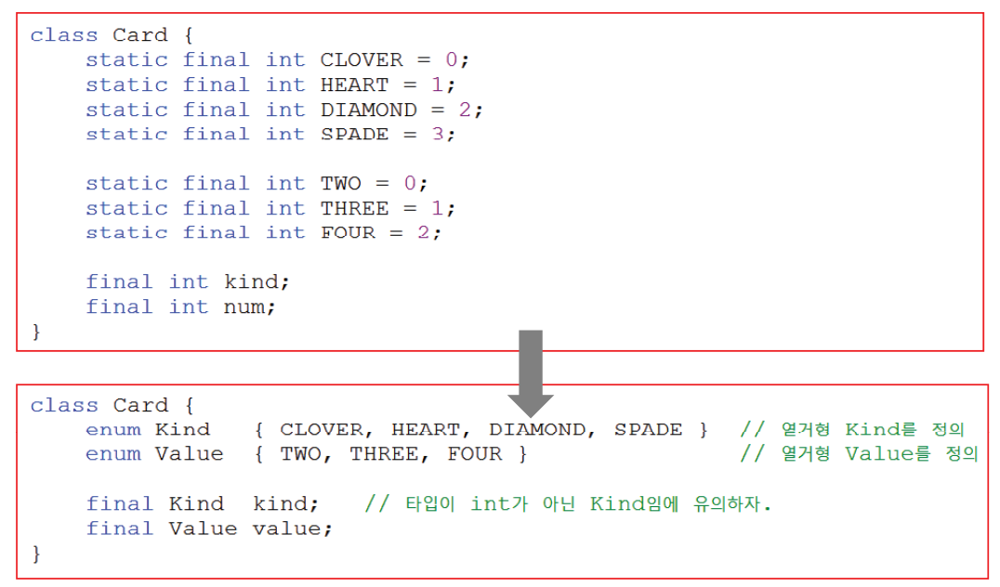

# 1. 지네릭스(Generics)
Java 5부터 도입된 기능으로, 타입 안정성을 제공하고 재사용성을 향상시키는 데 사용됩니다. 제네릭스는 컬렉션 클래스와 같이 다양한 데이터 타입을 다루는 코드에서 매우 유용
---

## 1.1 지네릭스(Generics)란?
- 컴파일시 타입을 체크해 주는 기능(compile-time type check) - JDK1.5
- 객체의 타입 안정성을 높이고 형변환의 번거로움을 줄여줌
(하나의 컬렉션에는 대부분 한 종류의 객체만 저장)

지네릭스의 장점

1. 타입 안정성: 컴파일 시에 컴파일러가 타입 불일치 오류를 검출할 수 있으므로 런타임 오류를 방지합니다. 이로써 코드의 안정성이 향상됩니다.

2. 재사용성: 제네릭 클래스나 인터페이스를 작성하면 다양한 데이터 타입에 대해 동작하는 클래스 또는 메서드를 작성할 수 있습니다.

3. 가독성: 제네릭스를 사용하면 코드가 더 읽기 쉽고 이해하기 쉽게 됩니다. 타입 정보가 제공되므로 코드의 의도를 더 명확하게 표현할 수 있습니다.

---

## 1.2 지네릭 클래스의 선언
- 클래스를 작성할 때, Object타입 대신 T와 같은 타입변수를 사용


- Box<T>는 제네릭 클래스로, T는 타입 파라미터
- 이 클래스는 다양한 데이터 타입을 저장할 수 있는 상자

---

## 1.3 지네릭스의 용어


---

## 1.4 지네릭스의 제약사항


---

## 1.5 지네릭 클래스의 객체 생성과 사용


---


## 1.6 제한된 지네릭 클래스


---

## 1.7 와일드 카드


---

## 1.8 지네릭 메서드


---

## 1.9 지네릭 타입의 형변환


---

## 1.10 지네릭 타입의 제거


---

# 2. 열거형(enums)
## 2.1 열거형이란?
- Enum(열거형)은 프로그래밍에서 고정된 상수 집합을 정의하는 데이터 형식입니다. Enum은 일반적으로 연관된 상수를 그룹화하고 코드를 더 읽기 쉽고 이해하기 쉽게 만들기 위해 사용됩니다. Java에서 Enum은 Java 5 이후 도입되었으며, 다른 프로그래밍 언어에서도 비슷한 기능을 제공

Enum의 주요 특징과 이점은 다음과 같습니다:

```
enum Day {
    SUNDAY, MONDAY, TUESDAY, WEDNESDAY, THURSDAY, FRIDAY, SATURDAY
}

```

1. 상수 그룹화: Enum은 연관된 상수 값을 그룹화할 수 있습니다. 위의 예제에서 Day Enum은 요일을 그룹화합니다.

2. 타입 안정성: Enum은 타입 안전성을 제공합니다. Enum 내의 값은 Enum 타입의 인스턴스이며, 다른 값이나 타입을 가질 수 없습니다.

3. 정렬 가능: Enum은 순서를 가질 수 있으며, Enum 값은 정의된 순서대로 비교할 수 있습니다.

4. Switch 문 사용: Enum은 switch 문과 함께 사용하기에 이상적입니다. 각 상수 값에 대한 동작을 switch 문으로 구현할 수 있습니다.

```
Day today = Day.MONDAY;

switch (today) {
    case SUNDAY:
        System.out.println("It's Sunday!");
        break;
    case MONDAY:
        System.out.println("It's Monday!");
        break;
    // 나머지 요일 처리
}

```

Enum을 사용하면 코드를 더 명확하고 유지보수하기 쉽게 만들 수 있으며, 잘 정의된 상수 그룹을 사용하여 오류를 방지할 수 있습니다. Java에서 Enum은 열거형 데이터를 다룰 때 흔히 사용되며, 프로그래밍에서 다양한 상황에 적용



---


## 2.2 열거형의 정의와 사용


---

## 2.3 모든 열거형의 조상 - java.lang.Enum


---

## 2.4 열거형에 멤버 추가하기


---
## 2.5 열거형의 이해

---

# 3. 애너테이션(Annotation)
## 3.1 애너테이션이란?

Java 프로그래밍 언어에서 메타데이터를 추가하는 특별한 형태의 주석입니다. 애너테이션은 코드에 정보를 추가하거나 코드를 구성, 컴파일러에 지시하거나 런타임 동작을 변경하는 데 사용됩니다. Java 5부터 도입되었으며, 주로 코드 문서화, 컴파일러 경고, 런타임 동작 제어 등 다양한 목적으로 사용

애너테이션은 @ 기호로 시작하며, 다음과 같은 형태로 사용
@AnnotationName


---

## 3.2 표준 애너테이션


---

## 3.2 표준 애너테이션 - @Override

메서드가 슈퍼클래스의 메서드를 오버라이드하고 있는지를 표시합니다. 이 애너테이션은 컴파일러에게 오버라이드 관련 경고를 표시하지 말라고 지시

---

## 3.2 표준 애너테이션 - @Deprecated

애너테이션은 해당 요소(클래스, 메서드 등)가 더 이상 권장되지 않음을 나타냅니다. 컴파일러는 사용자에게 경고를 표시

---

## 3.2 표준 애너테이션 - @FunctionalInterface

해당 인터페이스가 함수형 인터페이스임을 나타냅니다. 함수형 인터페이스는 람다 표현식을 사용하기 위해 사용

---

## 3.2 표준 애너테이션 - @SuppressWarnings

컴파일러 경고를 무시하도록 지시합니다. 특정 경고를 억제하는 데 사용

---

## 3.2 표준 애너테이션 - @SafeVarargs


---

## 3.3 메타 애너테이션 - @Target


---
## 3.3 메타 애너테이션 - @Retention


---

## 3.3 메타 애너테이션 - @Documented, @Inherited


---

## 3.3 메타 애너테이션 - @Repeatable


---

## 3.3 메타 애너테이션 - @Native


---

## 3.4 애너테이션 타입 정의하기


---
## 3.5 애너테이션 요소의 기본값


---
## 3.6 모든 애너테이션의 조상 - java.lang.annotation.Annotation


---
## 3.7 마커 애너테이션 - Marker Annotation


---

## 3.8 애너테이션 요소의 규칙


---

애너테이션은 사용자 정의 애너테이션을 생성하여 특수한 목적에 맞게 사용할 수도 있습니다. 사용자 정의 애너테이션은 @interface 키워드를 사용하여 정의됩니다. 예를 들어:

```
import java.lang.annotation.*;

@Retention(RetentionPolicy.RUNTIME)
@Target(ElementType.METHOD)
public @interface MyAnnotation {
    String value() default "default value";
    int count() default 0;
}

```

위의 코드에서 MyAnnotation은 사용자 정의 애너테이션으로, @Retention 및 @Target 애너테이션을 사용하여 애너테이션의 유지 정책과 적용 대상을 지정합니다. 또한 value()와 count()와 같은 멤버를 가질 수 있으며, 이러한 멤버에 기본값을 설정할 수 있습니다.

사용자 정의 애너테이션은 클래스, 메서드, 필드 등 다양한 요소에 적용할 수 있으며, 런타임에 리플렉션을 통해 애너테이션 정보를 읽을 수 있습니다. 이를 통해 애너테이션은 프로그램의 메타데이터를 정의하고 활용할 수 있으며, 프레임워크, 라이브러리, 테스트 도구 등에서 널리 활용됩니다.