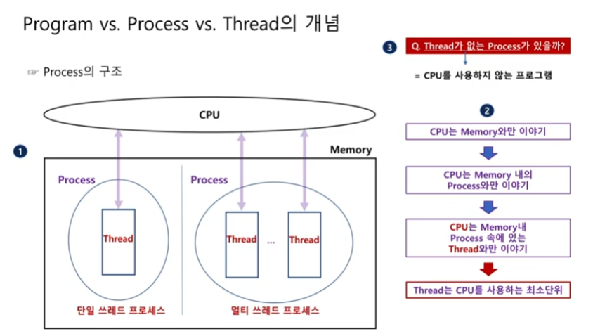
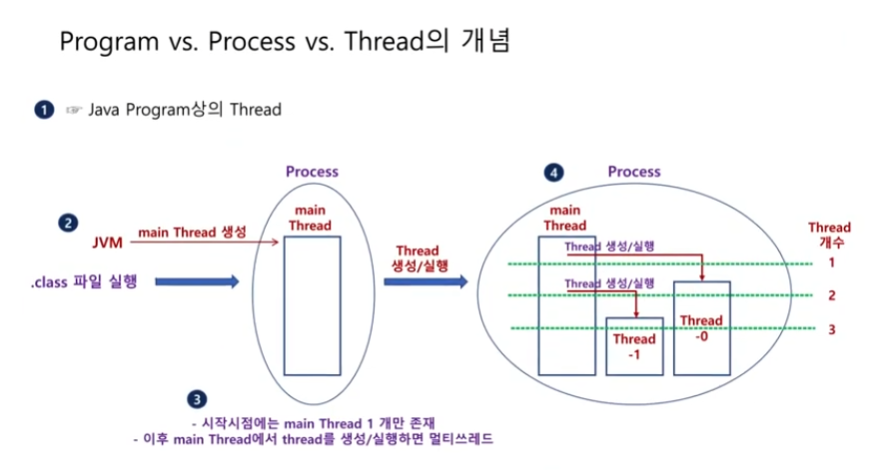

# 쓰레드_1

## 프로그램, 프로세스, 쓰레드
프로그램을 작성하다 보면 어쩔 수 없이 동시에 수행해야 하는 일들이 있습니다.
예를 들어 비디오 재생 프로그램을 작성한다면 화면 재생과 오디오 재생을 동시에 실행해야 할 것입니다.

이런 여러 개의 작업이 동시에 수행되도록 하기 위해서는 한정된 코어의 수를 갖는 CPU를 여러 개의 작업이 나눠 사용되어야 하며, 이를 `쓰레드(Thread)`라고 합니다.

### 프로그램과 프로세스의 개념
`프로그램(program)`과 `프로세스(process)`, 그리고 `쓰레드(thread)`의 개념을 명확히 알기 위해서는 컴퓨터의 구조를 이해할 필요가 있습니다.

컴퓨터를 이루는 주요 구성 요소에는 `중앙 처리 장치(CPU)`, `메모리(memory)` 그리고 `하드 디스크(hard disk)`가 있습니다.

이중 CPU는 연산을 수행함으로써 실제 프로그램을 실행하는 장치로, 가장 빠른 속도로 동작하지만, 반면 데이터의 저장 역할을 수행하는 하드 디스크는 상대적으로 가장 낮은 속도로 동작합니다.

CPU와 하드 디스크의 속도 차이는 실로 어마어마하기 때문에 이 둘은 서로 대화하지 않습니다.
때문에 하드 디스크보다는 훨씬 빠르고, CPU보다는 느리지만 거의 근접한 속도로 동작할 수 있는 메모리를 통해서 서로 대화를 할 수 있습니다.

따라서 실제 하드디스크에 저장된 프로그램이 실행되기 위해서는 먼저 프로그램을 메모리로 `로딩(loading)`하는 과정을 거쳐 `프로세스(process)`상태로 만들어야 합니다.
이렇게 로딩된 메모리의 프로세스가 CPU와 비슷한 속도로 대화하면서 프로그램을 실행하는 것입니다.

- 내용을 정리해 보면, 프로그램은 하드디스크에 저장된 파일들의 모임, 프로세스는 메모리상에 로딩된 프로그램을 의미합니다.

- 메모리는 프로그램 전체를 한꺼번에 로딩하는 것이 아니라 그때그때 필요한 부분만을 동적으로 로딩합니다.

- 이때 동일한 프로그램을 메모리에 2번 로딩하면 2개의 프로세스가 동작하게 되는데, 이를 `멀티 프로세스(multi-process)`라고 합니다.
예를 들어 워드 파일을 2개 열면 워드 프로그램이 메모리에 2번 로딩되어 멀티 프로세스로 동작합니다.


### 쓰레드의 개념
이제 이장의 주제인 쓰레드의 개념을 알아보겠습니다.
CPU는 속도 차이의 문제로 메모리의 프로세스와만 대화합니다.

프로세스가 쓰레드를 갖고 있으므로 외부에서 보면 프로세스가 CPU를 사용하는 것처럼 보였지만, 실제로 CPU를 사용는 것은 프로세스 내부의 쓰레드라는 것을 알 수 있습니다.

때문에 쓰레드가 없는 프로세스는 존재할 수 없으며, 쓰레드를 다른 말로 정의하면 `CPU를 사용하는 최소 단위`라고 할 수 있습니다.




### 자바 프로그램에서의 쓰레드
이제까지 작성해 온 모든 예제 프로그램도 실행 과정에서 메모리로 로딩될 것이고, 로딩된 프로세스의 내부에는 쓰레드가 있었습니다.



1. 먼저 .class 파일을 실행하면 JVM은 main 쓰레드를 생성합니다.
즉, 프로그램이 처음 실행되면 시작 시점에서는 main thread 1개만이 존재합니다.  main() 메서드에서 작성한 내용이 동작합니다.

2. 만일 main 쓰레드의 내부에서 위와같이 2개의 쓰레드를 생성해 실행하면 동시에 2개 이상의 쓰레드가 동작하게 되는데, 이를 멀티 쓰레드 프로세스라고 합니다.


### 멀티 쓰레드의 필요성
멀티 쓰레드는 2개 이상의 쓰레드가 동시에 CPU를 사용한다는 의미입니다.

이러한 멀티 쓰레드가 필요한 이유는 무엇인지 알아보겠습니다.

예시로 비디오 프레임 번호와 자막 번호를 출력하고자 할 때를 가정하겠습니다.
편의상 비디오 프레임 번호는 (1, 2, 3, 4, 5), 자막 번호는 (하나, 둘, 셋, 넷, 다섯)과 같이 표현하겠습니다.

당연히 자막번호는 비디오 프레임에 맞춰 출력되어야 합니다.

```java
// 비디오 프레임과 자막을 단일 쓰레드로 출력
public class TheNeedForThread {
    public static void main(String[] args) {
        // 비디오 프레임
        int[] intArray = {1, 2, 3, 4, 5};
        // 자막 번호
        String[] strArray = {"하나", "둘", "셋", "넷", "다섯"};

        // 비디오 프레임 출력
        for (int i: intArray) {
            System.out.println("(비디오 프레임) " + i);
            try {Thread.sleep(100);} catch (InterruptedException e) {}
        }

        // 자막 번호 출력
        for (String s: strArray) {
            System.out.println("(자막 번호) " + s);
            try {Thread.sleep(100);} catch (InterruptedException e) {}
        }
    }
}
```

2개의 반복문은 `단일 쓰레드(single-thread)`에서 실행됩니다.
즉, 비디오 프레임이 모두 출력되고 나서 자막 번호가 출력될 것입니다.

당연히 원하는 결과는 아니고, 이를 해결하기 위해서 사용하는 것이 `멀티 쓰레드(multi-thread)`입니다.


### 쓰레드는 정말 동시에 수행될까?
2개의 작업을 동시에 수행하기 위해서는 멀티 쓰레드를 사용해야 합니다.

쓰레드는 CPU를 사용하는 최소 단위라고 했으므로 만일 2개의 쓰레드가 있다면 2개의 작업이 동시에 수행될 것이고, 대표적인 예로 음악을 들으면서 웹 서핑을 하는 것을 들 수 있습니다.

여기서 당연히 `컴퓨터에는 단 하나의 CPU만 있는데 어떻게 각 쓰레드는 동시에 실행되는가?`에 대해 의구심이 들 수 있습니다.
이를 이해하기 위해서는 쓰레드의 `동시성(concurrency)`와 `병렬성(parallelism)`을 이해해야 합니다.

먼저 멀티 쓰레드를 사용하지 않을 때, 즉 단일 쓰레드로 2개의 작업을 처리할 때 각 작업은 `순차적(sequential)`으로 처리됩니다.
즉, 먼저 시작된 작업이 완전히 종료된 이후에 두 번째 작업이 실행되는 것입니다.

하지만 멀티 쓰레드에서는 동시성 또는 병렬성을 가지고 처리합니다.

- `동시성`

동시성은 처리할 작업의 수가 CPU의 코어 수보다 많을 때입니다.
예를 들어 CPU의 코어는 1개인데, 동시에 처리해야 할 작업이 2개일 때가 이에 해당합니다.

이때 CPU는 각 작업 쓰레드의 요청 작업을 번갈아가면서 실행합니다.
매우 짧은 간격으로 교차 실행하기 때문에 사용자는 두 작업이 마치 동시에 실행되는 것처럼 보이는 것입니다.
이것이 바로 쓰레드의 `동시성(concurrency)`입니다.

따라서 동시성은 엄밀히 이야기하면, 두 작업이 동시에 실행되는 것이 아니라 동시에 실행되는 것처럼 보이도록 하는 방식인 겁니다.

- `병렬성`

만일 CPU의 코어 수가 작업 수보다 많을 때는 각각의 작업을 각각의 코어에 할당해 동시에 실행할 수 있기 때문에 그야말로 동시에 작업이 수행됩니다.
이를 쓰레드의 `병렬성(parallelism)`이라 합니다.


만약 작업 수가 6개, 코어가 2개라면 쓰레드의 동시성과 병렬성이 함께 적용됩니다.
먼저 작업이 2개의 코어에 나뉘어 할당되고(병렬성), 각각의 코어는 할당된 작업을 번갈아 실행할 것입니다.(동시성)

정리하면 멀티 쓰레드의 목적은 병렬성과 동시성을 활용해 여러 작업을 동시에 실행하거나 동시에 실행하는 것처럼 보이게 하는 것입니다.


## 쓰레드의 생성 및 실행
쓰레드를 생성하는 방법은 크게 2가지로 나눌 수 있습니다.

첫 번째 방법은 Thread 클래스를 상속받아, run() 메서드를 오버라이딩하는 것으로, 이 메서드의 내부에서 자것ㅇ된 내용이 바로 CPU를 독립적으로 사용하면서 동시에 실행되는 것입니다.

두 번째 방법은 두 단계로 이루어져 있으며, 먼저 첫 번째 단계에서는 Runnable 인터페이스를 구현한 Runnable 객체를 생성합니다.
이 인터페이스는 추상 메서드로 run() 메서드를 가지고 있습니다.
따라서 당연히 인터페이스 객체를 생성 과정에서 run() 메서드를 구현해야 할 것입니다.
두 번째 단계에서는 Thread 객체를 생성할 때 앞 단계에서 생성한 Runnable 객체를 생성자로 전달하는 것입니다.

즉 2가지 생성 방법 모두 run() 메서드를 재정의하고, 결과적으로 Thread 객체를 생성합니다.

이렇게 생성한 쓰레드를 실행하는 방법은 객체를 어떤 방법으로 실행했든 Thread 객체 내의 `start() 메서드를 호출`하는 것입니다.

> 여기서 재정의한 메서드는 run() 이지만, run()의 내용을 실행하기 위해서는 반드시 start() 메서드를 호출해야 한다는 것을 명심해야 합니다.

> 또 하나의 특이점은, start() 메서드로 한 번 실행된 Thread 객체는 재사용할 수 없습니다.
만일 다시 실행하고 싶다면 객체를 다시 생성해야 합니다.


### 쓰레드 생성 및 실행 방법

1. `Thread 클래스를 상속받아 run() 메서드 재정의`
쓰레드를 생성 및 실행하는 첫 번째 방법은 아래와 같이 세 과정으로 구성됩니다.


```java
// STEP 1. 클래스 정의
// Thread 클래스를 상속받아 run() 메서드를 오버라이딩한 클래스(또는 익명 이너 클래스) 정의
class MyThread extends Thread {
    @Override
    public void run() {
        // 쓰레드 작업 내용
    }
}

// STEP 2. 객체 생성
// Thread 객체 생성
Thread myThread = new myThread();
// 또는
MyThread myThread = new MyThread();

// STEP 3. 쓰레드 실행
// start() 메서드를 이용해 쓰레드 실행
myThread.start();
```

첫 번째는 Thread 클래스를 상속받아 run() 메서드를 재정의한 클래스를 정의합니다.
쓰레드에서 작업할 내용은 run() 메서드 안에 작성합니다.
이후 생성한 Thread 클래스의 기본 생성자를 이용해 객체를 생성하고, 마지막 단계에서 start() 메서드를 호출해 실행합니다.

- 그렇다면 run() 메서드와 start() 메서드의 차이점은 무엇인지 알아보겠습니다.

쓰레드는 CPU를 사용하는 최소 단위입니다.
실제 CPU와 이야기하기 위해서는 자신만의 `스택(stack)`메모리를 포함해 준비해야 할 것이 많습니다.
start() 메서드는 바로 `새로운 쓰레드 생성/추가를 위한 모든 준비`, `새로운 쓰레드 위에서 run() 실행`이라는 2가지 작업을 연속으로 실행하는 메서드입니다

> 쓰레드의 내부에 run() 메서드가 있기 때문에 run()을 직접 호출해도 오류는 발생하지 않습니다.
다만, 이때 별도의 쓰레드가 아닌 현재의 쓰레드에서 메서드처럼 실행됩니다.


이제 이전에 단일 쓰레드에서 실행했던 비디오 프레임과 자막을 출력하는 프로그램을 멀티 쓰레드로 바꿔보겠습니다.

프로그램이 처음 실행될 때 이미 main 쓰레드가 실행되고 있으므로 비디오 프레임과 자막을 출력하는 작업을 동시에 실행하기 위해서는 적어도 하나 이상의 쓰레드를 추가로 생성해 실행해야 합니다.

```java
// 2개의 쓰레드 활용 (main, SMIFileThread)
// Thread 클래스를 상속해 클래스를 생성한 후 쓰레드 2개 생성

class SMIFileThread extends Thread {
    @Override
    public void run() {
        // 자막 번호
        String[] strArray = {"하나", "둘", "셋", "넷", "다섯"};
        try {Thread.sleep(10);} catch (InterruptedException e) {}
        // 자막 번호 출력
        for (STring s: strArray) {
            System.out.println(" -(자막 번호) " + s);
            try {Thread.sleep(200);} catch (InterruptedException e) {}
        }
    }
}

public class CreateAndStartThread {
    public static void main(String[] args) {
        // SMIFileThread 객체 생성 및 시작
        Thread smiFileThread = new SMIFileThread();
        smiFileThread.start();

        // 비디오 프레임 번호
        int[] intArray = {1, 2, 3, 4, 5};

        // 비디오 프레임 출력
        for (int i: intArray) {
            System.out.print("(비디오 프레임) " + i);
            try {Thread.sleep(200);} catch (InterruptedException e) {}
        }
    }
}
```

- 실행 결과
```
(비디오 프레임) 1 - (자막 번호) 하나
(비디오 프레임) 2 - (자막 번호) 둘
(비디오 프레임) 3 - (자막 번호) 셋
(비디오 프레임) 4 - (자막 번호) 넷
(비디오 프레임) 5 - (자막 번호) 다섯
```

다음은 앞의 예제와 동일한 기능을 수행하면서 3개의 쓰레드를 사용해 수행한 예 입니다.
SMIFileThread는 자막 번호를 출력하는 쓰레드이고, VideoFileThread는 비디오 프레임 번호를 출력하는 쓰레드입니다.
main 쓰레드는 이들 2개의 쓰레드 객체를 생성해 실행하는 역할만을 수행합니다.

```java
// 3개의 쓰레드 활용 (main, SMIFileThread, VideoFileThread)
// Thread 클래스를 상속해 클래스를 생성한 후 쓰레드 3개 생성

class SMIFileThread extends Thread {
    @Override
    public void run() {
        // 자막 번호
        String[] strArray = {"하나", "둘", "셋", "넷", "다섯"};
        try {Thread.sleep(10);} catch (InterruptedException e) {}
        // 자막 번호 출력
        for (STring s: strArray) {
            System.out.println(" -(자막 번호) " + s);
            try {Thread.sleep(200);} catch (InterruptedException e) {}
        }
    }
}

class VideoFileThread extends Thread {
    @Override
    public void run() {
        // 비디오 프레임 번호
        int[] intArray = {1, 2, 3, 4, 5};

        // 비디오 프레임 출력
        for (int i: intArray) {
            System.out.print("(비디오 프레임) " + i);
            try {Thread.sleep(200);} catch (InterruptedException e) {}
        }
    }
}

public class CreateAndStartThread {
    public static void main(String[] args) {
        //SMIFileThread 객체 생성 및 시작
        Thread smiFileThread = new SMIFileThread();
        smiFileThread.start();

        // VieoFileThread 객체 생성 및 시작
        Thread videoFileThread = new VideoFileThread();
        videoFileThread.start();
    }
}
```

- 실행 결과
```
(비디오 프레임) 1 - (자막 번호) 하나
(비디오 프레임) 2 - (자막 번호) 둘
(비디오 프레임) 3 - (자막 번호) 셋
(비디오 프레임) 4 - (자막 번호) 넷
(비디오 프레임) 5 - (자막 번호) 다섯
```

2. `Runnable 인터페이스 구현 객체를 생성한 후 Thread 생성자로 Runnable 객체 전달`

쓰레드 생성 및 실행을 위한 두 번째 방법도 세 단계로 구성되어 있습니다.

첫 번째는 Runnable 인터페이스를 구현한 클래스를 정의하는 것으로, 이 run() 추상 메서드를 구현하면서 여기에 쓰레드의 작업 내용을 작성합니다. 
두 번째는 앞서 정의한 클래스를 이용해 Runnable 객체를 생성합니다.
문제는 Runnable 객체의 내부에는 start() 메서드가 존재하지 않기 때문에 start()를 가지고 있는 Thread 객체를 생성해야 합니다.
다만, 구현한 run() 메서드 자체는 Runnable 객체가 가지고 있으므로 Thread 객체를 생성할 때 Runnable객체를 생성자의 매개변수로 넘겨줍니다.

이렇게 객체를 생성하면 생성된 Thread 객체 내부의 run() 메서는 생성자 매개변수로 넘어온 Runnable 객체 내부의 run()으로 대체됩니다.
이후 첫 번째 방법과 동일하게 Thread 객체의 start()를 호출해 쓰레드를 실행합니다.

> Runnable 인터페이스를 구현한 클래스를 직접 정의하는 대신 익명 이너 클래스 정의 방법을 이용해 바로 객체를 생성할 수도 있습니다.

```java
// STEP 1. 클래스 정의
// Runnable 인터페이스를 구현한 클래스 정의(추상 메서드 run() 구현)
class MyRunnable implements Runnable {
    @Override
    public void run() {
        // 쓰레드 작업 내용
    }
}

// STEP 2. 객체 생성
// Runnable 객체 생성 / Thread 객체 생성(생성자에 Runnable 객체 전달)
Runnable r = new MyRunnable();
// 또는
MyRunnable r = new MyRunnable();

Thread MyThread = new Thread(r);

// STEP 3. 쓰레드 실행
// start() 메서드를 이용해 쓰레드 실행
myThread.start()
```

다음 예제는 Runnable 인터페이스를 구현해 쓰레드를 생성하는 두 번째 방법을 사용해 비디오 프레임과 자막 파일 출력을 동시에 실행시킨 첫 번째 예제입니다.

방법 (1)의 첫 번째 예제와 마찬가지로 main 쓰레드와 SMIFileRunnable 객체를 사용해 각가 비디오 프레임 번호와 자막 번호를 출력했으며, main 쓰레드에서는 추가로 SMIFileRunnable 객체를 넘겨받아 쓰레드를 생성하고 실행하는 기능을 포함하고 있습니다.

```java
// 2개의 쓰레드 활용 (main, SMIFileThread)
// Runnable 인터페이스를 상속해 클래스를 생성한 후 쓰레드 2개 생성

class SMIFileRunnable implements Runnable {
    @Override
    public void run() {
        // 자막 번호
        String[] strArray = {"하나", "둘", "셋", "넷", "다섯"};
        try {Thread.sleep(10);} catch (InterruptedException e) {}
        // 자막 번호 출력
        for (String s: strArray) {
            System.out.println(" - (자막 번호) " + i);
            try {Thread.sleep(200);} catch (InterruptedException e) {}
        }
    }
}

public class CreateAndStartThread {
    public static void main(String[] args) {
        // SMIRunnavle 객체 생성
        Runnable smiFileRunnable = new SMIFileRunnable();
        // smiFileRunnable.start() - Runnable 객체에는 start() 메서드가 없어 오류 발생
        Thread thread = new Thread(smiFileRunnable);
        thread.start();

        // 비디오 프레임
        int[] intArray = {1, 2, 3, 4, 5};
        

        // 비디오 프레임 번호 출력
        for (int i: intArray) {
            System.out.print("(비디오 프레임) " + s);
            try {Thread.sleep(200);} catch (InterruptedException e) {}
        }
    }
}
```

- 실행 결과
```
(비디오 프레임) 1 - (자막 번호) 하나
(비디오 프레임) 2 - (자막 번호) 둘
(비디오 프레임) 3 - (자막 번호) 셋
(비디오 프레임) 4 - (자막 번호) 넷
(비디오 프레임) 5 - (자막 번호) 다섯
```

다음은 방법 (2)의 두 번째 예제로 3개의 쓰레드를 사용해 수행한 예입니다.
SMIFileRunnable은 자막 번호를 출력하는 객체, VideoFileRunnable은 비디오 프레임 번호를 출력하는 객체입니다.
main 쓰레드에서는 이들 2개의 객체를 생성자로 넘겨받아 쓰레드를 생성하고 실행하는 역할만을 수행합니다.

```java
// 3개의 쓰레드 활용 (main, SMIFileThread, VideoFileThread)
// Runnable 인터페이스 상속 클래스를 생성한 후 쓰레드 3개 생성

class SMIFileRunnable implements Runnable {
    @Override
    public void run() {
        // 자막 번호
        String[] strArray = {"하나", "둘", "셋", "넷", "다섯"};
        try {Thread.sleep(10);} catch (InterruptedException e) {}
        // 자막 번호 출력
        for (String s: strArray) {
            System.out.println(" - (자막 번호) " + i);
            try {Thread.sleep(200);} catch (InterruptedException e) {}
        }
    }
}

class VideoFileRunnable implements Runnable {
    @Override
    public void run() {
        // 비디오 프레임 번호
        int[] intArray = {1, 2, 3, 4, 5};
        try {Thread.sleep(10);} catch (InterruptedException e) {}
        // 비디오 프레임 출력
        for (int i: intArray) {
            System.out.println(" - (비디오 프레임) " + i);
            try {Thread.sleep(200);} catch (InterruptedException e) {}
        }
    }
}

public class CreateAndStartThread {
    public static void main(String[] args) {
        // SMIRunnable 객체 생성
        Runnable smiFileRunnable = new SMIFileRunnable();
        // smiFileRunnable.start() - Runnable 객체에는 start() 메서드가 없어 오류 발생
        Thread thread1 = new Thread(smiFileRunnable);
        thread1.start();
        // VideoFileRunnable 객체 생성
        Runnable videoFileRunnable = new VideoFileRunnable();
        // videoFileRunnable.start() - Runnable 객체에는 start() 메서드가 없어 오류 발생
        Thread thread2 = new Thread(videoFileRunnable);
        thread2.start();
    }
}
```

- 실행 결과
```
(비디오 프레임) 1 - (자막 번호) 하나
(비디오 프레임) 2 - (자막 번호) 둘
(비디오 프레임) 3 - (자막 번호) 셋
(비디오 프레임) 4 - (자막 번호) 넷
(비디오 프레임) 5 - (자막 번호) 다섯
```

방법 (2)의 마지막 예제는 3개의 쓰레드가 동작하는 앞의 예제와 동일하지만, 별도의 클래스를 정의하지 않고, 익명 이너 클래스 문법을 사용해 Runnable 인터페이스 객체를 생성한 이후에 실행한다는 점에서 차이가 있습니다.

따라서 실행되는 쓰레드는 main 쓰레드와 2개의 이름이 없는 익명 이너 클래스가 동작합니다.

```java
// 이너 클래스를 활용한 쓰레드 객체 생성 및 실행

public class CreateAndStartThread {
    public static void main(String[] args) {

        // 자막 번호를 출력하는 쓰레드의 익명 이너 클래스 정의
        Thread thead1 = new Thread(new Runnable() {
            @Override
            public void run() {
                // 자막 번호
                String[] strArray = {"하나", "둘", "셋", "넷", "다섯"};
                try {Thread.sleep(10);} catch (InterruptedException e) {}
                // 자막 번호 출력
                for (String s: strArray) {
                    System.out.println(" - (자막 번호) " + s);
                    try {Thread.sleep(200);} catch (InterruptedException e) {}
                }
            }
        });

        // 비디오 프레임 번호를 출력하는 쓰레드의 익명 이너 클래스 정의
        Thread thread2 = new Thread(new Runnable() {
            @Override
            public void run() {
                // 비디오 프레임
                int[] intArray = {1, 2, 3, 4, 5};
                
                // 비디오 프레임 출력
                for (int i: intArray) {
                    System.out.print("(비디오 프레임) " + i);
                    try {Thread.sleep(200);} catch (InterruptedException e) {}
                }
            }
        });

        //Thread 실행
        thread1.start();
        thread2.start();
    }
}
```

- 실행 결과
```
(비디오 프레임) 1 - (자막 번호) 하나
(비디오 프레임) 2 - (자막 번호) 둘
(비디오 프레임) 3 - (자막 번호) 셋
(비디오 프레임) 4 - (자막 번호) 넷
(비디오 프레임) 5 - (자막 번호) 다섯
```
