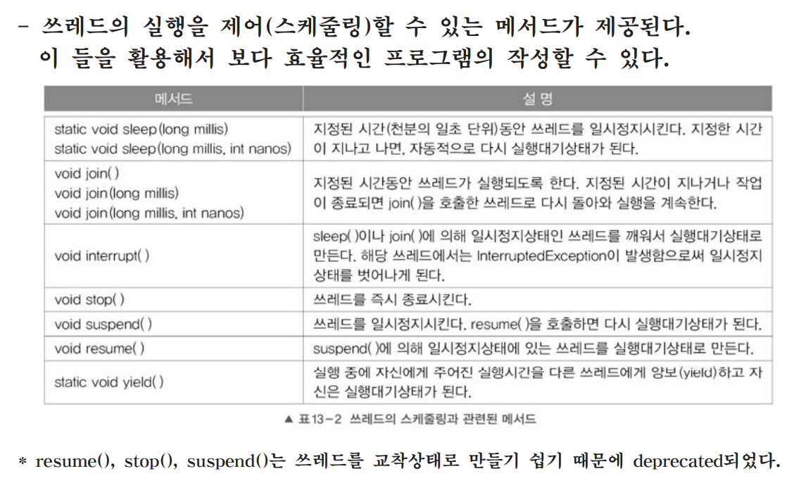
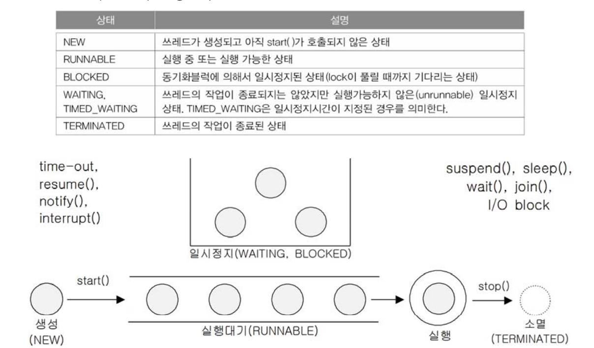
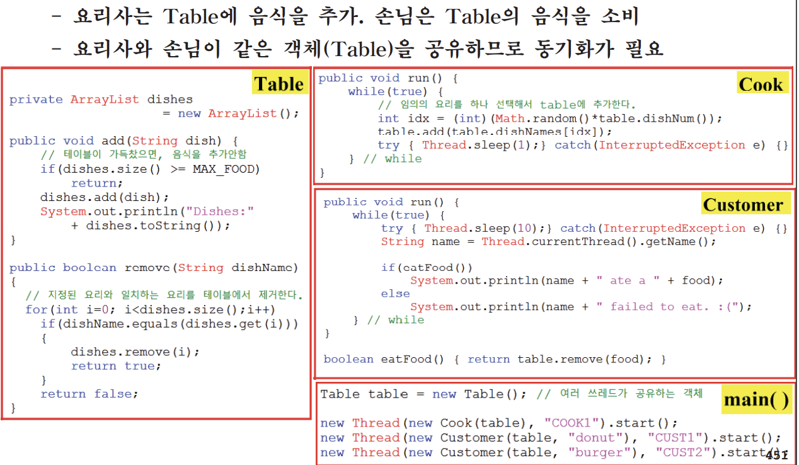
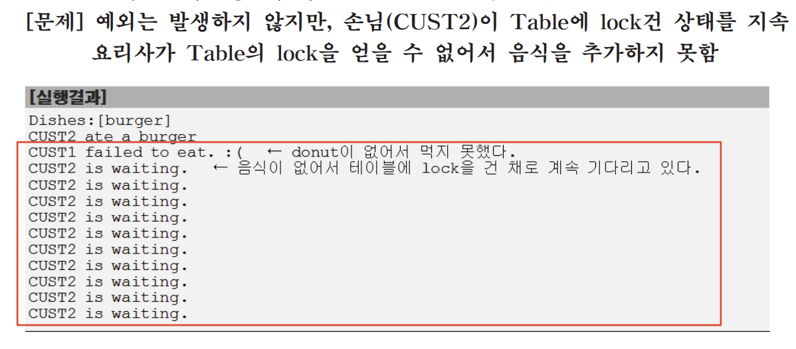

# 1. 쓰레드, 프로세스, 멀티 쓰레드

https://etfplant.tistory.com/839

## 1.1 프로세스와 쓰레드(process & thread) (1/2)


---

## 1.2 멀티프로세스 vs 멀티쓰레드


---

## 1.3 멀티쓰레드의 장단점


---

## 1.4 쓰레드의 구현과 실행


---

## 1.5 start()와 run()


---

## 2. 싱글쓰레드와 멀티쓰레드

## 2.1 싱글쓰레드 vs. 멀티쓰레드(1/3)


---

## 2.1 싱글쓰레드 vs. 멀티쓰레드(2/3) - 병행과 병렬


---

## 2.1 싱글쓰레드 vs. 멀티쓰레드(3/3) - blocking


---

## 2.2 쓰레드의 우선순위(priority of thread)


---

## 2.3 쓰레드 그룹(ThreadGroup)


---

## 2.4 데몬 쓰레드(daemon thread)


---

## 3. 쓰레드의 상태와 실행제어

## 3.1 쓰레드의 실행제어


---

## 3.2 쓰레드의 상태(state of thread)


---

## 3.3 쓰레드의 실행제어 메서드(1/5) - sleep()


---

## 3.3 쓰레드의 실행제어 메서드(2/5) interrupt()


---

## 3.3 쓰레드의 실행제어 메서드(3/5) - suspend(), resume(), stop()


---

## 3.3 쓰레드의 실행제어 메서드(4/5) - yield()


---

## 3.3 쓰레드의 실행제어 메서드(5/5) - join()


---

## 3.4 쓰레드의 실행제어 예제 - join() & interrupt()


---

## 4. 쓰레드의 동기화

## 4.1 쓰레드의 동기화 - synchronized


---

## 4.1 쓰레드의 동기화 - Example


---

## 4.2 wait(), notify(), notifyAll()를 이용한 동기화


---

## 4.3 생산자와 소비자 문제(Ex1)


## 4.3 생산자와 소비자 문제(Ex1) - 실행결과


---

## 4.3 쓰레드의 동기화(Ex2) - 생산자와 소비자 문제


## 4.3 생산자와 동기화(Ex2) - 실행결과


---

## 4.3 쓰레드의 동기화(Ex3) - 생산자와 소비자 문제


## 4.3 쓰레드의 동기화(Ex3) - 실행결과


---

# 쓰레드가 Java개념에 왜 있음 도대체?

성능 향상: 병렬 처리를 통해 계산 집약적인 작업을 빠르게 처리하고 프로그램의 성능을 향상시킬 수 있습니다. 예를 들어, 데이터베이스 조회, 이미지 처리, 암호화 등의 작업을 병렬로 처리할 때 멀티 쓰레드가 유용합니다.

응답성 향상: UI 스레드와 백그라운드 스레드를 사용하여 사용자 인터페이스의 응답성을 높일 수 있습니다. 긴 작업을 백그라운드에서 처리하고, UI 스레드는 사용자 입력을 처리하면서 프로그램이 끊김 없이 실행될 수 있습니다.

네트워크 통신: 네트워크 통신 작업을 수행할 때 멀티 쓰레드를 사용하여 병렬 요청 및 응답 처리를 관리할 수 있습니다. 이는 클라이언트-서버 응용 프로그램과 다중 클라이언트 서버에서 중요합니다.

대규모 데이터 처리: 대규모 데이터 처리와 분석 작업을 병렬로 처리하는 데 멀티 쓰레드 및 멀티 코어 CPU를 활용할 수 있습니다. 이는 빅 데이터 및 과학 연구 분야에서 유용합니다.

서비스 백그라운드 작업: 모바일 애플리케이션에서 백그라운드에서 데이터 동기화, 푸시 알림 처리, 로깅 등을 수행하는 데 멀티 쓰레드를 사용할 수 있습니다.

게임 프로그래밍: 게임 엔진은 멀티 쓰레드를 사용하여 그래픽 렌더링, 물리 시뮬레이션 및 게임 로직을 병렬로 처리합니다.

---

```
import java.util.Scanner;

public class Main {
    public static void main(String[] args) {
        int num;
        Scanner input = new Scanner(System.in);

        System.out.println("라면 몇 개 끓일까요?");
        num = input.nextInt();

        System.out.println(num + "개 주문 완료! 조리시작!");

        try {
            // 라면 조리를 담당하는 RamenCook 클래스의 인스턴스 생성
            RamenCook ramenCook = new RamenCook(num);

            // 4개의 스레드를 생성하고 시작
            new Thread(ramenCook, "A").start();
            new Thread(ramenCook, "B").start();
            new Thread(ramenCook, "C").start();
            new Thread(ramenCook, "D").start();
        } catch (Exception e) {
            e.printStackTrace();
        }
    }
}

// Runnable 인터페이스 정의
interface Runnable {
    public void run();
}

// 현재 스레드를 나타내는 currentThread 클래스
class currentThread extends Thread {
    public RamenCook ramenCook;
    static String nam;

    currentThread() {
        this(new RamenCook(5), "");
    }

    currentThread(RamenCook ramenCook, String nam) {
        this.ramenCook = ramenCook;
        this.nam = nam;
    }
}

// 라면 조리를 담당하는 RamenCook 클래스
class RamenCook extends Thread implements Runnable {
    private int ramenCount;
    private String[] burners = { "_", "_", "_", "_" };

    public RamenCook(int count) {
        ramenCount = count;
    }

    @Override
    public void run() {
        while (ramenCount > 0) {
            synchronized (this) {
                ramenCount--;
                // 현재 스레드의 이름과 남은 라면 수를 출력
                System.out.println(Thread.currentThread().getName() + " : " + ramenCount + "개 남았습니다");
            }

            for (int i = 0; i < burners.length; i++) {
                if (!burners[i].equals("_")) {
                    continue;
                }

                synchronized (this) {
                    // 현재 스레드가 버너를 점유하고 사용 중임을 출력
                    burners[i] = Thread.currentThread().getName();
                    System.out.println("                 " + Thread.currentThread().getName() + " : [" + (i + 1)
                            + "]번 버너 ON");
                    // 현재 버너 상태 출력
                    showBurners();
                }

                try {
                    // 일정 시간 동안 스레드를 일시 정지
                    Thread.sleep(2000);
                } catch (Exception e) {
                    e.printStackTrace();
                }

                synchronized (this) {
                    // 현재 스레드가 버너를 해제하고 사용 종료함을 출력
                    burners[i] = "_";
                    System.out.println("                                  " + Thread.currentThread().getName() + " : ["
                            + (i + 1) + "]번 버너 OFF");
                    // 현재 버너 상태 출력
                    showBurners();
                }
                break;
            }

            try {
                // 일정 시간 동안 스레드를 일시 정지
                Thread.sleep(Math.round(1000 * Math.random()));
            } catch (Exception e) {
                e.printStackTrace();
            }
        }
    }

    private void showBurners() {
        // 버너 상태를 출력하는 메서드
        String stringToPrint = "                                                             ";
        for (int i = 0; i < burners.length; i++) {
            stringToPrint += (" " + burners[i]);
        }
        System.out.println(stringToPrint);
    }
}

```