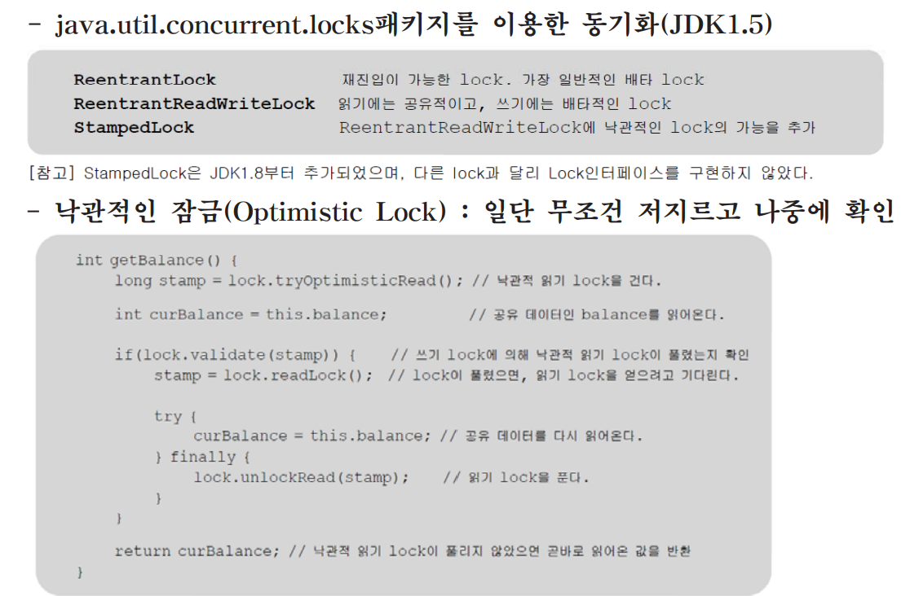
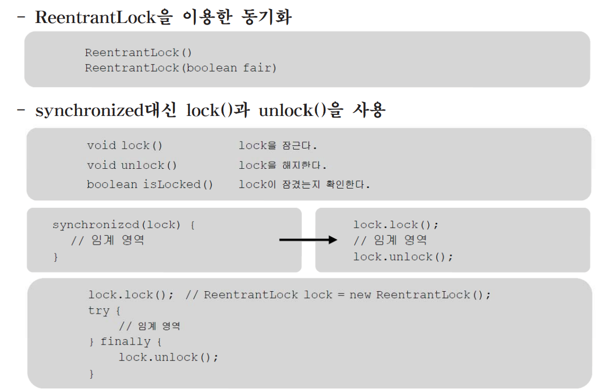
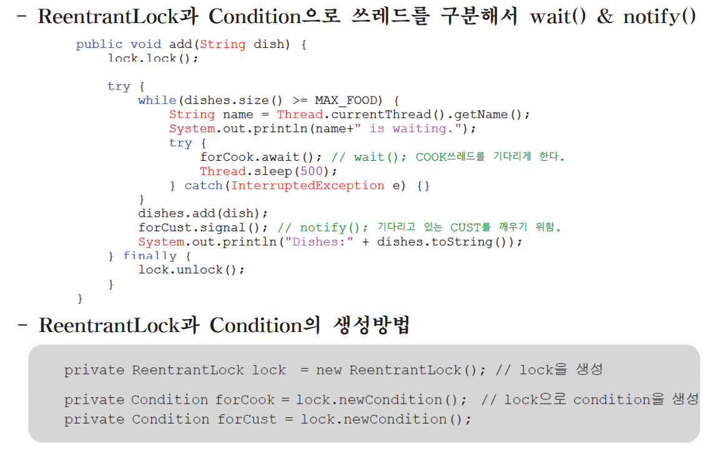
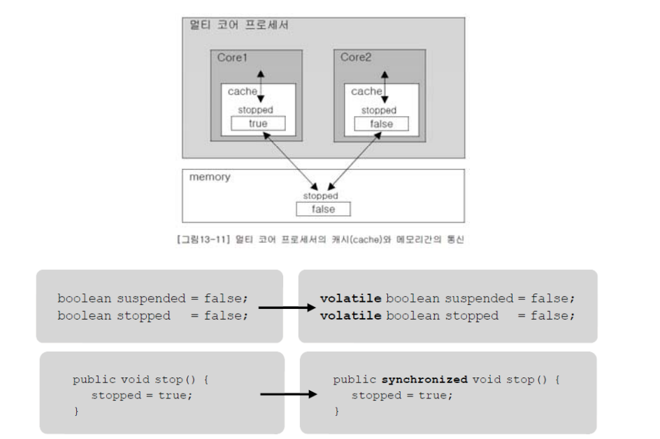
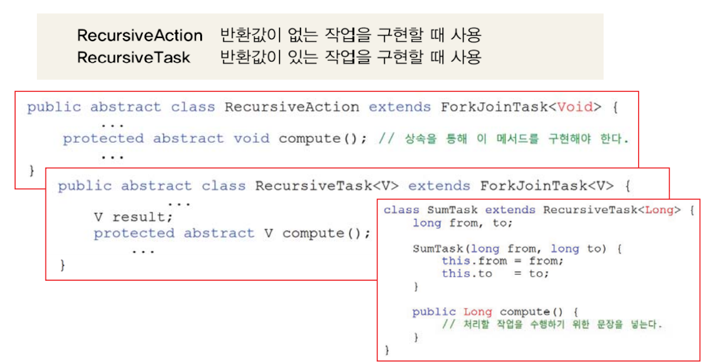
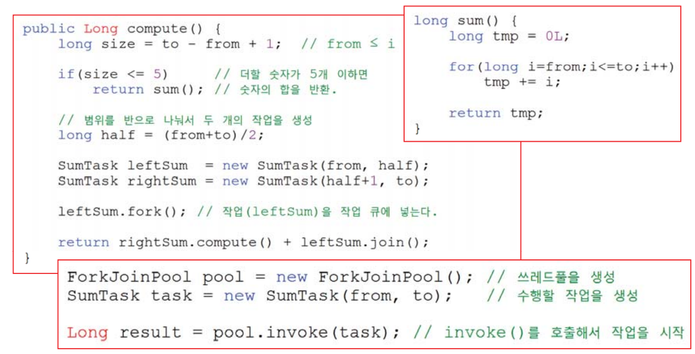
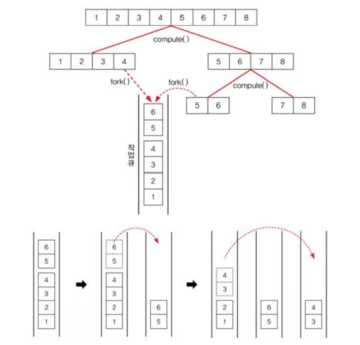
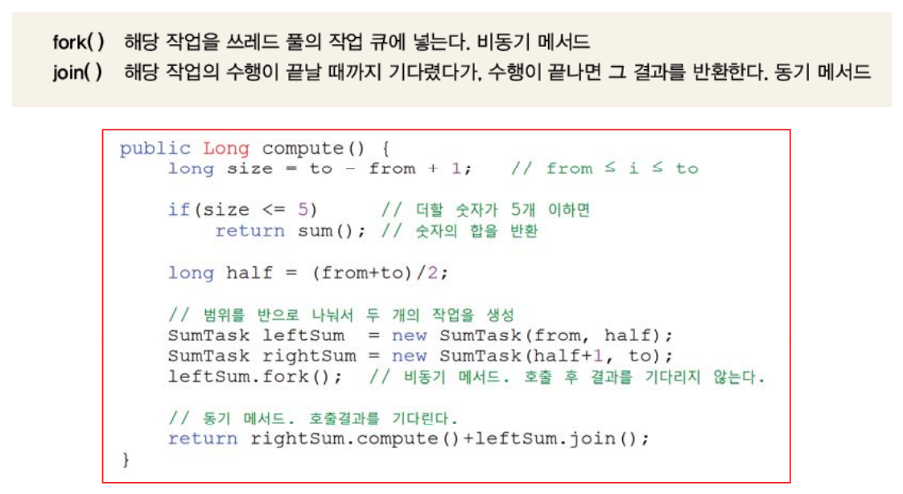

# Lock & Condition
- Lock - Lock은 Java에서 멀티쓰레드 환경에서 동기화를 달성하기 위한 객체입니다. Lock은 synchronized 키워드와 유사한 역할을 하지만 더 많은 제어와 유연성을 제공합니다.

- Condition - Condition은 Lock과 함께 사용하여 특정 조건을 기다리거나 신호를 보내는 데 사용됩니다. 일반적으로 스레드 간 통신 및 동기화에 유용합니다.
## 5.1 Lock과 Condition을 이용한 동기화(1/3)


## 5.1 Lock과 Condition을 이용한 동기화(2/3)


## 5.1 Lock과 Condition을 이용한 동기화(3/3)


## Lock 예제코드
Lock을 사용한 예제
```
import java.util.concurrent.locks.Lock;
import java.util.concurrent.locks.ReentrantLock;

public class Main {
    private static int sharedCounter = 0;
    private static Lock lock = new ReentrantLock();

    public static void main(String[] args) {
        Runnable incrementTask = () -> {
            lock.lock(); // 잠금 획득
            try {
                for (int i = 0; i < 1000; i++) {
                    sharedCounter++; // 공유 변수에 안전하게 접근
                }
            } finally {
                lock.unlock(); // 잠금 해제
            }
        };

        Thread thread1 = new Thread(incrementTask);
        Thread thread2 = new Thread(incrementTask);

        thread1.start();
        thread2.start();

        try {
            thread1.join();
            thread2.join();
        } catch (InterruptedException e) {
            e.printStackTrace();
        }

        System.out.println("최종 값: " + sharedCounter);
    }
}
```

Lock을 사용 안 한 예제
```

public class Main {
    private static int sharedCounter = 0;

    public static void main(String[] args) {
        Runnable incrementTask = () -> {
            for (int i = 0; i < 1000; i++) {
                sharedCounter++; // 공유 변수에 접근
            }
        };

        Thread thread1 = new Thread(incrementTask);
        Thread thread2 = new Thread(incrementTask);

        thread1.start();
        thread2.start();

        try {
            thread1.join();
            thread2.join();
        } catch (InterruptedException e) {
            e.printStackTrace();
        }

        System.out.println("최종 값: " + sharedCounter);
    }
}

```

Condition 예제
```
import java.util.concurrent.locks.Condition;
import java.util.concurrent.locks.Lock;
import java.util.concurrent.locks.ReentrantLock;

public class Main {
    public static void main(String[] args) throws InterruptedException {
        Lock lock = new ReentrantLock();
        Condition condition = lock.newCondition();

        lock.lock();
        try {
            // 어떤 조건을 기다림
            condition.await();

            // 조건이 충족되면 작업 수행
        } finally {
            lock.unlock();
        }
    }
}

```
---

## 5.2 volatile - cache와 메모리간의 불일치 해소
- 성능 향상을 위해 변수의 값을 core의 cache에 저장해 놓고 작업
- 여러 쓰레드가 공유하는 변수에는 volatile을 붙여야 항상 메모리에서 읽어옴


---

# 6. join & fork 프레임웩
## 6.1 fork & join 프레임웩
- 작업을 여러 쓰레드가 나눠서 처리하는 것을 쉽게 해준다.(JDK1.7)
- RecursiveAction 또는 RecursiveTask를 상속받아서 구현


---

## 6.2 compute()의 구현
- 수행할 작업과 작업을 어떻게 나눌 것인지를 정해줘야 한다.
- fork()로 나눈 작업을 큐에 넣고, compute()를 재귀호출한다.


---
## 6.3 작업 훔치기(work stealing)
- 작업을 나눠서 다른 쓰레드의 작업 큐에 넣는 것


## 6.4 fork()와 join()
- compute()는 작업을 나누고, fork()는 작업을 큐에 넣는다.(반복)
- join()으로 작업의 결과를 합친다.(반복)


---

예제코드
```
import java.util.concurrent.RecursiveTask;
import java.util.concurrent.ForkJoinPool;

public class ForkJoinTaskExample {
    public static void main(String[] args) {
        ForkJoinPool pool = new ForkJoinPool();

        long result = pool.invoke(new MyRecursiveTask(0, 1000));
        System.out.println("Result: " + result);
    }
}

class MyRecursiveTask extends RecursiveTask<Long> {
    private int start;
    private int end;

    public MyRecursiveTask(int start, int end) {
        this.start = start;
        this.end = end;
    }

    @Override
    protected Long compute() {
        if (end - start <= 100) {
            // 작은 작업을 직접 수행
            long sum = 0;
            for (int i = start; i <= end; i++) {
                sum += i;
            }
            return sum;
        } else {
            // 큰 작업을 더 작은 작업으로 분할하여 병렬로 실행
            int middle = (start + end) / 2;
            MyRecursiveTask leftTask = new MyRecursiveTask(start, middle);
            MyRecursiveTask rightTask = new MyRecursiveTask(middle + 1, end);
            leftTask.fork();
            long rightResult = rightTask.compute();
            long leftResult = leftTask.join();
            return leftResult + rightResult;
        }
    }
}

```