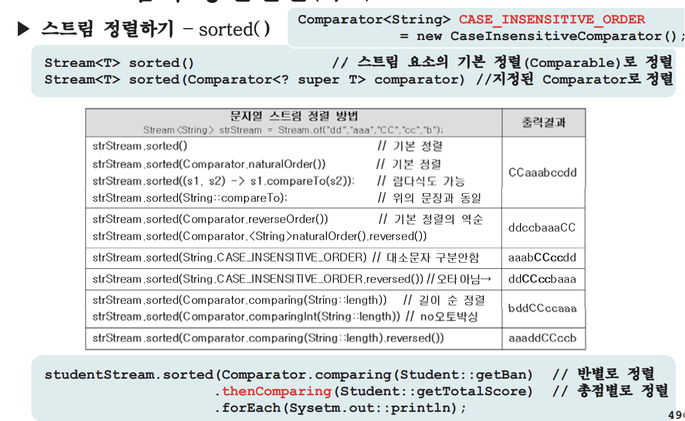
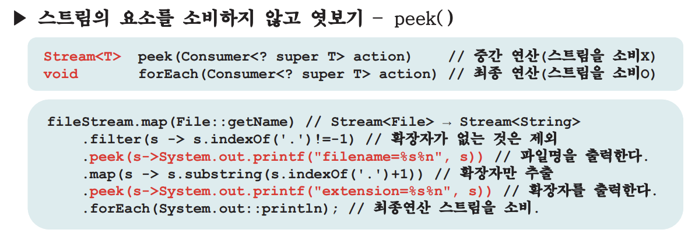
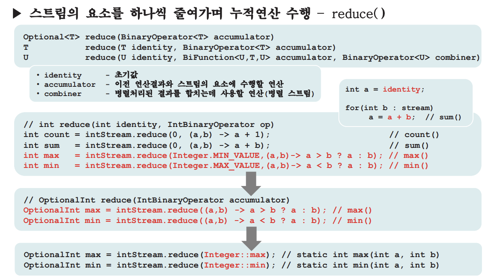
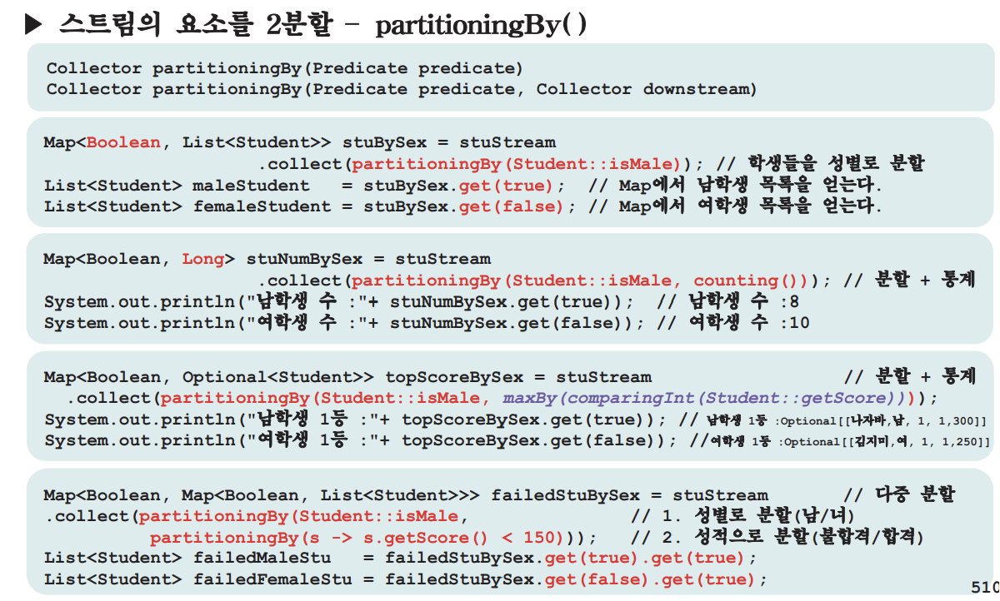

# 람다(Lambda)
## 1.1 람다식(Lambda Expression)이란?

---

## 1.2 람다식 작성하기

---

## 1.2 람다식 작성하기 - 주의사항

---

## 1.2 람다식 작성하기 - 실습

---

## 1.3 함수형 인터페이스(1/3)

---

## 1.3 함수형 인터페이스(2/3)

---

## 1.3 함수형 인터페이스 - example

---

## 1.3 함수형 인터페이스(3/3) - 매개변수와 반환타입

---

## 1.4 java.util.function패키지(1/5)

---

## 1.4 java.util.function패키지 - Quiz

---

## 1.4 java.util.function패키지(2/5)

---

## 1.4 java.util.function패키지(3/5)

---

## 1.4 java.util.function패키지(4/5)

---

## 1.4 java.util.function패키지(5/5)

---

## 1.5 Function의 합성(1/2)

---

## 1.5 Function의 합성(2/2)

---

## 1.6 Predicate의 결합

---

## 1.7 메서드 참조(method reference)(1/2)

---

## 1.7 메서드 참조(method reference)(2/2)

---

# 2. 스트림(Stream)
## 2.1 스트림(Stream)이란?

---

## 2.2 스트림(Stream)의 특징(1/2)

---

## 2.2 스트림(Stream)의 특징(2/2)

---

## 2.3 스트림의 생성(1/3)

---

## 2.3 스트림의 생성(2/3)

---

## 2.3 스트림의 생성(3/3)

---

## 2.4 스트림의 중간연산(1/6)

---

## 2.4 스트림의 중간연산(2/6)

---

## 2.4 스트림의 중간연산(3/6)

---

## 2.4 스트림의 중간연산(4/6)

---

## 2.4 스트림의 중간연산(5/6)

---

## 2.4 스트림의 중간연산(6/6)

---

## 2.5 Optional<T>과 OptionalInt(1/2)

---

## 2.5 Optional<T>과 OptionalInt(1/2)

---

## 2.6 스트림의 최종연산(1/4)

---

## 2.6 스트림의 최종연산(2/4)

---

## 2.6 스트림의 최종연산(3/4)

---

## 2.6 스트림의 최종연산(4/4)

---

## 2.7 collect(), Collector, Collectors

---

## 2.8 Collectors의 메서드(1/4)

---

## 2.8 Collectors의 메서드(2/4)

---

## 2.8 Collectors의 메서드(3/4)

---

## 2.8 Collectors의 메서드(4/4)

---

## 2.9 Collector 구현하기

---

## 2.9 Collector 구현하기 - example

---

## 2.10 스트림 변환(1/2)

---

## 2.10 스트림 변환(2/2)
