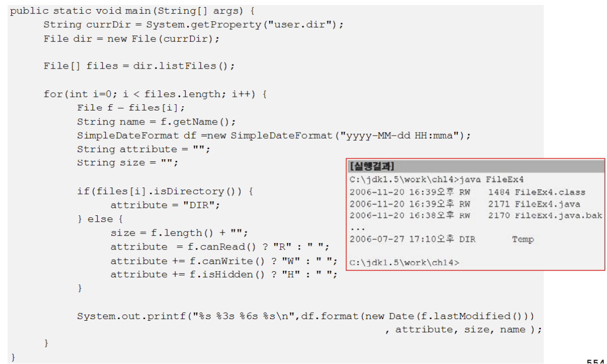

# 15. 입출력(I/O)
## 1. 입출력(I/O)
### 1.1 입출력(I/O)과 스트림(stream)
- 입출력(I/O)이란?
    - 입력(Input)과 출력(Output)을 줄여 부르는 말
    - 두 대상 간의 데이터를 주고 받는 것

- 스트림(stream)이란?
    - 데이터를 운반(입출력)하는데 사용되는 연결통로
    - 연속적인 데이터의 흐름을 물(stream)에 비유해서 붙여진 이름
    - 하나의 스트림으로 입출력을 동시에 수행할 수 없다.(단방향 통신)
    - 입출력을 동시에 수행하려면, 2개의 스트림이 필요하다.
    

---

### 1.2 바이트기반 스트림 - InputStream, OutputStream
- 데이터를 바이트(byte)단위로 주고 받는다.

### 1.3 보조스트림
- 스트림의 기능을 향상시키거나 새로운 기능을 추가하기 위해 사용
- 독립적으로 입출력을 수행할 수 없다.

### 1.4 문자기반 스트림 - Reader, Writer
- 입출력 단위가 문자(char, 2byte)인 스트림, 문자기반 스트림의 최고조상

---

## 2. 바이트기반 스트림
### 2.1 InputStream과 OutputStream

### 2.2 ByteArrayInputStream과 ByteArrayOutputStream
- 바이트배열(byte[])에 데이터를 입출력하는 바이트기반 스트림

---

### 2.3 FileInputStream과 FileOutputStream
- 파일(file)에 데이터를 입출력하는 바이트기반 스트림

## 3. 바이트기반 보조스트림
### 3.1 FilterInputStream과 FilterOutputStream

---

### 3.2 BufferedInputStream과 BufferedOutputStream

### 3.3 DataInputStream과 DataOutputStream

### 3.4 SequenceInputStream

### 3.5 PrintStream
- 데이터를 다양한 형식의 문자로 출력하는 기능을 제공하는 보조스트림
- System.out과 System.err이 PrintStream이다.
- PrintStream보다 PrintWriter를 사용할 것을 권장한다.

---

## 4.4 문자기반 스트림
### 4.1 Reader와 Writer

### 4.2 FileReader와 FileWriter

### 4.3 PipedReader와 PipedWriter

### 4.4 StringReader와 StringWriter

---

## 5. 문자기반 보조스트림
### 5.1 BufferedReader와 BufferedWriter
- 입출력 효율을 높이기 위해 버퍼(char[])를 사용하는 보조스트림
- 라인(line)단위의 입출력이 편리하다.

### 5.2 InputStreamReader와 OutputStreamWriter
- 바이트기반스트림을 문자기반스트림처럼 쓸 수 있게 해준다.
- 인코딩(encoding)을 변환하여 입출력할 수 있게 해준다.

---

## 6. 표준입출력 File
### 6.1 표준입출력 - System.in, System.out, System.err
- 콘솔(console, 화면)을 통한 데이터의 입출력을 '표준 입출력'이라 한다.
- JVM이 시작되면서 자동적으로 생성되는 스트림이다.

### 6.2 RandomAccessFile
- 하나의 스트림으로 파일에 입력과 출력을 모두 수행할 수 있는 스트림
- 다른 스트림들과 달리 Object의 자손이다.

### 6.3 File
### 6.3 File (1/2) - 생성자와 경로관련 메서드
- 파일과 디렉토리를 다루는데 사용되는 클래스

### 6.3 File (2/2) - 파일의 속성, 생성, 삭제, 목록
직렬화

---

## 7. 직렬화(serialization)
### 7.1 직렬화(serialization)란?

### 7.2 ObjectInputStream, ObjectOutputStream

### 7.3 직렬화 가능한 클래스 만들기

### 7.4 직렬화 가능한 클래스의 버전관리
